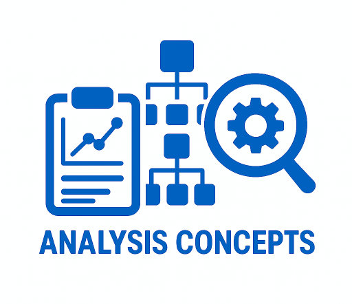

# Analysis Concepts (AC/DC Framework)

The main purpose of the Analysis Concepts project is to define and model concepts representing the derivation and analysis of data to support end-to-end automation and the CDISC 360i project.

The AC/DC (Analysis Concepts / Derivation Concepts) Framework provides a metadata-driven architecture for specifying, configuring, and executing statistical analyses for clinical trials. It separates *what* needs to be analyzed from *how* it is computed, enabling interchange, automation, and reuse across organizations and programming languages.



---

## Design Principles

| Principle | Description |
| --- | --- |
| **Concept-first modeling** | Concepts describe the real world independently of any study or data standard. A "change from baseline" is the same concept whether implemented in ADaM, SDTM, OMOP, or FHIR. |
| **Separation of specification from implementation** | Conceptual layer (human-readable) is kept distinct from the implementation layer (machine-readable, executable). This mirrors ISO 11179 terminology for metadata registries. |
| **Method–Concept independence** | Methods (statistical procedures) know nothing about concepts (clinical meaning). Transformations bridge the two, binding method input/output roles to concept dimensions. This keeps both sides reusable. |
| **Metadata-driven execution** | The execution engine reads method definitions, call templates, and output mappings from JSON metadata. Adding a new statistical method requires zero code changes to the engine or UI — only new JSON entries. |
| **Standards alignment** | Value types align to FHIR R5 primitives and complex types. Statistical measures link to the STATO ontology. Concept hierarchies use SKOS vocabulary (broader/narrower, inScheme, prefLabel). |
| **KISS** | Some complexity is unavoidable, but simplicity is a design goal. Complexity can be hidden from end-users by tools. "Do one thing and do it well" — a derivation requiring multiple steps should be broken into multiple Derivation Concepts. |

---

## Framework Layers

The framework is organized into three layers, with the Concept layer in the middle — serving as the standard-agnostic connector between specification and implementation:

```
┌─────────────────────────────────────────────────────────────┐
│  Specification Layer                                        │
│  Methods · Transformations · SmartPhrases                   │
│  Formulas · Configuration Options · Bindings                │
│  Describes HOW to derive and analyze                        │
├─────────────────────────────────────────────────────────────┤
│  Concept Layer                                              │
│  AC (Analysis Concepts) · DC (Derivation Concepts)          │
│  OC (Observation Concepts) · Shared Definitions             │
│  Standard-agnostic bridge — describes WHAT things mean      │
├─────────────────────────────────────────────────────────────┤
│  Implementation Layer                                       │
│  Language-specific code templates (R, SAS, Python, Julia)   │
│  Variable mappings (ADaM, SDTM) · Executable specifications│
│  Describes WHERE and IN WHAT FORM data lives                │
└─────────────────────────────────────────────────────────────┘
```

| Layer | Location | Role |
| --- | --- | --- |
| **Specification** | `lib/methods/`, `lib/transformations/` | Describes how to derive and analyze — methods, formulas, bindings, configurations |
| **Concept** | `model/concept/`, `model/shared/` | Standard-agnostic bridge defining what things mean — connects specification to implementation |
| **Implementation** | `lib/method_implementations/`, `ac-dc-app/data/` | Maps concepts to physical variables and methods to executable code |

---

## Model Elements

### Observation Concepts (OC)

**File:** `model/concept/OC_Instance_Model_v016.json` · **Schema:** `model/concept/oc_concepts.schema.json` (v0.16)

The Observation Concept is the atomic unit of clinical data. It represents a single observation in the real world (e.g., a blood pressure measurement, an adverse event occurrence).

- **Structure groups:** Identification (Topic, Category, Sequence), Result (Value, Unit, ReferenceRange), CollectionMethod (Device, Technique, Specimen)
- **Shared dimensions:** Subject, Study, Visit, Timing, Treatment, Population, Site
- **Observation subtypes:** EventObservation, InterventionObservation, FindingObservation, FindingAboutObservation
- **FHIR R5 alignment:** Value types mapped to FHIR primitives (decimal, integer, code, string, boolean, date, dateTime) and complex types (Quantity, CodeableConcept, Identifier)

### Derivation Concepts (DC)

**Files:** `model/concept/Option_B_Clinical.json` (currently used) · **Schema:** `model/concept/dc_concepts.schema.json` (v0.20)

Derivation Concepts describe subject-level data transformations — creating new data from collected or other derived data. Four naming options exist (A–D); **Option B (Clinical)** is the active variant.

**Categories (Option B):**

| Category | Concepts | Description |
| --- | --- | --- |
| PointComputation | Measure | Direct values (BMI, eGFR, imputed values) |
| Comparison | Change, PercentChange, Ratio, LogRatio, Shift | Differences and transitions from a reference point |
| SequenceAggregate | PeakValue, TroughValue, AreaUnderCurve, SequenceAverage | Aggregations over a sequence of observations |
| Classification | Flag, Category | Event indicators and categorized values |

Each DC concept carries dimensions that describe the semantic axes of the derived data (e.g., Subject, Parameter, AnalysisVisit, Treatment, Population).

### Analysis Concepts (AC)

**File:** `model/concept/AC_Concept_Model_v016.json` · **Schema:** `model/concept/ac_concepts.schema.json` (v0.16)

Analysis Concepts describe aggregated, non-subject-level results. They follow a 3-level SKOS-inspired hierarchy:

1. **Statistical Concepts** (atoms) — Individual statistical measures: Estimate, SE, CI_Lower, CI_Upper, PValue, HazardRatio, OddsRatio, etc.
2. **Result Patterns** (molecules) — Groups of related statistics: LSMeans, Contrasts, RegressionCoefficients, SurvivalCurves, FrequencyTable, etc.
3. **Categories** — Higher-order groupings of result patterns

Method output slots map to AC concepts, connecting computed results to their statistical meaning.

### Methods

**Directory:** `lib/methods/` · **Schema:** `model/method/acdc_methods.schema.json` (v0.7.0)

Methods describe *how* an analysis or derivation should be performed. A method has:

- **Input roles** — Named parameters with statisticalRole, dataType, cardinality, and required flag (e.g., `response: required decimal`, `group: optional code`)
- **Output specification** — Output classes, dimensions, and statistics produced
- **Formula** — Human-readable expression using a defined grammar (e.g., `result := MEAN(<response>) OVER (<group>*)`)
- **STATO coding** — Link to the Statistical Methods Ontology

**Method categories:**

| Type | Count | Examples |
| --- | --- | --- |
| **Derivations** | 60+ | Subtraction, Division, PercentChange, DateDifference, Categorization, Imputation (LOCF, BOCF, WOCF, Mean, Median, Zero), Rounding, WindowLookup |
| **Analyses** | 40+ | Mean, Median, Variance, StdDev, TTest, ANOVA, ANCOVA, MMRM, Chi-Square, Fisher Exact, CMH, Log-Rank, Kaplan-Meier, Cox PH, Count, Proportion |

**Supporting vocabularies:**

| File | Purpose |
| --- | --- |
| `model/method/statistics_vocabulary.json` (v0.5.0) | Reusable statistic definitions (estimate, SE, CI, p_value, etc.) with STATO codings |
| `model/method/output_class_templates.json` | Standard output structure templates used by methods |
| `model/method/formula_grammar.json` | BNF grammar for analysis formulas (Wilkinson-Rogers style) and derivation formulas (assignment style) |

### Shared Definitions

**Directory:** `model/shared/`

#### FHIR Value Types (`fhir_value_types.json`)

Defines the alignment between AC/DC data types and FHIR R5. Method inputs use FHIR **primitive types** (decimal, integer, code, string, boolean, date, dateTime), while DC concept outputs use **complex types** (Quantity for measured values, CodeableConcept for coded responses, Identifier for subject/record IDs). This separation ensures methods stay generic while concepts carry clinical semantics.

#### BC-to-OC Mapping: Rules and Pre-computed Cache

Two files work together to classify USDM Biomedical Concept (BC) properties into OC Instance Model facets:

**`oc_bc_property_mapping.json`** — The **rules engine**. A compact lookup table (~60 lines) that maps USDM standard codes to OC facets. For example, code `C70856` (Observation Result) maps to `Result.Value`, code `C44276` (Unit of Temperature) maps to `Result.Unit`, code `C13717` (Anatomic Site) maps to `Location`. These rules are study-independent and work for any USDM study. The app uses this file at runtime via `classifyBcProperties()` (`endpoint-spec.js`) to dynamically classify BC properties for OC facet display.

**`bc_to_oc_instance_mapping.json`** — The **pre-computed cache**. The result of applying the rules above to all 161 BCs and 1,511 properties in the CDISC Pilot Study. Each property records which OC facet it mapped to, the matching method used (code_match, name_heuristic, code_fix), and the resolved FHIR value type (Quantity, CodeableConcept, dateTime). The app uses this file for the **BC parameter picker** (`endpoint-spec.js`, `derivation-pipeline.js`) — filtering which BCs are compatible with a selected concept (e.g., "only BCs with a numeric `Result.Value`" when the concept is Measure) without re-running the classification rules against every property at render time.

```
oc_bc_property_mapping.json  →  "If code = C70856, then facet = Result.Value"
       (rules)                    (general, study-independent, used for display)

bc_to_oc_instance_mapping.json → "Temperature.VSORRES (C70856) = Result.Value via code_match"
       (pre-computed cache)        (CDISC Pilot Study specific, used for filtering)
```

For a new study, the instance mapping would need to be regenerated by applying the rules to that study's USDM BCs.

#### Qualifier Types (`model/concept/CDDM_Shared_QualifierTypes.json`)

Qualifier types represent semantically different versions of a data definition — choices that change the **scientific meaning**, not just the physical encoding. A transformation binding must specify a qualifier value when the source data definition has qualifiers.

| Qualifier | Definition | Values | Used By |
| --- | --- | --- | --- |
| IntentType | Whether the value reflects planned assignment or actual receipt | Planned, Actual | Treatment, Period |
| DerivationStatus | Whether the value is protocol-defined or analysis-derived | Protocol, Analysis | AnalysisVisit |
| ReferenceFrame | Whether timing is relative to an event or an absolute calendar date | Relative, Absolute | Timing |
| BoundaryType | Whether a date marks the start or end of an interval | Start, End | Date |

**How qualifier types drive concept-to-variable resolution:**

When the app needs to resolve an abstract concept (e.g., "Treatment") to a physical variable name, qualifier types provide the primary resolution path. The `displayConcept()` function in `concept-display.js` follows a three-step resolution order:

1. **Qualifier-based** (authoritative) — concept + qualifierType + qualifierValue → `implementationMapping` in the CDDM file. For example: Treatment + IntentType=Planned → `TRTP`, Treatment + IntentType=Actual → `TRTA`.
2. **DataType-based** (fallback) — concept + dataType → `byDataType` in `concept-variable-mappings.json`.
3. **Generic** (last resort) — concept → default variable name.

Each qualifier type carries its own `implementationMapping` per data standard, making the resolution fully metadata-driven:

| Concept + Qualifier | ADaM | SDTM |
| --- | --- | --- |
| Treatment · IntentType=Planned | TRTP | — |
| Treatment · IntentType=Actual | TRTA | — |
| AnalysisVisit · DerivationStatus=Protocol | VISIT | — |
| AnalysisVisit · DerivationStatus=Analysis | AVISIT/AVISITN | — |
| Timing · ReferenceFrame=Relative | ADY | --DY |
| Timing · ReferenceFrame=Absolute | ADT | --DTC |
| Date · BoundaryType=Start | ASTDT | --STDTC |
| Date · BoundaryType=End | AENDT | --ENDTC |

### Transformations

**File:** `lib/transformations/ACDC_Transformation_Library_v06.json` · **Schema:** `model/method/acdc_transformations.schema.json` (v0.1.0)

Transformations are the bridge between Methods and Concepts. Each transformation:

- References a **method** (`usesMethod: M.*`)
- Declares **bindings** that map concept dimensions to method input/output roles
- Specifies a **transformation type** (derivation or analysis)
- Is an **instance of** a concept (`instanceOf: DC.* or AC.*`)
- Has a **composedPhrase** (human-readable template describing the analysis)

**SmartPhrases** — Reusable phrase templates for human-readable descriptions:

| SmartPhrase | Template |
| --- | --- |
| SP_CFB_ENDPOINT | "change from baseline in {parameter}" |
| SP_PCTCFB_ENDPOINT | "percent change from baseline in {parameter}" |
| SP_TTE_ENDPOINT | "time to {event}" |
| SP_RESPONDER_ENDPOINT | "proportion of responders in {parameter}" |
| SP_VALUE_ENDPOINT | "{parameter} value" |
| SP_SHIFT_ENDPOINT | "shift from baseline in {parameter}" |

**ConfigurationOptions** — Parameterized choices resolved at study time:

| Option | Values | Default |
| --- | --- | --- |
| imputation | LOCF, BOCF, WOCF, Mean, Median, MMRM | LOCF |
| event | death, discontinuation, first AE, disease progression | — |
| strata | site, region, baseline severity | — |
| conf_level | 90, 95, 97.5, 99 | 95 |

### Implementation Catalog

**File:** `lib/method_implementations/r_implementations.json` · **Schema:** `model/method/method_implementation_catalog.schema.json` (v0.1.0)

The implementation catalog maps abstract methods to language-specific executable code. Each entry contains:

- **`callTemplate`** — Code template with `<role>` placeholders, e.g.: `t.test(<response> ~ <fixed_effect>, data = <dataset>, paired = TRUE)`
- **`outputMapping`** — Expressions to extract results from the language's return value, e.g.: `estimate → result$estimate`, `p_value → result$p.value`
- **`package`** and **`function`** — The library and function to call (e.g., `stats::t.test`)
- **`documentation`** — URL to the function's documentation

Currently implemented for **R**. The schema supports R, SAS, Python, and Julia.

### Concept-to-Variable Mappings

**File:** `ac-dc-app/data/concept-variable-mappings.json`

Maps abstract concepts to physical variable names within specific data standards:

| Concept | ADaM Variable | Data Type |
| --- | --- | --- |
| Measure | AVAL / AVALC | decimal / code |
| Change | CHG | decimal |
| PercentChange | PCHG | decimal |
| Shift | AVALC | string |
| PeakValue | AVAL | decimal |
| Flag | AVALC, xxxFL | boolean |
| Category | AVALC | code |

**Dimension mappings:**

| Dimension | ADaM Variable(s) |
| --- | --- |
| Subject | USUBJID |
| Parameter | PARAMCD, PARAM |
| Timing | ADT, ADY, ATPT |
| AnalysisVisit | AVISIT, AVISITN |
| Treatment | TRTA, TRTP |
| Population | ITTFL, SAFFL, EFFFL |
| Period | APERIOD, APERIODC |
| Site | SITEID, SITEGR1 |

---

## Schema Files

| Schema | Path | Version | Defines |
| --- | --- | --- | --- |
| AC Concepts | `model/concept/ac_concepts.schema.json` | v0.16 | Analysis Concept hierarchy (Statistical Concepts → Result Patterns → Categories) |
| DC Concepts | `model/concept/dc_concepts.schema.json` | v0.20 | Derivation Concept categories, dimensions, and FHIR-aligned result types |
| OC Concepts | `model/concept/oc_concepts.schema.json` | v0.16 | Observation Concept instance model with recursive data definitions |
| Methods | `model/method/acdc_methods.schema.json` | v0.7.0 | Method definitions with input/output roles, formulas, and STATO codings |
| Transformations | `model/method/acdc_transformations.schema.json` | v0.1.0 | Transformation bindings, SmartPhrases, and configuration options |
| Implementations | `model/method/method_implementation_catalog.schema.json` | v0.1.0 | Language-specific code templates with callTemplate and outputMapping |
| Study eSAP | `model/study/study_esap.schema.json` | v0.1.0 | Study-level eSAP binding USDM entities, AC/DC transformations, and ARS analyses into estimand-driven specifications |

---

## Study Layer, USDM, and the eSAP Model

### Relationship to USDM

The [CDISC Unified Study Definitions Model (USDM)](https://www.cdisc.org/usdm) provides the study context that drives the entire AC/DC pipeline. USDM defines the protocol-level structure — study design, objectives, endpoints, arms, populations, encounters, and biomedical concepts. The AC/DC framework consumes USDM as its upstream input:

```
USDM Study Definition
├── Study → StudyVersion → StudyDesign
│   ├── Objectives (primary, secondary)
│   │   └── Endpoints (the variables of interest)
│   │       └── BiomedicalConcepts (what is measured)
│   ├── Arms (treatment groups)
│   ├── Populations & AnalysisPopulations
│   ├── Encounters (visits / timepoints)
│   └── Activities → ScheduleTimelines (when BCs are collected)
│
└── feeds into ──→ AC/DC eSAP (study-level analysis specification)
```

The app parses USDM JSON via `usdm-parser.js`, extracting a simplified study object with objectives, endpoints, arms, populations, encounters, biomedical concepts, and narrative content. This parsed study provides the concrete values that resolve abstract AC/DC concepts into study-specific specifications.

### The eSAP Model

**Schema:** `model/study/study_esap.schema.json` (v0.1.0)

The electronic Statistical Analysis Plan (eSAP) is the study-level document that binds AC/DC Transformations and Methods to a study's objectives, endpoints, and estimands. It bridges three models:

| Source | Role | Provenance |
| --- | --- | --- |
| **USDM** | Study structure (objectives, endpoints, populations, arms, encounters) | Reference entities (green) |
| **AC/DC Transformation & Method Model** | Reusable transformation templates and SmartPhrases | Cross-reference entities |
| **ARS** (Analysis Results Standard) | Analysis result definitions | Cross-reference entities |
| **eSAP** | Study-level resolved bindings, configurations, slices, and phrases | Owned entities (purple) |

The schema uses `$provenance` annotations on every entity to make this dependency graph explicit and machine-readable.

### Estimands (ICH E9 R1)

The Estimand is the central organizing concept of the eSAP, following the ICH E9(R1) framework. Each estimand precisely defines *what treatment effect is being estimated* by combining five components:

| Component | eSAP Entity | Source |
| --- | --- | --- |
| **Population** | `AnalysisPopulation` | USDM |
| **Variable of interest** | `Endpoint` (with `derivationSteps`) | USDM + AC/DC |
| **Interventions** | `StudyIntervention` | USDM |
| **Intercurrent events** | `IntercurrentEvent` (with strategy) | USDM |
| **Summary measure** | `StudyAnalysis` (analysis steps) | AC/DC |

Each Estimand's `analysisSteps` are `StudyAnalysis` instances — study-level resolutions of AC/DC Transformation templates. Each step carries:

- **`resolvedBindings`** — Concept-to-method-role bindings with study-specific values
- **`resolvedSlices`** — Data slice definitions with concrete dimension values (e.g., "baseline" = Week 0)
- **`resolvedPhrases`** — SmartPhrase templates filled with study-specific parameters
- **`resolvedExpression`** — The method formula with study-level concepts substituted
- **`configurationValues`** — Resolved configuration choices (e.g., imputation = LOCF, conf_level = 95)

Similarly, each Endpoint can have `derivationSteps` (`StudyDerivation` instances) that specify the chain of derivations needed to produce the analysis variable.

### eSAP Document Structure

The eSAP follows a standard SAP outline with 14 sections:

| # | Section | Content Source |
| --- | --- | --- |
| 1 | List of Abbreviations | USDM narrative |
| 2 | Introduction | USDM narrative |
| 3 | Study Objectives | USDM objectives |
| 4 | Study Design | USDM design, arms, populations |
| 5 | Changes in the Protocol | Manual |
| 6 | Estimands | USDM + AC/DC |
| 7 | Study Endpoints | USDM endpoints + AC/DC derivation specs |
| 8 | Analysis Sets | USDM analysis populations |
| 9 | Statistical Methods | AC/DC methods + transformations |
| 10 | Statistical Analysis | AC/DC resolved specifications |
| 11 | Computer Software | Implementation catalog |
| 12 | References | USDM narrative |
| 13 | Table/Figure/Listing Shells | Generated from AC/DC output specs |
| 14 | Appendices | USDM narrative |

### End-to-End Flow: USDM → eSAP → Execution

```
 USDM Study         AC/DC Library          Study eSAP            Execution
┌──────────┐     ┌────────────────┐     ┌──────────────┐     ┌────────────┐
│Objectives│     │ Methods        │     │ Estimands    │     │ WebR       │
│Endpoints │────→│ Transformations│────→│  StudyAnalysis│────→│ acdc_engine│
│Arms      │     │ SmartPhrases   │     │  StudyDeriv. │     │ .R         │
│Populations│    │ Configurations │     │ Resolved:    │     │            │
│Encounters│     │                │     │  bindings    │     │ Results    │
│BCs       │     │ Impl. Catalog  │     │  slices      │     │ (JSON)     │
└──────────┘     └────────────────┘     │  phrases     │     └────────────┘
                                        │  expressions │
                                        └──────────────┘
```

---

## The eSAP Builder App

The `ac-dc-app/` directory contains a browser-based eSAP builder that demonstrates the framework end-to-end — from study selection to in-browser R execution.

### Technology Stack

- **Frontend:** Vanilla JavaScript (ES6 modules), HTML5, CSS3 — no framework dependencies
- **Execution:** WebR (WebAssembly R runtime) for in-browser statistical analysis
- **Serving:** Python SimpleHTTPServer (`serve.py`, port 8080)
- **Architecture:** Single-Page Application with hash-based routing and centralized state

### 8-Step Wizard Workflow

| Step | View | Purpose |
| --- | --- | --- |
| 1 | `study-select.js` | Browse and select a USDM study |
| 2 | `study-overview.js` | Review study design, arms, objectives, endpoints, populations |
| 3 | `endpoint-what.js` | Select endpoint and specify the derivation concept |
| 4 | `endpoint-how.js` | Choose analysis method and configure it |
| 5 | `endpoint-summary.js` | Review all configured endpoints in a summary table |
| 6 | `derivation-pipeline.js` | Define derivation chains for composite/derived concepts |
| 7 | `esap-builder.js` | Build narrative eSAP document with method specifications |
| 8 | `execute-analysis.js` | Upload ADaM XPT datasets and run analyses via WebR |

### How the App Uses Metadata

The app loads **14 data sources in parallel** at startup (`data-loader.js`) and derives all behavior from them:

```
USDM Study JSON ──→ Parsed endpoints, populations, arms
                      ↓
Concept Models ─────→ DC categories, OC dimensions, AC hierarchy
                      ↓
Transformation Lib ─→ SmartPhrases, bindings, configuration options
                      ↓
Method Library ─────→ Input/output roles, formulas, statistics
                      ↓
R Implementations ──→ callTemplate, outputMapping, package info
                      ↓
Variable Mappings ──→ Concept → ADaM variable resolution
                      ↓
           ┌─────────────────────────┐
           │  Resolved Specification │ ← rebuilt before each render
           │  (fully executable JSON)│
           └────────────┬────────────┘
                        ↓
           WebR Engine (acdc_engine.R)
           ├─ Resolves concept → variable names from mappings
           ├─ Builds data cube from slices
           ├─ Evaluates callTemplate with resolved role bindings
           ├─ Extracts results via outputMapping expressions
           └─ Returns JSON results
```

**Key property:** Adding a new statistical method requires only:
1. A method JSON definition in `lib/methods/` (formula, input/output roles)
2. An R implementation entry in `lib/method_implementations/r_implementations.json` (callTemplate + outputMapping)
3. Zero changes to `acdc_engine.R` or any JavaScript code

### Known Hardcoding

While the framework is designed to be fully metadata-driven, the app currently contains a few instances where domain values are hardcoded in JavaScript rather than derived from model metadata:

| Issue | Location | Description |
| --- | --- | --- |
| BC domain grouping | `endpoint-spec.js`, `derivation-pipeline.js` | Biomedical Concept grouping uses hardcoded string matches (e.g., "Blood Pressure" → "Vital Signs", "ADAS-Cog" → "ADAS-Cog Items"). Should be externalized to a metadata configuration file. |
| Concept type checks | `endpoint-spec.js`, `derivation-pipeline.js` | Checks like `slot.concept === 'Measure'` and `conceptCat !== 'Observation'` use string literals instead of model-driven lookups. |
| SmartPhrase role filtering | `phrase-engine.js`, `smartphrase-builder.js` | A fixed set of role names (`endpoint`, `parameter`, `timepoint`, `population`, `grouping`) is hardcoded. Adding new roles requires code changes. |
| Auto-confirm dimensions | `derivation-pipeline.js` | A hardcoded set (`Subject`, `Parameter`, `AnalysisVisit`, etc.) determines which dimensions are auto-confirmed. Should be derived from the DC or OC model. |

---

## Repository Structure

```
analysis-concepts/
├── model/                              # Conceptual layer
│   ├── concept/                        # AC, DC, OC concept models + schemas
│   │   ├── AC_Concept_Model_v016.json
│   │   ├── Option_B_Clinical.json      # Active DC variant
│   │   ├── OC_Instance_Model_v016.json
│   │   ├── CDDM_Shared_QualifierTypes.json
│   │   └── *.schema.json              # Validation schemas
│   ├── method/                         # Method schemas + vocabularies
│   │   ├── acdc_methods.schema.json
│   │   ├── acdc_transformations.schema.json
│   │   ├── statistics_vocabulary.json
│   │   ├── output_class_templates.json
│   │   └── formula_grammar.json
│   ├── shared/                         # Cross-cutting definitions
│   │   ├── fhir_value_types.json
│   │   ├── oc_bc_property_mapping.json
│   │   └── bc_to_oc_instance_mapping.json
│   ├── study/                          # Study-level schemas
│   └── drawings/                       # Architecture diagrams (.drawio)
│
├── lib/                                # Transformation + implementation layer
│   ├── methods/                        # Method definitions
│   │   ├── _index.json                 # Method catalog
│   │   ├── analyses/                   # 39 analysis methods (M.Mean, M.TTest, ...)
│   │   └── derivations/               # 17 derivation methods (M.Subtraction, ...)
│   ├── transformations/                # Transformation library
│   │   └── ACDC_Transformation_Library_v06.json
│   └── method_implementations/         # Language-specific code templates
│       └── r_implementations.json
│
├── ac-dc-app/                          # eSAP Builder web application
│   ├── index.html                      # SPA entry point
│   ├── serve.py                        # Dev server (port 8080)
│   ├── js/
│   │   ├── app.js                      # State management + routing
│   │   ├── data-loader.js              # Parallel data loading
│   │   ├── components/                 # header, sidebar, drag-drop
│   │   ├── views/                      # 8 wizard step views
│   │   └── utils/                      # Parsers, engines, serializers
│   ├── css/                            # Modular stylesheets
│   ├── r/                              # R execution engine
│   │   └── acdc_engine.R              # Metadata-driven R engine
│   └── data/                           # Sample data
│       ├── usdm/                       # USDM study definitions
│       ├── adam/                        # ADaM sample datasets
│       ├── sdtm/                       # SDTM sample datasets
│       └── concept-variable-mappings.json
│
├── scripts/                            # Utilities (validation, enrichment)
├── documents/                          # Presentations and model drawings
└── studies/                            # Study index
```

---

## Contribution

Contribution is very welcome. When you contribute to this repository you are doing so under the below licenses. Please checkout [Contribution](CONTRIBUTING.md) for additional information. All contributions must adhere to the following [Code of Conduct](CODE_OF_CONDUCT.md).

## License

 

### Code & Scripts

This project is using the [MIT](http://www.opensource.org/licenses/MIT "The MIT License | Open Source Initiative") license (see [`LICENSE`](LICENSE)) for code and scripts.

### Content

The content files like documentation and minutes are released under [CC-BY-4.0](https://creativecommons.org/licenses/by/4.0/). This does not include trademark permissions.

## Re-use

When you re-use the source, keep or copy the license information also in the source code files. When you re-use the source in proprietary software or distribute binaries (derived or underived), copy additionally the license text to a third-party-licenses file or similar.

When you want to re-use and refer to the content, please do so like the following:

> Content based on [CDISC Analysis Concepts (GitHub)](https://github.com/cdisc-org/analysis-concepts) used under the [CC-BY-4.0](https://creativecommons.org/licenses/by/4.0/) license.
