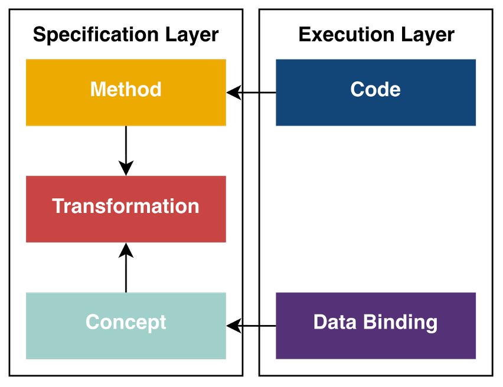

# `define.yaml` vs. the AC/DC framework

*A comparison of two LinkML-rooted approaches to clinical metadata, walked through the Change From Baseline derivation and the ANCOVA-on-CFB analysis.*

| | |
|---|---|
| **Status** | Draft |
| **Date** | 2026-06-01 |
| **Audience** | AC/DC working group; reviewers deciding whether to converge on `define.yaml` |
| **Scope** | Method / Analysis / Transformation layer of the AC framework, compared against `define.yaml`. The Item / ItemGroup / Dataset / Dataflow parts of `define.yaml` are summarised but not compared in detail. |

---

## 0. Executive summary

### 0.1 The structural argument — Specification Layer vs. Execution Layer

The AC framework draws an explicit line between two layers:



```text
┌── Specification Layer ──┐   ┌── Execution Layer ──┐
│                         │   │                     │
│   ┌───────────────┐     │   │   ┌─────────────┐   │
│   │    Method     │◄────┼───┼───│    Code     │   │
│   └───────┬───────┘     │   │   └─────────────┘   │
│           │             │   │                     │
│   ┌───────▼───────┐     │   │                     │
│   │ Transformation│     │   │                     │
│   └───────▲───────┘     │   │                     │
│           │             │   │                     │
│   ┌───────┴───────┐     │   │   ┌─────────────┐   │
│   │    Concept    │◄────┼───┼───│ Data Binding│   │
│   └───────────────┘     │   │   └─────────────┘   │
│                         │   │                     │
│   implementation-       │   │   implementation-   │
│   agnostic              │   │   bound             │
└─────────────────────────┘   └─────────────────────┘
```

The two layers and their narrow contact points are deliberate:

- **Specification Layer** (left): `Method`, `Transformation`, `Concept`. Implementation-agnostic by construction. A `Method` (`M.ANCOVA`) doesn't know what concept it will operate on; a `Concept` (`Change`) doesn't know which physical column it will project to; a `Transformation` (`T.CFB_ANCOVA`) binds Method to Concept but still references neither code nor column names.
- **Execution Layer** (right): `Code` and `Data Binding`. Implementation-bound. *Code* picks the actual R / SAS / Python implementation of a method; *Data Binding* projects a concept onto specific SDTM / ADaM columns. The dataContracts model (`docs/dataContracts-approach.md` §8.4) names additional Execution-Layer artefacts: the SDTM-tables projection, the ADaM-tables projection, the ARS-package projection, the FHIR projection, the OMOP-CDM projection, and **the Define-XML projection** — all generated from the Specification Layer + DC graph, all implementation-bound.
- **The contact points are narrow and one-directional**: Code implements Method (Execution reads from Spec); Data Binding attaches data to Concept (Execution reads from Spec). The Specification Layer never reaches into the Execution Layer. A Concept does not know its target columns; a Method does not know its compiled R code; a Transformation does not know what dataset its output lives in.

**`define.yaml` does not respect this boundary.** Its abstract primitives (`Method`, `ReifiedConcept`, `Analysis`, `FormalExpression`) look Specification-Layer-shaped — but every FK chain in a usable Define instance eventually terminates at `Item` (with `dataType`, `length`, `displayFormat`, `codeList`, `origin.sourceItems[]`) and `ItemGroup` (with `domain: "ADVS"`, `observationClass`, `keySequence`), which are pure Execution-Layer concepts. The Define schema *flattens the two layers into one type system*. A `Method` that doesn't bind to an `Item` accomplishes nothing in Define; an `Item` without `dataType` and `length` is not a Define-XML-compliant submission element. The two layers are fused **by design** — because Define's job is to describe the submission artefact, which sits entirely in the Execution Layer.

There is no subset of `define.yaml` that retains the AC framework's Specification / Execution separation. Even using only `ReifiedConcept` + `Method` + `FormalExpression` (the seemingly abstract primitives) requires references to `Item` / `Parameter.items` once you want to actually express anything that does work. The flattening is structural, not accidental.

### 0.2 Therefore — Define is a projection target, never an authoring layer

The architectural fit follows directly:

- The **Specification Layer** stays where it is: AC framework (`lib/methods/*`, `lib/transformations/*`, `lib/concepts/*`) + USDM (study design) + eSAP (analysis plan) + the controlled terminology you're building. Concept-bound, physical-agnostic. The concept-free Method rule lives here, schema-enforced.
- The **Execution Layer** carries the Code (engine + generated SAS / R / Python) and the Data Bindings (`concept-variable-mappings.json` as projection rules; SDTM-tables projection; ADaM-tables projection; **Define-XML / Define-JSON projection**; ARS, FHIR, OMOP projections).
- The **engine's lineage record** is what mediates between Spec and Execution. The dataContracts approach (`docs/dataContracts-approach.md` — DC URIs + DP graph with `derives_from` edges) is *one* implementation choice for that record, optional alongside tabular engines with sidecar lineage manifests, concept-cube engines, and hybrid stores; the AC Specification Layer is the same regardless. The dataContracts choice is the natural fit for a true digital data flow because it makes lineage machine-queryable end-to-end, lets every submission/exchange projection fall out of the same graph (so SDTM, ADaM, Define-XML, ARS, FHIR, and OMOP cannot drift from each other or from the data), and gives every value a stable identifier across studies (so multi-study pooling is structural, not a JOIN reconstruction). Where the rest of this document writes "the DC graph", read it as shorthand for *the engine's lineage record* in whichever implementation you pick.
- `define.yaml` lives entirely on the Execution Layer side, *one* generated artefact among the projection siblings. It is required (FDA submissions need it) but not elevated.

The recommendation in §7-§8 thus reduces to: **build a projection generator** that emits Define-XML / Define-JSON from the engine's lineage record alongside the SDTM-tables / ADaM-tables / ARS / FHIR / OMOP generators. The generator inherits the SDMX, PROV, ODM, and schema-level USDM mappings the AC libraries don't carry (per §6.1), uses Define's class-level `exact_mappings` to satisfy LinkML→RDF tooling for free, and never feeds back into the Specification Layer.

### 0.3 What this means for the rest of the document

The two-walkthrough analysis (§2, §3), the gain/loss inventories (§5, §6), and the audit of standards mappings (§6.1) all sit *underneath* this structural argument. They explain *why* particular Define elements look attractive — but every "gain" in the §6 inventory is a gain *for the Execution Layer projection*, not for the Specification Layer. Read with that distinction in mind, several items in §6 are not gains over the dataContracts model upstream (most notably §6.4 — `Origin` is derivable from upstream metadata, not a primitive that needs storing).

---

## 1. The two models, in one diagram

```text
DEFINE.YAML  (one schema, ~50 classes)            AC FRAMEWORK  (stacked schemas)
───────────────────────────────────────────       ────────────────────────────────────────────
                                                  acdc_method.yaml
                              ┌── Method ──┐         Method, MethodInput, MethodOutput,
                              │  Analysis  │         Formula, Configuration
                              │  Formal-   │         "concept-free" — enforced by absence
                              │  Expression│         of any concept-typed slot
GovernedElement ──┬── Item ───┘  Parameter │
                  ├── ItemGroup ─┐         │      acdc_transformation.yaml
                  ├── Data-      │  Reified-       Transformation
                  │   Structure- │  Concept          inputDataStructure  ─┐
                  │   Definition │  Concept-         outputDataStructure ─┴── twin qb:DSDs
                  ├── Dataflow ──┘  Property         Input/OutputMeasureBinding,
                  ├── Dataset                        Input/OutputDimensionBinding,
                  ├── Dimension                      Slice, SliceConstraint, SliceKey
                  ├── Measure                        XOR rule: concept | conceptCategory
                  └── CubeComponent              lib/concepts/
                                                    Option_B_Clinical.json (Derivation
SDMX / qb / FHIR / OMOP / USDM /                    Concepts: Measure, Change, …)
ODM / NCIt / PROV mappings                          AC_Concept_Model_v017.json (Analysis
on most classes                                     Concepts: LSMeans, Contrasts, Type3-
                                                    Tests, ParameterEstimates, …)

                                                  lib/concepts/concept-variable-mappings.json
                                                    sdtm.concepts.Change → "CHG"
                                                    adam.concepts.Change → "CHG"
                                                    (the SDTM/ADaM ↔ concept bridge)
```

Both stacks ultimately project onto an **RDF Data Cube** (`qb:DataStructureDefinition` / `qb:dimension` / `qb:measure` / `qb:Slice` / `qb:SliceKey`). That convergence is the alignment seam exploited in §6.

---

## 2. Walkthrough A — Change From Baseline (derivation)

The same derivation expressed in both models, side by side.

### 2.1 AC framework

Three artefacts collaborate:

**`lib/methods/derivations/M_Subtraction.json`** — concept-free arithmetic primitive.

```jsonc
{
  "conceptId": "M.Subtraction",
  "name": "Subtraction",
  "formula": {
    "notation": "assignment",
    "generic_expression": "result := <minuend> - <subtrahend>"
  },
  "inputs":  [{ "name": "minuend", "dataType": "decimal", "cardinality": "single" },
              { "name": "subtrahend", "dataType": "decimal", "cardinality": "single" }],
  "outputs": [{ "name": "result", "output_type": "computed_value",
                "dataType": "decimal", "unit_policy": "preserved" }]
}
```

No mention of *baseline*, *visit*, *parameter*, or *CHG*. This file is reusable for any subtraction — date differences, residuals, anything.

**`lib/transformations/ACDC_Transformation_Library_v06.json` → `T.ChangeFromBaseline`** — the binding layer.

```jsonc
{
  "conceptId":          "T.ChangeFromBaseline",
  "label":              "Change From Baseline",
  "shortLabel":         "CFB",
  "transformationType": "derivation",
  "usesMethod":         "M.Subtraction",
  "methodConfigurations": [],

  "inputDataStructure": {
    "dimensions": [
      { "concept": "Subject" },
      { "conceptCategory": "ParameterDimension" },
      { "conceptCategory": "VisitDimension" }
    ],
    "measures": [
      { "input": "minuend",    "concept": "Measure", "requiredValueType": "Quantity",
        "slice": "endpoint" },
      { "input": "subtrahend", "concept": "Measure", "requiredValueType": "Quantity",
        "slice": "parameter_baseline" }
    ],
    "slices": [
      { "name": "endpoint",
        "constraints": [
          { "dimension": "ParameterDimension", "value": "{parameter}" },
          { "dimension": "VisitDimension",     "value": "{visit}" }
        ] },
      { "name": "parameter_baseline",
        "constraints": [
          { "dimension": "ParameterDimension", "value": "{parameter}" },
          { "dimension": "VisitDimension",     "value": "{baseline_visit}" }
        ] }
    ]
  },

  "outputDataStructure": {
    "dimensions": [
      { "concept": "Subject" },
      { "conceptCategory": "ParameterDimension" },
      { "conceptCategory": "VisitDimension" }
    ],
    "measures": [
      { "output": "result", "concept": "Change" }
    ]
  },

  "sliceKeys": [
    { "dimension": "ParameterDimension", "source": "biomedicalConcept" },
    { "dimension": "VisitDimension",     "source": "visit" }
  ]
}
```

The two slices `endpoint` and `parameter_baseline` are the only place "baseline" exists; their *diff* (one `{visit}`, the other `{baseline_visit}`) is the load-bearing signal that says "subtract the baseline value from the current value." The method has no idea it's being used for CFB. The cube structure is twin `qb:DataStructureDefinition` blocks (each 1:1 with `qb:DataStructureDefinition`); slice templates live inside `inputDataStructure.slices[]`; the output binding's `concept` ("Change") identifies what the produced cube represents; the rendered phrase is composed at display time from `validSmartPhrases[]` × `sliceKeys[]`-bound values.

**`lib/concepts/Option_B_Clinical.json` → `Change`** — the semantic anchor.

```jsonc
"Change": {
  "definition": "The arithmetic difference between two values of the same parameter.",
  "math": "x − x_ref",
  "result": { "valueType": "NumericValue", "unit": "inherited" }
}
```

**`lib/concepts/concept-variable-mappings.json` → `adam.concepts.Change`** — the projection to ADaM.

```jsonc
"Change": { "variable": "CHG", "byDataType": { "decimal": "CHG" },
            "notes": "Change from baseline" }
```

So the chain is `M.Subtraction` (math) → `T.ChangeFromBaseline` (the *baseline* binding + a `Subject × Parameter × Visit` cube) → `Change` (the AC/DC semantic concept) → `CHG` (the ADaM column). Each file owns one thing, and the validator's job (§6.6 of the method-schema spec) is to check the FK joins.

### 2.2 `define.yaml` equivalent

`define.yaml` does not provide M / T / Concept / Mapping as four separate files. The closest single-file expression is:

- A `Method` instance for the *arithmetic itself*, with a `FormalExpression` carrying the assignment and `Parameter` instances for `minuend` / `subtrahend`.
- An `Item` representing `CHG`, whose `method:` slot points at that `Method` instance and whose `conceptProperty:` slot points at a `ConceptProperty` (e.g. `BC_VS_SBP_change.value`).
- The encompassing `ItemGroup` (the `ADaM BDS DSD` for ADVS — modelled as `DataStructureDefinition` with `dimensions: [USUBJID, PARAMCD, AVISIT]` and `measures: [AVAL, BASE, CHG, ...]`).
- The `Method` may carry `implementsConcept:` pointing at a `ReifiedConcept` named `Change` (which would replicate `Option_B_Clinical.json`'s `Change` entry as a Define `ReifiedConcept`).
- The whole thing wrapped in a `MetaDataVersion` (the root of any Define instance) carrying `itemGroups[]`, `items[]`, `methods[]`, `concepts[]`, `standards[]`, etc.

The two-block snippet above (`M.CHG.SBP` + `Item.CHG`) is **abridged** — it shows only the slots that line up directly with AC, omitting the wrapping containers and the source-side `Item`s. A more complete shape:

```yaml
# Define-yaml top-level wrapper. Every Item / Method / ItemGroup lives inside one of these.
- id: MDV.ACME_001.v1
  studyOID: ACME-001
  protocolName: "ACME-001 Hypertension Phase III"
  standards:
    - { OID: STD.ADaMIG, name: ADaMIG,  publishingSet: ADaM, version: "1.3", status: FINAL }
    - { OID: STD.SDTMIG, name: SDTMIG,  publishingSet: SDTM, version: "3.4", status: FINAL }

  # Semantic concept layer — what AC keeps in Option_B_Clinical.json.
  concepts:
    - id: RC.Change
      label: Change
      description: "Arithmetic difference between two values of the same parameter."
      properties:
        - id: CP.Change.value
          label: "Value of the change"
          # ConceptProperty: minOccurs / maxOccurs / codeList go here.

  # Reusable derivation primitive — concept-free in spirit (no implementsConcept set).
  methods:
    - id: M.Subtraction
      type: Computation
      expressions:
        - id: E.Sub.assignment
          expression: "result := minuend - subtrahend"
          parameters:
            - { name: minuend,    dataType: float, required: true }
            - { name: subtrahend, dataType: float, required: true }
          returnValue: { id: RV.Sub, dataType: float }

    # Study-bound binding — where AC has T.ChangeFromBaseline.
    # Define collapses transformation + study binding into one Method per binding.
    - id: M.CHG.SBP
      type: Computation
      implementsConcept: RC.Change        # FK to ReifiedConcept above
      wasDerivedFrom: M.Subtraction       # provenance — this binds the primitive
      expressions:
        - id: E.CHG.SBP.assignment
          expression: "CHG := AVAL - BASE"
          parameters:
            - { name: minuend,    items: [Item.AVAL] }
            - { name: subtrahend, items: [Item.BASE] }
          returnValue: { id: RV.CHG.SBP, dataType: float }

  # ADaM BDS DSD — the output cube. ItemGroup is the Define construct that plays
  # the role of AC's outputDataStructure (with structure = "DataCube" giving it
  # the dimensions/measures shape via the DataStructureDefinition subclass).
  itemGroups:
    - id: IG.ADVS
      name: "Vital Signs Analysis Dataset"
      domain: ADVS
      type: DataCube
      structure: "ADaM BDS — one record per subject, parameter, visit"
      observationClass: { name: Findings }
      keySequence: [Item.USUBJID, Item.PARAMCD, Item.AVISITN]
      items:
        - { id: Item.STUDYID, dataType: text,    length: 12, origin: { type: Collected } }
        - { id: Item.USUBJID, dataType: text,    length: 30, origin: { type: Collected } }
        - { id: Item.PARAMCD, dataType: text,    length: 8,  origin: { type: Assigned } }
        - { id: Item.AVISIT,  dataType: text,    length: 40, origin: { type: Derived  } }
        - { id: Item.AVISITN, dataType: integer,            origin: { type: Derived  } }
        - { id: Item.AVAL,    dataType: float,              origin: { type: Predecessor, sourceItems: [ { item: Item.VSSTRESN } ] } }
        - { id: Item.BASE,    dataType: float,              origin: { type: Derived,     sourceItems: [ { item: Item.AVAL } ] } }
        - id: Item.CHG
          dataType: float
          method: M.CHG.SBP                     # FK to the Method above
          conceptProperty: CP.Change.value      # FK to the ConceptProperty above
          origin:
            type: Derived
            sourceItems:
              - { item: Item.AVAL }
              - { item: Item.BASE }

    # The SDTM source — same structure, also an ItemGroup.
    - id: IG.VS
      domain: VS
      type: Table
      structure: "SDTM Findings — one record per subject, test, position, time-point"
      observationClass: { name: Findings }
      keySequence: [Item.USUBJID, Item.VSTESTCD, Item.VISITNUM, Item.VSDTC]
      items:
        - { id: Item.VSTESTCD, dataType: text, length: 8,  origin: { type: Collected } }
        - { id: Item.VSSTRESN, dataType: float,            origin: { type: Collected } }
        - { id: Item.VSSTRESC, dataType: text, length: 20, origin: { type: Collected } }
        # ... full Findings variable list
```

So the right way to read the abridged "two-block" example earlier is: *those are the two new objects Define needs to add to an existing `MetaDataVersion`, given that the encompassing `IG.ADVS` and the source `Item.AVAL` / `Item.BASE` already exist.*

#### What is the same (CFB)

- `FormalExpression.expression` corresponds to the AC method's `formula.generic_expression`. (The Define expression is a concrete code string; the AC one is a symbolic template — see §3.4.)
- `Parameter` corresponds to `MethodInput`. Both carry name + dataType + binding.
- `Method.implementsConcept → ReifiedConcept` corresponds to `binding.concept = "Change"`.
- `ItemGroup` of type `DataCube` with `dimensions / measures` corresponds to the AC transformation's `inputDataStructure` / `outputDataStructure`.

#### What changes shape (CFB)

| AC artefact | `define.yaml` location | Comment |
|---|---|---|
| `M.Subtraction` (concept-free) | A *generic* `Method` instance, possibly without `implementsConcept` set | Define allows this — but does not require it. There is no rule that says "a Method MUST NOT reference a ReifiedConcept." |
| `T.ChangeFromBaseline` | A bespoke `Method` per parameter, OR a single `Method` plus per-`Item` rebinding | Define has no first-class "transformation" object; the binding lives on the `Item.method` reference and the `FormalExpression.parameters[].items`. |
| Twin `inputDataStructure` / `outputDataStructure` blocks | Two `DataStructureDefinition`s, one per `Dataflow` (or `Dataset.structuredBy`) | The twin-DSD shape lines up almost 1:1 with Define's pattern of a `Dataflow` referencing an input and an output `Dataset`, each `structuredBy → DataStructureDefinition`. This is the closest direct correspondence in the whole comparison. |
| `inputDataStructure.measures[].input: "minuend"` / `outputDataStructure.measures[].output: "result"` | `FormalExpression.parameters[].name` / `FormalExpression.returnValue.id`, with `parameters[].items → Item` | Both sides FK the method's input/output slot names; both validate against the method definition at build time. |
| `slice = parameter_baseline` (in `inputDataStructure.slices[]`) | A `WhereClause` containing `Condition`s on `PARAMCD` and `AVISIT`, attached either to a `Parameter` (`applicableWhen`) or used as a `qb:SliceKey` analogue | Define has `WhereClause`, `Condition`, `RangeCheck`, and `qb:SliceKey` listed under `Condition.related_mappings` — but no concrete `Slice` class with a templated value like `{baseline_visit}`. |
| `sliceKeys[].source = "biomedicalConcept" \| "visit" \| "population"` | No direct equivalent | This is the AC-specific contract that *the endpoint spec supplies the slice values*. Define-yaml doesn't speak about endpoints. |
| `requiredValueType: Quantity` on the binding | `Item.dataType` + Item's link to FHIR Quantity (via `narrow_mappings: fhir:StructureDefinition/variable`) | Define expresses type constraints on the `Item`, not on the binding. |
| `_w3c_alignment` block at the top of the transformation library file | Mappings declared inline on each class (`exact_mappings: qb:DataStructureDefinition`, etc.) | The alignment block is conceptually equivalent to Define's `exact_mappings` — both say "this AC/Define construct is a qb thing." Define puts it on the class; the AC library puts it once at file scope. |

#### What is lost going from AC → Define (CFB)

1. **The concept-free invariant for methods.** In AC, `M.ANCOVA.json` *cannot* mention `Change` — there is no slot to hold it. In Define, `Method.implementsConcept` is always available, so a sponsor could publish `M.ANCOVA_for_change_in_SBP` and Define would accept it. The reusability discipline becomes a convention, not a schema rule.
2. **The transformation as an addressable object.** `T.ChangeFromBaseline` has its own OID, its own `composedPhrase`, its own `validSmartPhrases`. In Define, the binding is implicit in `Item.method` + `FormalExpression.parameters`; you can't grant or revoke it as a unit, and there's no `composedPhrase`-like field at all.
3. **The endpoint-spec coupling (`sliceKeys[].source`).** Slice values like `{baseline_visit}` flow from a USDM endpoint at study time. Define has no slot that says "this dimension is bound at endpoint-pick time."

#### What is gained going from AC → Define (CFB)

1. **Per-element audit / governance fields.** Needs nuance — AC already has identifier and governance metadata, just not the full Define set:

   - AC carries (on every method/transformation): `conceptId` (= Define's `OID`, just renamed and pattern-validated as `M.*` / `T.*`), `name`, `label`, `description`, `ncitCode`, `codings[]`, `schema_version` (the LinkML version the instance conforms to). The transformation library file carries `version`.
   - AC transformations carry `usesMethod` — a typed FK that plays the role of `wasDerivedFrom` for the Method→Transformation relationship.
   - AC **lacks**: `mandatory` (per-element required-in-this-context flag), `comments[]` / `siteOrSponsorComments[]` (per-element review annotations), `lastUpdated` (per-element timestamp), `owner` (typed User / Organization attribution), generic `wasDerivedFrom` (Define's `Governed` mixin makes this available on *every* governed element, not just transformation→method), and `deprecated`.

   Versioning and provenance in AC live in git history and the `schema_version` field. For the use cases the AC framework targets (cross-study method libraries that change rarely), git-history versioning is sufficient and matches how the library is reviewed. For standards-package distribution to downstream consumers who expect machine-readable audit trails on every element, Define's per-element governance fields are what those consumers expect to find.
2. **Multilingual labels and `aliases[]`.** Define's `Labelled` mixin makes `label`, `description`, `aliases` all able to be `TranslatedText` polymorphically. AC's labels are plain `range: string` with no `TranslatedText` alternative and no `aliases[]` slot on the method or transformation schemas. If labels ever need to be rendered in Japanese or Chinese for trial-master-file consumption, AC has no current path.
3. **Schema-level standards mappings on every class.** Each Define class declares `exact_mappings` / `close_mappings` / `narrow_mappings` against SDMX, qb, FHIR, OMOP, USDM, ODM, NCIt, and PROV. The AC framework already maps qb (class-level in `acdc_transformation.yaml` + file-level `_w3c_alignment`), FHIR (value types in concept results + the §6.6 rule 10 compatibility table), OMOP (top-level section in `concept-variable-mappings.json`), and NCIt (per-concept `code` blocks) — these are equivalent in *coverage*, but Define puts them on the class metadata so LinkML→RDF tooling consumes them directly, whereas AC puts them in the data instances. AC genuinely lacks: SDMX (no `sdmx:*` references at all), PROV (no machine-readable provenance vocabulary), ODM (no round-trip), and schema-level USDM linkage. See §6.1 for the full audit.
4. **Origin & traceability** — *not* a gain in the dataContracts architecture. Define's `Origin.type` (Collected / Derived / Assigned / Predecessor / Protocol / NotAvailable / Other) and `sourceItems[]` are *derivable* from upstream metadata: USDM (`Collected` ⇐ BC bound to ScheduledActivityInstance; `Protocol` ⇐ bound to StudyDesign), the AC transformation library (`Derived` ⇐ has a `T.*` in lineage; `sourceItems[]` ⇐ the transformation's input bindings), and `concept-variable-mappings.json` (`Predecessor` ⇐ direct projection rule; `Assigned` ⇐ CodeList lookup). The Define projection generator computes `Origin` at emission time; it isn't authored. See §6.4 for the full table.

---

## 3. Walkthrough B — ANCOVA on Change From Baseline (analysis)

### 3.1 AC framework

**`lib/methods/analyses/M_ANCOVA.json`** — concept-free statistical primitive.

```jsonc
{
  "conceptId": "M.ANCOVA",
  "name": "Analysis of Covariance",
  "label": "ANCOVA",
  "formula": {
    "notation": "wilkinson_rogers",
    "generic_expression": "<response> ~ <covariate>* + <fixed_effect>+ + ..."
  },
  "configurations": [
    { "name": "ss_type", "dataType": "enum",
      "enumValues": ["I","II","III","IV"], "defaultValue": "III" },
    { "name": "alpha",   "dataType": "decimal", "defaultValue": 0.05 }
  ],
  "inputs":  [
    { "name": "response",     "dataType": "decimal", "cardinality": "single" },
    { "name": "covariate",    "dataType": "decimal", "cardinality": "multiple" },
    { "name": "fixed_effect", "dataType": "code",    "cardinality": "multiple" }
  ],
  "outputs": [
    { "name": "fit_statistics_linear",    "output_type": "fit_statistics_linear" },
    { "name": "type3_tests_f",            "output_type": "type3_tests_f",
      "indexed_by": ["covariate","fixed_effect","fixed_effect:fixed_effect","covariate:fixed_effect"] },
    { "name": "parameter_estimates_linear","output_type": "parameter_estimates_linear" },
    { "name": "ls_means",                  "output_type": "ls_means",
      "indexed_by": ["fixed_effect"] },
    { "name": "contrasts_t",               "output_type": "contrasts_t",
      "indexed_by": ["fixed_effect"] }
  ]
}
```

Nothing here says "change from baseline", "treatment", or "site". The five outputs are statistical *patterns* indexed by formula slot names.

**`T.CFB_ANCOVA`** — the binding.

```jsonc
{
  "conceptId":          "T.CFB_ANCOVA",
  "label":              "Change From Baseline ANCOVA",
  "shortLabel":         "CFB ANCOVA",
  "transformationType": "analysis",
  "usesMethod":         "M.ANCOVA",
  "methodConfigurations": [
    { "configurationName": "ss_type", "value": "III" }
  ],

  "inputDataStructure": {
    "dimensions": [
      { "input": "fixed_effect", "concept": "Treatment" },
      { "concept": "Subject" },
      { "conceptCategory": "ParameterDimension" },
      { "conceptCategory": "VisitDimension" }
    ],
    "measures": [
      { "input": "response",  "concept": "Change",  "requiredValueType": "Quantity",
        "slice": "endpoint" },
      { "input": "covariate", "concept": "Measure", "requiredValueType": "Quantity",
        "slice": "parameter_baseline" }
    ],
    "slices": [
      { "name": "endpoint",
        "constraints": [
          { "dimension": "ParameterDimension", "value": "{parameter}" },
          { "dimension": "VisitDimension",     "value": "{visit}" },
          { "dimension": "Population",         "value": "{population}" }
        ] },
      { "name": "parameter_baseline",
        "constraints": [
          { "dimension": "ParameterDimension", "value": "{parameter}" },
          { "dimension": "VisitDimension",     "value": "{baseline_visit}" },
          { "dimension": "Population",         "value": "{population}" }
        ] }
    ]
  },

  "outputDataStructure": {
    "dimensions": [
      { "concept": "Treatment" },
      { "concept": "Subject" },
      { "conceptCategory": "ParameterDimension" },
      { "conceptCategory": "VisitDimension" }
    ],
    "measures": [
      { "output": "ls_means",                   "concept": "LSMeans" },
      { "output": "contrasts_t",                "concept": "Contrasts" },
      { "output": "type3_tests_f",              "concept": "Type3Tests" },
      { "output": "parameter_estimates_linear", "concept": "ParameterEstimates" },
      { "output": "fit_statistics_linear",      "concept": "FitStatistics" }
    ]
  },

  "sliceKeys": [
    { "dimension": "ParameterDimension", "source": "biomedicalConcept" },
    { "dimension": "VisitDimension",     "source": "visit" },
    { "dimension": "Population",         "source": "population" }
  ]
}
```

This single object encodes: *ANCOVA, with response = the Change concept (which T.ChangeFromBaseline produced), with the baseline value of the same parameter as covariate, with planned treatment as the fixed effect, at one analysis visit, in one population, using SS type III*. Producing the same ANCOVA on the raw (unsubtracted) value would be a different transformation but the same method.

Two details worth highlighting about this shape:

- The five method outputs `ls_means`, `contrasts_t`, `type3_tests_f`, `parameter_estimates_linear`, `fit_statistics_linear` each bind to the corresponding AC result pattern via `output` + `concept`. The mapping between method-output slot and AC result pattern IS the output-measure binding list.
- Both inputs cite a named slice (`endpoint` for the response, `parameter_baseline` for the covariate). The diff between the two slices (`{visit}` vs `{baseline_visit}`) is the load-bearing signal that says "the covariate is the baseline value of the same parameter and population as the response."

The analysis concepts the outputs map onto (`LSMeans`, `Contrasts`, `Type3Tests`, `ParameterEstimates`, `FitStatistics`) live in `AC_Concept_Model_v017.json` and define *what statistical objects look like* (constituents and dimensions) independently of the method that produced them.

### 3.2 `define.yaml` equivalent

`define.yaml` has an `Analysis` class explicitly for this — `Analysis is_a Method` plus `analysisReason`, `analysisPurpose`, `analysisMethod`, `applicableWhen`, `inputData`. A faithful instance:

```yaml
- id: A.CFB_ANCOVA.SBP.Week24
  name: ANCOVA on change from baseline in SBP at Week 24
  analysisPurpose: "Primary efficacy comparison"
  analysisMethod:
    - id: M.ANCOVA
      type: Analysis
      implementsConcept: ANCOVA   # ReifiedConcept
      expressions:
        - expression: "CHG ~ BASE + TRTP"
          parameters:
            - name: response,     items: [Item.CHG]
            - name: covariate,    items: [Item.BASE]
            - name: fixed_effect, items: [Item.TRTP]
  applicableWhen:
    - id: WC.ITT_Week24
      conditions:
        - { item: Item.ITTFL,  comparator: EQ, checkValues: ["Y"] }
        - { item: Item.AVISIT, comparator: EQ, checkValues: ["Week 24"] }
  inputData:
    - id: IG.ADVS_BDS         # ItemGroup with dimensions+measures
```

#### What is the same (ANCOVA CFB)

- `Analysis.analysisMethod` is the AC `usesMethod` FK.
- The formula text in `FormalExpression.expression` is the AC `formula.default_expression`.
- `Parameter.items` (which references an `Item` or `Dimension` or `Measure`) is the AC binding's `methodRole → concept` link.
- `Analysis.applicableWhen → WhereClause → Condition → RangeCheck` is how Define expresses the AC `sliceKeys` / `slice.constraints`.
- `Analysis.inputData → ItemGroup | Dataset` is the AC `inputDataStructure`.

#### What changes shape (ANCOVA CFB)

| AC artefact | `define.yaml` location | Comment |
|---|---|---|
| `M.ANCOVA` (concept-free, statistical generic) | A `Method` instance, possibly tagged `implementsConcept: ANCOVA` | Same problem as §2.2: nothing in Define stops a sponsor from collapsing M and T into one statement (`A.CFB_ANCOVA.SBP.Week24` above already does it implicitly — there is no separate ANCOVA-without-context object). |
| `outputs[]` with `output_type` into `output_class_templates.json` (template by *statistical shape*) | `ReturnValue` plus `Item`s in the output `ItemGroup` (a `Dataset` typed as `DataCube`) | Define's output shape is enumerated as concrete `Item`s. The AC layer-1 / layer-2 / layer-3 templates (statistic / pattern / instance) are not modelled as such — though `ReifiedConcept` plus `ConceptProperty` could carry the same info if you reified the patterns. |
| Output measure bindings `{output: "ls_means", concept: "LSMeans"}` (one per method-output slot) | One `Item` per output column in the output `ItemGroup`, each with `conceptProperty → LSMeans.<constituent>` | Define expresses each column individually; AC binds the *method-output slot* directly to the *AC result pattern*, and the validator chain-resolves the per-statistic columns from the pattern's `constituents[]` against `statistics_vocabulary.json`. |
| `methodConfigurations[].configurationName="ss_type", value="III"` | `Parameter.value` on a `FormalExpression` parameter | Define's `Parameter` is overloaded: it can be a formula token AND a configuration value-holder. AC keeps these in separate arrays (`inputs[]` vs `configurations[]`), which is easier to validate and easier to render. |
| Twin `inputDataStructure` + `outputDataStructure` with explicit dim duplication | One `Analysis.inputData → ItemGroup` \| `Dataset` plus an output `ItemGroup`, each with its own DSD | Both schemas describe the consumed and produced cubes as independent DSDs. AC carries this duplication on purpose ("the price of qb fidelity"); Define does it because `Dataflow` already separates input from output. |
| `inputDataStructure.slices[]` with `{visit}` / `{baseline_visit}` placeholders | `WhereClause` + `Condition` + `RangeCheck` (no templating) | Define can express the literal version of either slice but does not have the *template* mechanism. The endpoint-driven binding (`sliceKeys[].source = "visit"`) has no Define counterpart. |
| `validSmartPhrases[]` (composed phrase rendered at display time from this list × sliceKey-bound values) | No equivalent slot | The rendered string is composed at display time from the SmartPhrase list and the sliceKey-bound values, never stored as data; Define has no slot for it on either side. |

#### What is lost going from AC → Define (ANCOVA CFB)

1. **Concept-free method discipline** (same point as §2.2 — louder here because analyses are where it matters most).
2. **Output decomposition into (class, shape, distribution).** `output_class_templates.json` decomposes every analysis output as a triple (e.g. `(ls_means, vector, none)` or `(type3_tests_f, vector, F)`). Define expresses outputs as `Item`s and leaves the statistical typology to documentation.
3. **The SmartPhrase / `composedPhrase` rendering contract.** Authors-of-protocols-see-and-edit-spec-as-text is a first-class concern in AC; in Define it would have to live in `comments` or `description`.
4. **Slice templates with parameterised placeholders.** AC's `Slice.constraints[].value = "{baseline_visit}"` is a *template*, not a literal. Define's `RangeCheck.checkValues` is a list of literal strings.

#### What is gained going from AC → Define (ANCOVA CFB)

1. **`analysisReason`, `analysisPurpose`, `applicableWhen`** — explicit narrative slots tied to USDM. AC carries this information on the eSAP / analysis-spec side rather than on the transformation schema; if submission consumers expect it on the per-analysis projection, Define has slots and AC routes it through the per-study spec.
2. **`Analysis is_a Method`** — Define gives Method and Analysis a shared schema surface via inheritance, so any feature added to `Method` is automatically available on `Analysis`. AC distinguishes the two using the `transformationType: "derivation" | "analysis"` discriminator on the transformation plus the `formula.notation` (`assignment` vs `wilkinson_rogers` vs `survival`) on the method; the same separation is expressed, but without the polymorphism a generic procedure that accepts "any Method" would inherit.
3. **`Display`** — first-class schema object for "the rendered output" (tables, listings, figures). AC has no equivalent at the schema level; ARS submissions and TLF rendering are downstream concerns handled by the ARS projection.

(`Dataflow` and `Origin.sourceItems` are *not* listed here. AC's Transformation is structurally equivalent to a `Dataflow` — input DSD + output DSD + method reference — so the schemas align on that axis. `Origin.sourceItems` and `Origin.type` are both derivable from upstream AC + USDM + projection-rule metadata, and the Define projection generator computes them at emission time rather than reading them as authored data; §6.4 has the full table.)

---

## 4. Concept and mapping comparison

### 4.1 Semantic concepts

| AC | Define.yaml |
|---|---|
| `lib/concepts/Option_B_Clinical.json` (DC: Measure, Change, PercentChange, Ratio, LogRatio, Shift, …) | `ReifiedConcept` instances (with `ConceptProperty` children for value/unit/baseline). `narrow_mappings: usdm:DerivationConcept`. |
| `lib/concepts/AC_Concept_Model_v017.json` (AC: LSMeans, Contrasts, Type3Tests, ParameterEstimates, FitStatistics — each with `constituents` and `dimensions`) | `ReifiedConcept` instances (with `ConceptProperty` children for each constituent). `narrow_mappings: usdm:AnalysisConcept`. |
| `lib/concepts/OC_Instance_Model_v016.json` (Observation Concepts) | `ReifiedConcept`. `narrow_mappings: usdm:BiomedicalConcept`. |

The AC choice to keep DC, AC, and OC in three separate JSON files (and to name them clinical-style: *Measure*, *Change*, *LSMeans* rather than statistical-style: *AbsoluteDifference*, *LeastSquaresMean*) is design, not necessity — `define.yaml` would happily accept all three as `ReifiedConcept` instances in one file, with `properties → ConceptProperty`. The `concept` field on AC bindings becomes a string FK into `ReifiedConcept.OID` in Define.

### 4.2 SDTM/ADaM ↔ concept mappings

`lib/concepts/concept-variable-mappings.json` is the AC framework's "Implementation" layer: it maps each concept (`Change`, `Measure`, `Shift`) to the ADaM variable (`CHG`, `AVAL`, `AVALC`) and, for SDTM, to facet → variable maps (`Identification.Topic → --TESTCD`).

`define.yaml` has *no equivalent file* but has the *mechanism* for it: each `Item` carries `conceptProperty: ConceptProperty`, so the same information can be expressed as `Item.CHG → ConceptProperty.Change.value` repeated across every ADaM / SDTM `ItemGroup`. The AC file is more compact (one entry per concept, varies by `byDataType`); the Define encoding is more explicit (one `Item` per variable per dataset, with `conceptProperty` plus `Origin.sourceItems`).

If you converged, the AC mapping file becomes a *generator* for Define-style `Item`s in the SDTMIG / ADaMIG standards packages.

### 4.3 Implementation-side coverage in `define.yaml`

Worth spelling out, since the worked examples in §2 / §3 focus on the Method / Analysis / Transformation layer and might give the impression that `define.yaml` stops at the abstract level. It doesn't. Implementation modelling — the SDTM / ADaM variables, the domains, the datasets, the controlled terminology — is in fact *the original purpose* of Define (the spec is named after Define-XML / Define-JSON, which exist to describe submission datasets). The relevant Define classes:

| Concern | Define class / slot | What it carries |
|---|---|---|
| The variable | `Item` | `dataType`, `length`, `codeList`, `displayFormat`, `decimalDigits`, `significantDigits`, `method`, `origin`, `applicableWhen`, `conceptProperty`, `rangeChecks` |
| The variable's data origin | `Item.origin: Origin` | `type: Collected \| Derived \| Assigned \| Predecessor \| Protocol \| Not Available \| Other`, `source: Investigator \| Sponsor \| Subject \| Vendor`, `sourceItems[]` (the chain of upstream Items this Item was derived from), supporting documents |
| The dataset / domain | `ItemGroup` | `domain` (e.g. `"ADVS"`, `"VS"`), `structure` (free-text or `TranslatedText` description, e.g. *"ADaM BDS — one record per subject, parameter, visit"*), `type: ItemGroupType` (`DataCube`, `Table`, `Object`, `DatasetSpecialization`, `ValueList`, `Section`, `Form`), `keySequence[]` (the dataset key — USUBJID + PARAMCD + AVISIT for BDS, etc.), `observationClass.name` + `subClasses[]` (Findings / Events / Interventions / Subject-Level — the CDISC GOC classification), `items[]`, `applicableWhen` (WhereClause-conditioned ItemGroups, the Define-XML mechanism for VLM) |
| Cube structure | `DataStructureDefinition is_a ItemGroup` | adds `dimensions: Dimension[]`, `measures: Measure[]`, `attributes: DataAttribute[]`, `grouping`, `evolvingStructure`. `Dimension` / `Measure` / `DataAttribute` `is_a CubeComponent` and each carry an FK back to an `Item` plus a `role`. |
| The standards context | `Standard` | `name: StandardName` (`SDTMIG`, `ADaMIG`, `CDASH`, `SEND`, `SDTMIG-AP`, `SENDIG-DART`, ...), `type: StandardType` (`CT`, `IG`), `publishingSet` (`SDTM`, `ADaM`, `DEFINE-XML`, `CDASH`, `SEND`), `version`, `status: DRAFT \| FINAL`, `href` |
| Controlled terminology | `CodeList` + `CodeListItem` | the NCI CT lookups (`NY`, `ETHNIC`, `ARM`, etc.) |
| Variable relationships (SDTM BC predicates) | `Relationship` | `subject` + `object` + `predicateTerm: PredicateTermEnum` (`IS_RESULT_OF`, `GROUPS_BY`, `IS_UNIT_FOR`, `IS_TIMING_FOR`, `IDENTIFIES`, ...) + `linkingPhrase: LinkingPhraseEnum` ("is the result of the test in:", "is the unit for the value in:", "groups values in:", ...) — the same vocabulary the SDTM BC model uses |
| The concrete dataset / file | `Dataset` + `Distribution` | `Dataset.structuredBy → DataStructureDefinition`, `describedBy → Dataflow`, `keys: SeriesKey \| GroupKey`, `distribution: Distribution[]` (the actual representations: CSV, JSON, FHIR, ...), `conformsTo` (Define-XML standard), `informationSensitivityClassification` |
| Per-record vs. per-dataset metadata | `DataAttribute` + `CubeComponent.missingHandling` + `imputation` | attributes for unit-of-measure flags, observation status, missing-value reasons; each one referenceable to an Item |

So a real Define instance of an ADaM ADVS dataset would include:
- An `ItemGroup IG.ADVS` with `domain: ADVS`, `type: DataCube` (so the BDS DSD shape works), `observationClass.name: Findings`, `keySequence` listing the BDS key, and an `items[]` array with every BDS variable.
- Per-variable: `dataType`, `length`, `codeList`, `origin.type` (`Collected` for STUDYID/USUBJID, `Assigned` for PARAMCD, `Derived` for AVISIT/AVAL/BASE/CHG, `Predecessor` when the value is copied verbatim from SDTM), and for derived variables `origin.sourceItems` pointing at the upstream SDTM `Item`s (e.g. `Item.CHG.origin.sourceItems = [Item.AVAL, Item.BASE]`, `Item.AVAL.origin.sourceItems = [Item.VSSTRESN]`).
- A sibling `ItemGroup IG.VS` for the SDTM source (Findings, Table-shaped), with its own items[] listing VS variables.
- A `Standard` reference for `SDTMIG v3.4` and another for `ADaMIG v1.3`.
- The `Method` instances referenced by `Item.method` (the derivation algorithms).
- The `ReifiedConcept` / `ConceptProperty` instances referenced by `Item.conceptProperty` (the BC semantic anchors).

This is materially what `concept-variable-mappings.json` encodes for AC — *which ADaM/SDTM variable carries which concept's value*, plus the variable's role and physical type — but Define expresses it per-variable on each `Item`, with a navigable `Origin.sourceItems` chain making the derivation lineage explicit. AC's mapping file is a compact "concept → variable name" lookup; Define's encoding is verbose-but-traceable.

The key point — and the reason §6.4 reframed `Origin` as *not* a gain — is that **Define's verbosity adds no new information**. The `Origin.type` label and the `sourceItems[]` chain are both derivable from the upstream metadata (USDM + transformation library + projection rules); the Define encoding is a *rendering* of that derived information at projection time, not a separate source of truth. AC's compact lookup answers "what variable holds this concept?" directly; the answer to "where did this variable's value come from?" falls out of the DC graph and the transformation library, and the Define projection generator stamps it onto the emitted `Item` objects. Both encodings are correct; only one needs to be authored.

---

## 5. What you would lose by adopting `define.yaml` wholesale

These are the things the AC framework gives you that `define.yaml` does not — in priority order.

### 5.1 Schema-enforced concept-free methods

The biggest one. `acdc_method.yaml` has **no slot** that could carry a concept reference. The constraint in §6.6 of the design spec — *"method files MUST NOT reference clinical concepts"* — is enforced by absence: there is nothing to violate. In `define.yaml`, `Method.implementsConcept` is always present, and `Analysis is_a Method` means analyses inherit it. The convention becomes a recommendation enforced only at review time, which is materially weaker.

### 5.2 The Method × Transformation orthogonal product

In AC, *N* methods × *M* concepts = *N×M* possible transformations, each addressable, configurable, and reviewable in isolation. The current library has 38 analysis methods and 21 derivation methods. The transformation library exploits this multiplicatively: `T.CFB_ANCOVA`, `T.CFB_MMRM_Primary`, `T.LOCF_Imputation`, `T.OS_LogRank`, … each one a thin pairing.

In `define.yaml`, a transformation has no first-class object: it is implicit in `Item.method + FormalExpression.parameters[].items`. To make CFB-ANCOVA addressable you create a per-study `Method` instance, which means the *N×M* matrix collapses to *one instance per study × per binding*. Reuse becomes file-copy reuse, not FK reuse.

### 5.3 The output decomposition vocabulary

AC's three axes from `output_class_templates.json` — class × shape × distribution — give every analysis output a *typed contract*: a Type-III F test is `(type3_tests_f, vector, F)`; an LS-mean is `(ls_means, vector, none)`; a CFB is `(computed_value, scalar, none)`. ARS consumers can validate the shape of every result without reading documentation. Define expresses the result as a `Dataset` of `Item`s; the typology lives in description text.

### 5.4 Slice templates and `sliceKeys[].source`

`{baseline_visit}` resolving to "the baseline visit declared in the endpoint spec at study-spec time" is an AC-specific contract. Define has `qb:SliceKey` listed as a mapping but no schema slot that says where the slice value comes from at study time.

### 5.5 Smart-phrase composability (`composedPhrase`, `validSmartPhrases`)

Authoring an analysis spec by typing *"change from baseline in {parameter} at {visit} comparing {treatment} groups using ANCOVA adjusting for baseline {parameter}"* and having a deterministic mapping to `T.CFB_ANCOVA` is unique to AC. Define has no slot for this.

### 5.6 Layered narrowness

`acdc_method.yaml` has 4 enums + 8 classes. `acdc_transformation.yaml` has 3 enums + 14 classes. Reviewers can hold each file in their head. `define.yaml` has ~30 enums and ~50 classes in one file; reviewers cannot.

---

## 6. What you would gain by adopting `define.yaml` wholesale

In priority order.

### 6.1 Uniform class-level standards mappings (and the two standards AC genuinely lacks)

This one needs nuance — AC is not a blank slate here. A fair accounting:

**Where AC already has the mapping:**

- **qb (RDF Data Cube)** — full class-level alignment in `acdc_transformation.yaml`: `class_uri: qb:DataStructureDefinition`, `slot_uri: qb:dimension`, `qb:measure`, `class_uri: qb:Slice`, `qb:SliceKey`, `qb:ComponentSpecification`, `qb:componentProperty`. Plus the file-level `_w3c_alignment` block in the transformation library. This is *structurally equivalent* to Define's `exact_mappings: qb:DataStructureDefinition` etc. — no gain from Define on the qb axis.
- **FHIR** — FHIR complex types (`Quantity`, `CodeableConcept`, `Count`, `Duration`) drive the method-output `dataType` compatibility table (§6.6 rule 10) and the per-concept `result.valueType` in `Option_B_Clinical.json` / `AC_Concept_Model_v017.json`. `concept-variable-mappings.json` has a top-level `fhir` section. Define carries `narrow_mappings: fhir:*` on its classes; both stacks express FHIR alignment, just at different layers.
- **OMOP** — `concept-variable-mappings.json` has a top-level `omop` section mirroring `sdtm` and `adam`. Define has `narrow_mappings: omop:Transformation`, `omop:Field`, `omop:Table` on its classes. Same coverage, different layer.
- **NCIt** — every concept in DC / AC / OC carries a `code: { system: "NCI", value }` slot. Heavy use.
- **STATO** — referenced in `acdc_method.yaml`'s `codings[]` slot for statistical methods.

**Where AC genuinely lacks the mapping:**

- **SDMX** — no `sdmx:*` references anywhere in the AC schemas or library. Define has `sdmx:DataStructureDefinition`, `sdmx:Dimension`, `sdmx:Measure`, `sdmx:Concept`, `sdmx:DataConstraint`, `sdmx:Dataflow`, `sdmx:JsonDataset`, … on most classes. This is a real gap.
- **PROV** — nuanced. AC has no explicit `prov:*` vocabulary in its schemas. But the *data-level* provenance Define renders as `prov:wasDerivedFrom` (i.e. the lineage between a derived value and its sources) is fully derivable from the DC graph's `derives_from` edges plus the transformation library's input bindings — exactly the same logic as Define's `Origin.sourceItems` (see §6.4). The projection generator can emit PROV triples without AC ever storing them. What remains a genuine gap is *library-element* provenance ("who created `M.ANCOVA` on what date?") — Define's `Governed.owner` / `lastUpdated` would carry that as data; AC defers it to git history. So: PROV-as-data-lineage is not a gap; PROV-as-library-authorship is.
- **ODM** — Define has `exact_mappings: odm:MethodDef`, `odm:ItemRef`, `odm:ItemGroupDef`, `odm:FormalExpression` everywhere; AC has no ODM references. Matters if you ever need ODM round-trip.
- **USDM** — Define has `narrow_mappings: usdm:BiomedicalConcept`, `usdm:AnalysisConcept`, `usdm:DerivationConcept`, `usdm:StudyDesign`. AC has *behavioural* USDM linkage (the endpoint-spec drives the sliceKey sources) but no schema-level `usdm:` mappings.

**What's genuinely different** when AC and Define both map the same standard (qb, FHIR, OMOP, NCIt):

- **AC carries the mapping at the data layer** — per-concept `code` blocks, per-output `valueType`, per-target sections in the mappings file. Compact and study-author-friendly.
- **Define carries the mapping at the schema layer** — class-level `exact_mappings` / `close_mappings` / `narrow_mappings` URIs that LinkML-to-RDF / LinkML-to-JSON-Schema tooling consumes directly. This is what produces the "drop in a LinkML processor, get RDF" workflow.

So the genuine gain on standards is narrow: **(a)** schema-level uniformity (every Define class declares its mapping URIs in one place, so a LinkML processor emits qb-/FHIR-/OMOP-compliant output without per-class wiring), and **(b)** the two specific standards AC doesn't cover (SDMX, PROV) plus ODM and stronger USDM. For the standards both stacks address (qb, FHIR, OMOP, NCIt), the alignment is present in both — AC at the data layer, Define at the class layer.

### 6.2 Per-element review and audit fields

`Governed` mixin (`mandatory`, `comments`, `siteOrSponsorComments`, `purpose`, `lastUpdated`, `owner`, `wasDerivedFrom`) makes per-element audit data uniformly available across every governed element. AC carries the identification side (`conceptId`, `name`, `label`, `description`, `ncitCode`, `codings[]`, `schema_version`, plus `usesMethod` as a typed derivation FK on transformations); what is distinctively Define is the **review/audit trail** (`mandatory`, `comments`, `siteOrSponsorComments`, `lastUpdated`, `owner`). For cross-study library files reviewed in git, AC's posture is sufficient; for standards-package distribution to downstream consumers, the per-element trail is the gap.

### 6.3 Multilingual labels and aliases

`Labelled` mixin makes `label`, `description`, `aliases` `TranslatedText`-capable. AC labels are plain strings; no `aliases[]` slot exists in the AC method or transformation schemas. Material gap for non-English trial-master-file consumption.

### 6.4 `Origin` + `SourceItem` per-variable lineage (derivable from upstream metadata)

Define's `Origin.type` enum (`Collected` / `Derived` / `Assigned` / `Predecessor` / `Protocol` / `Not Available` / `Other`) and `sourceItems[]` chain are entirely *derivable* from metadata the AC + USDM + dataContracts stack maintains:

| Define `Origin.type` | Derivable from |
|---|---|
| `Collected` | Concept bound to a `usdm:ScheduledActivityInstance` (BC at a SoA point) |
| `Derived` | Concept has a `T.*` transformation in its lineage / DC has `derives_from` edges |
| `Assigned` | Value comes from a CodeList lookup or a CRF label binding |
| `Predecessor` | Item is a direct projection of another Item (`AVAL ← VSSTRESN` via `concept-variable-mappings.json`) |
| `Protocol` | Item bound to a `usdm:StudyDesign` element (arm, epoch, planned treatment) |
| `Not Available` / `Other` | Negative space; computable by exclusion |

`Origin.sourceItems[]` is the same picture: the `derives_from` edges in the DC graph. The Define projection generator computes both at emission time; they're never authored.

Storing `Origin` as a primary, hand-authored field — which is the workflow today's Define-XML uses, and which Define's schema enables — is precisely the failure mode `docs/dataContracts-approach.md` §8.4 calls out:

> *"Those three artifacts drift independently — the SAS program changes but the Define-XML annotation doesn't, or the ADaM spec evolves but the Origin element isn't updated."*

The dataContracts approach fixes this *not* by adopting `Origin` as a stored field at the authoring layer, but by **deriving it from the graph at projection time**. The Define-XML projection generator (§7.2) is the only place `Origin` exists; it's read, not written.

### 6.5 First-class `Display`

`Display` is a first-class schema object for "the rendered output" (tables, listings, figures). AC has nothing equivalent at the schema level — ARS submissions and TLF rendering live downstream of the framework. (`Dataflow` is not listed here: AC's Transformation is structurally a `Dataflow` — twin DSDs + analysisMethod — so the two schemas align on that axis.)

### 6.6 `Condition` / `WhereClause` / `RangeCheck` composability

AC's `slice.constraints` are flat (a list of `{ dimension, value }`). Define's `Condition` / `WhereClause` / `RangeCheck` support nesting, operators (AND/OR/NOT/EXPRESSION), reusable OIDs, and formal-expression escapes for the corner cases. The AC slice mechanism would benefit from this composability when validation rules get more complex.

### 6.7 Standards-package shape

Define is designed to be the publishing format for CDISC standards packages (SDTMIG, ADaMIG, CDASH, Define-XML). Sponsors already speak it. If the AC framework is to be ratified as a CDISC standard, expressing the *standards-package projection* in `define.yaml` reduces the learning curve. (The library files themselves stay AC-native; only the standards-package distribution shape is Define.)

---

## 7. Alignment options

### 7.0 Framing — Define is a projection, not an authoring layer

A position the rest of §7 depends on. `docs/dataContracts-approach.md` §8.4 puts SDTM / ADaM / Define-XML / ARS / FHIR / OMOP on the same footing: each is an *auto-generated projection* of the concept-anchored DC + DP graph. None of them is the source of truth. The authoring surface is:

- **Cross-study libraries** (concept-bound, physical-agnostic): `lib/methods/*`, `lib/transformations/*`, `lib/concepts/*`.
- **Per-study spec**: USDM (study design) + eSAP (executable Statistical Analysis Plan). The eSAP references the library transformations and binds them to the study's endpoints, visits, and populations.

From those, the engine generates the DC graph; from the DC graph it projects whichever physical realizations are needed for submission and downstream use. Define-XML is one such projection — required because FDA expects it, structurally no different from the SDTM-tables projection or the FHIR projection.

This reframes what the §7 options are. The question is not *"do we adopt Define as our spec format?"* (no, that conflicts with the dataContracts model on two fronts — it's a study instance, and it's physical-bound). The question is *"how do we build the Define projection generator and what does its relationship to the authoring layer look like?"*

The three options below now read as three different placements for the Define generator.

### 7.1 Status quo — hand-author Define-XML at submission time

Keep the AC framework and the dataContracts pipeline as-is. When a study reaches submission, hand-author the Define-XML (as today). **Cost**: Define drifts from the DC graph it should describe — exactly the failure mode `dataContracts-approach.md` §8.4 calls out (*"Those three artifacts drift independently … reviewers reading the submission package have to compare them and reconcile"*). Acceptable as a transitional state, untenable long-term.

### 7.2 Build a Define-XML projection generator from the DC graph (recommended near-term)

Add a generator that emits Define-XML / Define-JSON from the DC + DP graph — one of N projection generators (alongside SDTM tables, ADaM tables, ARS packages, FHIR resources, OMOP CDM). The twin-DSD shape of the transformation library makes the metadata side near-mechanical:

- `lib/methods/M_*.json` → `Method` instances on the emitted MetaDataVersion (with `implementsConcept` left null to mark them concept-free). Library-side; emitted once per Standards package (ADaMIG, SDTMIG, …).
- `lib/transformations/T.*` → a `Dataflow` whose input cube's DSD is generated from `inputDataStructure`, whose output cube's DSD is generated from `outputDataStructure`, and whose `analysisMethod` references the named `Method` (with `methodConfigurations[]` projected onto `FormalExpression.parameters[].value`). For `transformationType: analysis`, also emit an `Analysis` instance with `analysisMethod` set.
- `lib/concepts/{Option_B_Clinical,AC_Concept_Model,OC_Instance_Model}.json` → `ReifiedConcept` instances; emitted once into the standards package.
- **The per-study `MetaDataVersion`** is generated from the eSAP + USDM (study design, study-bound endpoints) and the DC graph. Items in `IG.ADVS`, `IG.ADSL`, `IG.VS`, … are emitted from the projection rules in `concept-variable-mappings.json` applied to the DCs the study spec declares.
- `Item.origin.sourceItems` chains are emitted from the DC graph's `derives_from` edges (see `docs/dataContracts-approach.md` §8.4 — the chain is structural, not narrative). Define-XML's Origin and Method elements stop being hand-authored.
- `inputDataStructure.slices[]` `{placeholder}` values are resolved against the eSAP-bound endpoint at projection time; what gets emitted into Define is the literal `WhereClause` + `Condition` + `RangeCheck` for the bound parameter/visit/population, not the template.
- `sliceKeys[].source` is *not* emitted into Define directly — it's a property of the authoring layer that drove the projection, not a property of the projection itself. The bound values appear in the emitted `WhereClause`.
- The library's `_w3c_alignment` block has no representation on the Define side; Define's class-level `exact_mappings: qb:DataStructureDefinition` etc. provide the same information automatically on emission.

**Gain over Option 7.1**: the submission Define-XML is structurally derived from the same DC graph that produces SDTM/ADaM. Drift between Define and the data it describes becomes impossible. Per `docs/dataContracts-approach.md` §8.4: *"every claim in the Define-XML is backed by a URI that resolves to a structural lineage chain"*.

**Cost**: a generator with tests; ongoing maintenance when either schema evolves; explicit handling of the cases the dataContracts model exposes that Define-XML can't represent without extensions (e.g. value-set IDs that aren't NCI codes, FHIR-only types when projecting a study into the FHIR target).

### 7.3 Migrate AC schemas to inherit from Define classes (longer-term)

Rewrite `acdc_method.yaml` and `acdc_transformation.yaml` so their root classes `is_a` Define classes. The twin-DSD shape makes the inheritance graph particularly clean:

- `acdc_method.Method` (renamed something like `ACDCMethod`) `is_a: define.Method` with `implementsConcept` *removed* via `slot_usage`. (LinkML supports overriding a parent slot to be forbidden; the validator checks this.)
- `acdc_method.MethodInput` `is_a: define.Parameter`.
- `acdc_method.MethodOutput` `is_a: define.ReturnValue` (or a new `ItemGroup`-like class for structured outputs).
- `acdc_transformation.Transformation` `is_a: define.Dataflow` (since the §6 shape now declares an input DSD, an output DSD, and a method — exactly what `Dataflow` carries). For `transformationType: "analysis"`, it would additionally project to a `define.Analysis` instance with `analysisMethod` set.
- `acdc_transformation.InputDataStructure` / `OutputDataStructure` `is_a: define.DataStructureDefinition` (1:1, no slot adaptation needed).
- `acdc_transformation.InputMeasureBinding` / `InputDimensionBinding` `is_a: define.CubeComponent` (which already extends `GovernedElement` and references `Item`).
- `acdc_transformation.Slice` `is_a: define.WhereClause` (plus the placeholder extension).
- `acdc_transformation.SliceKey` — no Define parent; an AC-specific extension.

**Gain**: one schema, one validator, AC-extracted SDMX/qb/FHIR mappings preserved across the layered enforcement. The twin-DSD shape inherits Define's mappings on `DataStructureDefinition` automatically.

**Cost**: schema redesign, file regeneration, validator rewrite. The concept-free rule on `Method` is preserved by `slot_usage: { implementsConcept: { required: false, equals_string: "" } }` plus a build-time rule; that's a structural pattern Define currently doesn't use but LinkML supports. The `_w3c_alignment` block at the top of the transformation library file becomes redundant (the class-level Define mappings replace it).

A reasonable plan: do 7.2 immediately (low effort, immediate interoperability) and pre-commit to 7.3 only after the AC framework's own semantics (output decomposition, slice templates, smart phrases) are formalised enough that the inheritance map is clear.

---

## 8. Recommendation

Adopt **Option 7.2** now and **plan for 7.3** once two AC-side designs settle:

1. **Output decomposition** (`output_class_templates.json`) is currently AC-only. If it stabilises, propose adding three axes (`OutputClass`, `OutputShape`, `Distribution` — they're already enums in `acdc_method.yaml`) into Define as `ReifiedConcept` categories so structured analysis outputs are typeable across both schemas.
2. **Slice templates** (`{baseline_visit}` etc.) and `sliceKeys[].source` are also AC-only and have no Define analogue. Either:
   - propose them as a Define extension (e.g. a `Slice` class with `constraints: SliceConstraint[]` carrying templated values, parallel to AC), or
   - keep them as AC-private extensions of `WhereClause` and accept that AC artefacts round-trip through Define only with a `comments` field carrying the AC encoding.

You are not missing anything material *for the current AC framework's job* by not having adopted Define. What you would gain is **publishability**: SDMX / qb / FHIR / USDM / PROV mappings on every element, a multilingual labelling story, full audit fields, and a path to express the AC library as a Define-JSON / Define-XML deliverable. What you would lose if you adopted Define naïvely (no extensions, no `slot_usage` overrides) is the very thing that makes the AC framework distinctive: the schema-enforced separation of *math* from *meaning*. The recommendation is to keep that separation as the authoring discipline, and to use Define as the publication and interoperability surface.

---

## Appendix — file index referenced

| File | Role |
|---|---|
| `define.yaml` | Single-schema metadata model (LinkML, ~2,560 lines) with SDMX/qb/FHIR/OMOP/USDM/ODM/NCIt/PROV mappings. |
| `model/linkML/acdc_method.yaml` | LinkML schema for AC methods. Encodes §3 of the method-schema design spec. |
| `model/linkML/acdc_transformation.yaml` | LinkML schema for AC transformations. Encodes §6 (Option B — strict twin DSDs). |
| `model/json_schema/acdc_method.schema.json` | Generated JSON Schema from `acdc_method.yaml`. |
| `model/json_schema/acdc_transformation.schema.json` | Generated JSON Schema from `acdc_transformation.yaml`. |
| `lib/methods/analyses/M_ANCOVA.json` | Concept-free ANCOVA primitive. |
| `lib/methods/derivations/M_Subtraction.json` | Concept-free arithmetic primitive used by `T.ChangeFromBaseline`. |
| `lib/transformations/ACDC_Transformation_Library_v06.json` | All transformations; contains `T.ChangeFromBaseline` (§2.1) and `T.CFB_ANCOVA` (§3.1). |
| `lib/concepts/Option_B_Clinical.json` | Derivation Concepts (Measure, Change, PercentChange, …). |
| `lib/concepts/AC_Concept_Model_v017.json` | Analysis Concepts (LSMeans, Contrasts, Type3Tests, …) plus categories (TreatmentComparison, …). |
| `lib/concepts/OC_Instance_Model_v016.json` | Observation Concepts. |
| `lib/concepts/concept-variable-mappings.json` | SDTM / ADaM ↔ concept mappings. |
