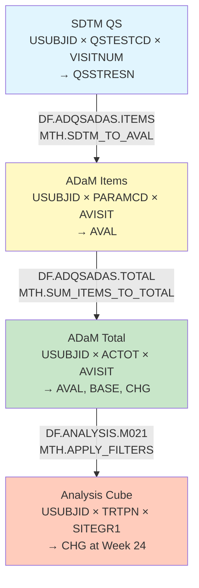

# Define-JSON: DataFlow and Analysis Data Cubes

## Overview

This document explains how to use **Dataflow**, **DataStructure**, and **CubeComponent** classes in Define-JSON to model the transformation from source data to analysis datasets. These SDMX-inspired structures capture how data flows through the analysis pipeline and how dimensions change at each stage.

**Key Concepts**:
- **Dataflow**: Describes data supply and consumption patterns
- **DataStructure**: Defines the dimensional structure of a dataset
- **CubeComponent**: Individual dimensions, measures, and attributes
- **Dimensional Transformation**: How source dimensions map to analysis dimensions

---

## SDMX Integration Classes

### 1. Dataflow (Data Supply/Demand)

```json
{
  "OID": "DF.ADQSADAS",
  "name": "ADAS-Cog Analysis Dataflow",
  "label": "ADAS-Cog Questionnaire Analysis Data Flow",
  "description": "Flow of ADAS-Cog data from SDTM QS domain through ADaM transformations to analysis-ready structure",
  "structure": "IG.ADQSADAS",
  "version": "1.0",
  "status": "Final"
}
```

### 2. DataStructure (Referenced by ItemGroup)

```json
{
  "OID": "DS.ADQSADAS",
  "name": "ADQSADAS_Structure",
  "label": "ADAS-Cog Analysis Dataset Structure",
  "description": "Dimensional structure for ADAS-Cog analysis with subject, visit, parameter dimensions",
  "dimensions": [
    "DIM.USUBJID",
    "DIM.PARAMCD", 
    "DIM.AVISIT"
  ],
  "measures": [
    "MEAS.AVAL",
    "MEAS.BASE",
    "MEAS.CHG"
  ],
  "attributes": [
    "ATTR.AVALC",
    "ATTR.DTYPE",
    "ATTR.TRTP"
  ]
}
```

### 3. CubeComponent (Dimensions, Measures, Attributes)

**Dimension Components** (identify observations):
```json
{
  "OID": "DIM.USUBJID",
  "componentType": "Dimension",
  "item": "IT.ADQSADAS.USUBJID",
  "componentRole": "Identity",
  "description": "Subject identifier dimension"
}
```

**Measure Components** (quantify observations):
```json
{
  "OID": "MEAS.AVAL",
  "componentType": "Measure",
  "item": "IT.ADQSADAS.AVAL",
  "description": "Analysis value measure",
  "missingHandling": "omit",
  "imputation": "none"
}
```

**Attribute Components** (describe observations):
```json
{
  "OID": "ATTR.TRTP",
  "componentType": "Attribute",
  "item": "IT.ADQSADAS.TRTP",
  "attachmentLevel": "Observation",
  "description": "Planned treatment attribute"
}
```

---

## Example: ADAS-Cog Analysis Pipeline

### Stage 1: Source Data (SDTM QS Domain)

**Dataflow**: Raw data collection
```json
{
  "OID": "DF.QS.SOURCE",
  "name": "QS_Source_Dataflow",
  "label": "SDTM Questionnaire Source Data Flow",
  "description": "Raw questionnaire data from CRF collection",
  "structure": "IG.QS"
}
```

**Data Structure**: SDTM QS dimensions
```json
{
  "OID": "DS.QS",
  "name": "QS_Structure",
  "label": "SDTM Questionnaire Structure",
  
  "cubeComponents": [
    {
      "OID": "DIM.QS.USUBJID",
      "componentType": "Dimension",
      "componentRole": "Identity",
      "item": "IT.QS.USUBJID",
      "description": "Unique subject identifier"
    },
    {
      "OID": "DIM.QS.QSTESTCD",
      "componentType": "Dimension",
      "componentRole": "Qualifier",
      "item": "IT.QS.QSTESTCD",
      "description": "Question/item short name (e.g., QS01, QS02, ..., QS11)"
    },
    {
      "OID": "DIM.QS.VISITNUM",
      "componentType": "Dimension",
      "componentRole": "Time",
      "item": "IT.QS.VISITNUM",
      "description": "Visit sequence number"
    },
    {
      "OID": "MEAS.QS.QSSTRESN",
      "componentType": "Measure",
      "item": "IT.QS.QSSTRESN",
      "description": "Numeric result/score for each question item (0-5 scale)"
    },
    {
      "OID": "ATTR.QS.QSORRESU",
      "componentType": "Attribute",
      "item": "IT.QS.QSORRESU",
      "attachmentLevel": "Observation",
      "description": "Original units (typically empty for ADAS-Cog)"
    }
  ]
}
```

**Dimensional Shape**: Subject × Question × Visit
```
Dimensions: [USUBJID, QSTESTCD, VISITNUM]
Granularity: One row per subject per question item per visit
Example:
  USUBJID=01-001, QSTESTCD=QS01, VISITNUM=1, QSSTRESN=2
  USUBJID=01-001, QSTESTCD=QS02, VISITNUM=1, QSSTRESN=3
  ...
  USUBJID=01-001, QSTESTCD=QS11, VISITNUM=1, QSSTRESN=1
```

---

### Stage 2: Item-Level Analysis Dataset (ADQSADAS Items)

**Dataflow**: SDTM to ADaM item transformation
```json
{
  "OID": "DF.ADQSADAS.ITEMS",
  "name": "ADQSADAS_Items_Dataflow",
  "label": "ADAS-Cog Item-Level Analysis Data Flow",
  "description": "Transform SDTM QS to ADaM BDS structure with AVAL for each item",
  "structure": "IG.ADQSADAS.ITEMS",
  "provisionAgreements": [{
    "sourceDataflow": "DF.QS.SOURCE",
    "targetDataflow": "DF.ADQSADAS.ITEMS",
    "transformationMethod": "MTH.SDTM_TO_AVAL"
  }]
}
```

**Data Structure**: ADaM BDS with PARAMCD dimension
```json
{
  "OID": "DS.ADQSADAS.ITEMS",
  "name": "ADQSADAS_Items_Structure",
  "label": "ADAS-Cog Item-Level Structure",
  
  "cubeComponents": [
    {
      "OID": "DIM.USUBJID",
      "componentType": "Dimension",
      "componentRole": "Identity",
      "item": "IT.ADQSADAS.USUBJID"
    },
    {
      "OID": "DIM.PARAMCD",
      "componentType": "Dimension",
      "componentRole": "Qualifier",
      "item": "IT.ADQSADAS.PARAMCD",
      "description": "Parameter code (QS01-QS11 item codes)"
    },
    {
      "OID": "DIM.AVISIT",
      "componentType": "Dimension",
      "componentRole": "Time",
      "item": "IT.ADQSADAS.AVISIT",
      "description": "Analysis visit (Baseline, Week 2, Week 4, ..., Week 24)"
    },
    {
      "OID": "MEAS.AVAL",
      "componentType": "Measure",
      "item": "IT.ADQSADAS.AVAL",
      "description": "Analysis value (item score 0-5)",
      "missingHandling": "retain"
    },
    {
      "OID": "ATTR.TRTP",
      "componentType": "Attribute",
      "item": "IT.ADQSADAS.TRTP",
      "attachmentLevel": "Dataset",
      "description": "Planned treatment (constant for subject)"
    }
  ]
}
```

**Dimensional Transformation**:
```
Source (SDTM QS):
  [USUBJID × QSTESTCD × VISITNUM] → QSSTRESN

Target (ADaM Items):
  [USUBJID × PARAMCD × AVISIT] → AVAL

Mapping:
  QSTESTCD → PARAMCD (direct copy: QS01-QS11)
  VISITNUM → AVISIT (lookup: 1→"Baseline", 2→"Week 2", etc.)
  QSSTRESN → AVAL (direct copy with type standardization)
```

---

### Stage 3: Total Score Analysis Dataset (ADQSADAS Total)

**Dataflow**: Item aggregation to total score
```json
{
  "OID": "DF.ADQSADAS.TOTAL",
  "name": "ADQSADAS_Total_Dataflow",
  "label": "ADAS-Cog Total Score Analysis Data Flow",
  "description": "Aggregate 11 item scores to total score with baseline and change",
  "structure": "IG.ADQSADAS.TOTAL",
  "provisionAgreements": [{
    "sourceDataflow": "DF.ADQSADAS.ITEMS",
    "targetDataflow": "DF.ADQSADAS.TOTAL",
    "transformationMethod": "MTH.SUM_ITEMS_TO_TOTAL"
  }]
}
```

**Data Structure**: Reduced dimensions (no PARAMCD)
```json
{
  "OID": "DS.ADQSADAS.TOTAL",
  "name": "ADQSADAS_Total_Structure",
  "label": "ADAS-Cog Total Score Structure",
  
  "cubeComponents": [
    {
      "OID": "DIM.USUBJID",
      "componentType": "Dimension",
      "componentRole": "Identity",
      "item": "IT.ADQSADAS.USUBJID"
    },
    {
      "OID": "DIM.PARAMCD.TOTAL",
      "componentType": "Dimension",
      "componentRole": "Qualifier",
      "item": "IT.ADQSADAS.PARAMCD",
      "description": "Parameter code (fixed value: ACTOT)"
    },
    {
      "OID": "DIM.AVISIT",
      "componentType": "Dimension",
      "componentRole": "Time",
      "item": "IT.ADQSADAS.AVISIT"
    },
    {
      "OID": "MEAS.AVAL.TOTAL",
      "componentType": "Measure",
      "item": "IT.ADQSADAS.AVAL",
      "description": "Total score (sum of 11 items, range 0-70)",
      "missingHandling": "proportional_imputation"
    },
    {
      "OID": "MEAS.BASE",
      "componentType": "Measure",
      "item": "IT.ADQSADAS.BASE",
      "description": "Baseline total score",
      "missingHandling": "omit"
    },
    {
      "OID": "MEAS.CHG",
      "componentType": "Measure",
      "item": "IT.ADQSADAS.CHG",
      "description": "Change from baseline (AVAL - BASE)",
      "missingHandling": "omit"
    },
    {
      "OID": "ATTR.TRTP",
      "componentType": "Attribute",
      "item": "IT.ADQSADAS.TRTP",
      "attachmentLevel": "Dataset"
    }
  ]
}
```

**Dimensional Transformation**:
```
Source (ADaM Items):
  [USUBJID × PARAMCD × AVISIT] → AVAL
  where PARAMCD IN (QS01, QS02, ..., QS11)

Target (ADaM Total):
  [USUBJID × PARAMCD × AVISIT] → {AVAL, BASE, CHG}
  where PARAMCD = ACTOT

Aggregation:
  Sum 11 items → 1 total per subject per visit
  AVAL (total) = SUM(AVAL where PARAMCD in QS01-QS11)
  
New Measures:
  BASE = AVAL where AVISIT = "Baseline"
  CHG = AVAL - BASE
```

---

### Stage 4: Analysis Data Cube (Week 24 Efficacy Analysis)

**Dataflow**: Analysis-ready subset with population filters
```json
{
  "OID": "DF.ANALYSIS.M021",
  "name": "M021_Analysis_Dataflow",
  "label": "Week 24 Dose-Response Analysis Data Flow",
  "description": "Subset ADQSADAS total to Week 24 efficacy population for dose-response modeling",
  "structure": "IG.ANALYSIS.M021",
  "provisionAgreements": [{
    "sourceDataflow": "DF.ADQSADAS.TOTAL",
    "targetDataflow": "DF.ANALYSIS.M021",
    "transformationMethod": "MTH.APPLY_POPULATION_FILTERS"
  }]
}
```

**Data Structure**: Analysis-specific dimensions with treatment
```json
{
  "OID": "DS.ANALYSIS.M021",
  "name": "M021_Analysis_Structure",
  "label": "Dose-Response Analysis Structure",
  
  "cubeComponents": [
    {
      "OID": "DIM.USUBJID",
      "componentType": "Dimension",
      "componentRole": "Identity",
      "item": "IT.M021.USUBJID"
    },
    {
      "OID": "DIM.TRTPN",
      "componentType": "Dimension",
      "componentRole": "Treatment",
      "item": "IT.M021.TRTPN",
      "description": "Treatment as dimension (0, 5, 10 mg dose levels)"
    },
    {
      "OID": "DIM.SITEGR1",
      "componentType": "Dimension",
      "componentRole": "Stratification",
      "item": "IT.M021.SITEGR1",
      "description": "Site group for stratified analysis"
    },
    {
      "OID": "MEAS.CHG",
      "componentType": "Measure",
      "item": "IT.M021.CHG",
      "description": "Change from baseline at Week 24",
      "missingHandling": "omit"
    },
    {
      "OID": "ATTR.BASE",
      "componentType": "Attribute",
      "item": "IT.M021.BASE",
      "attachmentLevel": "Observation",
      "description": "Baseline value (used as covariate)"
    },
    {
      "OID": "ATTR.EFFFL",
      "componentType": "Attribute",
      "item": "IT.M021.EFFFL",
      "attachmentLevel": "Observation",
      "description": "Efficacy population flag (filter: = 'Y')"
    }
  ]
}
```

**Dimensional Transformation**:
```
Source (ADaM Total):
  [USUBJID × PARAMCD × AVISIT] → {AVAL, BASE, CHG}
  where PARAMCD = ACTOT

Target (Analysis Cube):
  [USUBJID × TRTPN × SITEGR1] → CHG
  
Filters Applied:
  AVISIT = "Week 24"
  PARAMCD = "ACTOT"
  EFFFL = "Y"
  ANL01FL = "Y"

Dimensional Changes:
  - PARAMCD dimension collapsed (single value: ACTOT)
  - AVISIT dimension collapsed (single value: Week 24)
  + TRTPN dimension added (from merge with ADSL)
  + SITEGR1 dimension added (from merge with ADSL)

Result:
  One row per subject in efficacy population
  Dimensions identify subject's treatment and site group
  Measure is change from baseline at Week 24
```

---

## Complete Dataflow Pipeline

### Visual Representation



### Dimensional Evolution Table

| Stage | Dimensions | Measures | Granularity | Row Count (est.) |
|-------|-----------|----------|-------------|------------------|
| SDTM QS | USUBJID, QSTESTCD, VISITNUM | QSSTRESN | Subject × Item × Visit | 254 subj × 11 items × 7 visits = 19,558 rows |
| ADaM Items | USUBJID, PARAMCD, AVISIT | AVAL | Subject × Parameter × Visit | 254 subj × 11 params × 7 visits = 19,558 rows |
| ADaM Total | USUBJID, PARAMCD, AVISIT | AVAL, BASE, CHG | Subject × ACTOT × Visit | 254 subj × 1 param × 7 visits = 1,778 rows |
| Analysis M021 | USUBJID, TRTPN, SITEGR1 | CHG | Subject × Treatment × Site | ~240 subj (efficacy pop) = 240 rows |

---

## Complete Define-JSON Example

```json
{
  "OID": "MDV.ADQSADAS.PIPELINE.v1",
  "name": "ADAS-Cog Analysis Pipeline",
  "label": "ADAS-Cog Data Flow and Dimensional Transformations",
  
  "dataflows": [
    {
      "OID": "DF.QS.SOURCE",
      "name": "QS_Source",
      "label": "SDTM QS Source Data Flow",
      "structure": "IG.QS"
    },
    {
      "OID": "DF.ADQSADAS.ITEMS",
      "name": "ADQSADAS_Items",
      "label": "Item-Level Analysis Data Flow",
      "structure": "IG.ADQSADAS.ITEMS",
      "provisionAgreements": [{
        "OID": "PA.QS.TO.ITEMS",
        "sourceDataflow": "DF.QS.SOURCE",
        "targetDataflow": "DF.ADQSADAS.ITEMS",
        "transformationMethod": "MTH.SDTM_TO_AVAL"
      }]
    },
    {
      "OID": "DF.ADQSADAS.TOTAL",
      "name": "ADQSADAS_Total",
      "label": "Total Score Analysis Data Flow",
      "structure": "IG.ADQSADAS.TOTAL",
      "provisionAgreements": [{
        "OID": "PA.ITEMS.TO.TOTAL",
        "sourceDataflow": "DF.ADQSADAS.ITEMS",
        "targetDataflow": "DF.ADQSADAS.TOTAL",
        "transformationMethod": "MTH.SUM_ITEMS_TO_TOTAL"
      }]
    },
    {
      "OID": "DF.ANALYSIS.M021",
      "name": "Analysis_M021",
      "label": "Week 24 Dose-Response Analysis Flow",
      "structure": "IG.ANALYSIS.M021",
      "provisionAgreements": [{
        "OID": "PA.TOTAL.TO.ANALYSIS",
        "sourceDataflow": "DF.ADQSADAS.TOTAL",
        "targetDataflow": "DF.ANALYSIS.M021",
        "transformationMethod": "MTH.APPLY_POPULATION_FILTERS"
      }]
    }
  ],
  
  "itemGroups": [
    {
      "OID": "IG.QS",
      "name": "QS",
      "label": "Questionnaire SDTM Domain",
      "domain": "QS",
      "type": "Collection",
      "dataflow": "DF.QS.SOURCE",
      "dataStructure": {
        "OID": "DS.QS",
        "dimensions": ["USUBJID", "QSTESTCD", "VISITNUM"],
        "measures": ["QSSTRESN"],
        "attributes": ["QSORRESU", "QSTEST"]
      }
    },
    {
      "OID": "IG.ADQSADAS.ITEMS",
      "name": "ADQSADAS_Items",
      "label": "ADAS-Cog Item-Level Analysis Dataset",
      "domain": "ADAS",
      "type": "Analysis",
      "dataflow": "DF.ADQSADAS.ITEMS",
      "dataStructure": {
        "OID": "DS.ADQSADAS.ITEMS",
        "dimensions": ["USUBJID", "PARAMCD", "AVISIT"],
        "measures": ["AVAL"],
        "attributes": ["AVALC", "TRTP", "DTYPE"]
      }
    },
    {
      "OID": "IG.ADQSADAS.TOTAL",
      "name": "ADQSADAS_Total",
      "label": "ADAS-Cog Total Score Analysis Dataset",
      "domain": "ADAS",
      "type": "Analysis",
      "dataflow": "DF.ADQSADAS.TOTAL",
      "dataStructure": {
        "OID": "DS.ADQSADAS.TOTAL",
        "dimensions": ["USUBJID", "PARAMCD", "AVISIT"],
        "measures": ["AVAL", "BASE", "CHG"],
        "attributes": ["TRTP", "EFFFL", "ANL01FL"]
      }
    },
    {
      "OID": "IG.ANALYSIS.M021",
      "name": "M_AC_021",
      "label": "Week 24 Dose-Response Analysis",
      "type": "Analysis",
      "dataflow": "DF.ANALYSIS.M021",
      "dataStructure": {
        "OID": "DS.ANALYSIS.M021",
        "dimensions": ["USUBJID", "TRTPN", "SITEGR1"],
        "measures": ["CHG"],
        "attributes": ["BASE", "EFFFL"]
      }
    }
  ],
  
  "cubeComponents": [
    {
      "OID": "DIM.USUBJID",
      "componentType": "Dimension",
      "componentRole": "Identity",
      "item": "IT.USUBJID",
      "description": "Unique subject identifier - primary dimension across all structures"
    },
    {
      "OID": "DIM.QSTESTCD",
      "componentType": "Dimension",
      "componentRole": "Qualifier",
      "item": "IT.QS.QSTESTCD",
      "description": "SDTM question item code (QS01-QS11)"
    },
    {
      "OID": "DIM.PARAMCD",
      "componentType": "Dimension",
      "componentRole": "Qualifier",
      "item": "IT.ADQSADAS.PARAMCD",
      "description": "ADaM parameter code (QS01-QS11 items, ACTOT total)"
    },
    {
      "OID": "DIM.VISITNUM",
      "componentType": "Dimension",
      "componentRole": "Time",
      "item": "IT.QS.VISITNUM",
      "description": "SDTM visit sequence number"
    },
    {
      "OID": "DIM.AVISIT",
      "componentType": "Dimension",
      "componentRole": "Time",
      "item": "IT.ADQSADAS.AVISIT",
      "description": "ADaM analysis visit (Baseline, Week 2, Week 4, Week 8, Week 16, Week 20, Week 24)"
    },
    {
      "OID": "DIM.TRTPN",
      "componentType": "Dimension",
      "componentRole": "Treatment",
      "item": "IT.ADSL.TRT01PN",
      "description": "Numeric treatment code (0=Placebo, 5=Low, 10=High)"
    },
    {
      "OID": "DIM.SITEGR1",
      "componentType": "Dimension",
      "componentRole": "Stratification",
      "item": "IT.ADSL.SITEGR1",
      "description": "Pooled site group for stratified analysis"
    },
    {
      "OID": "MEAS.QSSTRESN",
      "componentType": "Measure",
      "item": "IT.QS.QSSTRESN",
      "description": "SDTM numeric result (item score 0-5)"
    },
    {
      "OID": "MEAS.AVAL",
      "componentType": "Measure",
      "item": "IT.ADQSADAS.AVAL",
      "description": "Analysis value (item score or total score)",
      "missingHandling": "proportional_imputation"
    },
    {
      "OID": "MEAS.BASE",
      "componentType": "Measure",
      "item": "IT.ADQSADAS.BASE",
      "description": "Baseline value",
      "missingHandling": "omit"
    },
    {
      "OID": "MEAS.CHG",
      "componentType": "Measure",
      "item": "IT.ADQSADAS.CHG",
      "description": "Change from baseline",
      "missingHandling": "omit"
    }
  ],
  
  "methods": [
    {
      "OID": "MTH.SDTM_TO_AVAL",
      "name": "SDTM_to_AVAL",
      "label": "Map SDTM to ADaM Analysis Value",
      "type": "Transformation",
      "description": "Transform SDTM QS domain to ADaM BDS structure with AVAL",
      "expressions": [
        {
          "context": "SAS",
          "expression": "DATA adqsadas_items;\n  SET sdtm.qs;\n  PARAMCD = QSTESTCD;\n  AVAL = QSSTRESN;\n  /* Lookup AVISIT from VISITNUM */\n  IF VISITNUM = 1 THEN AVISIT = 'Baseline';\n  ELSE IF VISITNUM = 2 THEN AVISIT = 'Week 2';\n  /* ... additional visit mappings ... */\nRUN;",
          "parameters": [
            {"name": "source_domain", "value": "QS"},
            {"name": "target_dataset", "value": "ADQSADAS"}
          ]
        }
      ],
      "documents": [{
        "OID": "DOC.ADQSADAS.SPEC",
        "title": "ADQSADAS Dataset Specification"
      }]
    },
    {
      "OID": "MTH.SUM_ITEMS_TO_TOTAL",
      "name": "Sum_Items_to_Total",
      "label": "Aggregate Item Scores to Total",
      "type": "Computation",
      "description": "Sum 11 ADAS-Cog item scores to create total score (ACTOT)",
      "expressions": [
        {
          "context": "Python",
          "expression": "def sum_with_missing(scores):\n  n_present = scores.notna().sum()\n  if n_present >= 9:  # At least 9 of 11 items\n    return scores.sum() * (11 / n_present)\n  return np.nan\n\ntotal = items.groupby(['USUBJID', 'AVISIT']).apply(lambda x: sum_with_missing(x['AVAL']))",
          "parameters": [
            {"name": "min_items", "value": "9", "description": "Minimum items required (11-2)"},
            {"name": "total_items", "value": "11"}
          ]
        },
        {
          "context": "SAS",
          "expression": "PROC SQL;\n  CREATE TABLE adqsadas_total AS\n  SELECT USUBJID, AVISIT,\n    'ACTOT' AS PARAMCD,\n    CASE WHEN N(AVAL) >= 9\n      THEN SUM(AVAL) * (11 / N(AVAL))\n      ELSE . END AS AVAL\n  FROM adqsadas_items\n  WHERE PARAMCD IN ('QS01'-'QS11')\n  GROUP BY USUBJID, AVISIT;\nQUIT;",
          "parameters": [
            {"name": "item_range", "value": "QS01-QS11"}
          ]
        }
      ],
      "documents": [{
        "OID": "DOC.ADAS.SCORING",
        "title": "ADAS-Cog Scoring Rules"
      }]
    },
    {
      "OID": "MTH.APPLY_POPULATION_FILTERS",
      "name": "Apply_Population_Filters",
      "label": "Apply Analysis Population Filters",
      "type": "Selection",
      "description": "Filter to efficacy population at Week 24 and merge with ADSL for treatment/site variables",
      "expressions": [
        {
          "context": "SAS",
          "expression": "DATA analysis_m021;\n  MERGE adqsadas_total (WHERE=(AVISIT='Week 24' AND PARAMCD='ACTOT' AND EFFFL='Y' AND ANL01FL='Y'))\n        adsl (KEEP=USUBJID TRT01PN SITEGR1);\n  BY USUBJID;\nRUN;",
          "parameters": [
            {"name": "visit_filter", "value": "Week 24"},
            {"name": "param_filter", "value": "ACTOT"},
            {"name": "population_flags", "value": "EFFFL='Y' AND ANL01FL='Y'"}
          ]
        },
        {
          "context": "R",
          "expression": "analysis_m021 <- adqsadas_total %>%\n  filter(AVISIT == 'Week 24',\n         PARAMCD == 'ACTOT',\n         EFFFL == 'Y',\n         ANL01FL == 'Y') %>%\n  left_join(adsl %>% select(USUBJID, TRT01PN, SITEGR1),\n           by = 'USUBJID')",
          "parameters": [
            {"name": "merge_vars", "value": "TRT01PN, SITEGR1"}
          ]
        }
      ]
    }
  ]
}
```

---

## Key Patterns and Best Practices

### Pattern 1: Dataflow Chain

Each transformation is a separate Dataflow with explicit provenance:

```
DF.QS.SOURCE 
  → DF.ADQSADAS.ITEMS (via MTH.SDTM_TO_AVAL)
    → DF.ADQSADAS.TOTAL (via MTH.SUM_ITEMS_TO_TOTAL)
      → DF.ANALYSIS.M021 (via MTH.APPLY_POPULATION_FILTERS)
```

### Pattern 2: Dimensional Reduction

As data flows through pipeline, dimensions are progressively collapsed:

```
Stage 1: [USUBJID × QSTESTCD × VISITNUM]     (3 dimensions, 19,558 rows)
Stage 2: [USUBJID × PARAMCD × AVISIT]        (3 dimensions, 19,558 rows)
Stage 3: [USUBJID × PARAMCD × AVISIT]        (3 dimensions, 1,778 rows)
Stage 4: [USUBJID × TRTPN × SITEGR1]         (3 dimensions, 240 rows)
```

### Pattern 3: Measure Evolution

New measures are derived at each stage:

```
SDTM:        QSSTRESN (item score)
ADaM Items:  AVAL (standardized item score)
ADaM Total:  AVAL (total score), BASE (baseline), CHG (change)
Analysis:    CHG (filtered to Week 24)
```

### Pattern 4: Attribute Addition

Attributes are added via merges and derivations:

```
Stage 1: QSORRESU (collection metadata)
Stage 2: AVALC, DTYPE (analysis metadata)
Stage 3: EFFFL, ANL01FL (population flags)
Stage 4: BASE (covariate), treatment/site dimensions
```

---

## Benefits of DataFlow/CubeComponent Approach

1. **Explicit Lineage**: Dataflow chain documents complete transformation pipeline
2. **Dimensional Clarity**: CubeComponents make data structure explicit
3. **SDMX Alignment**: Enables statistical data exchange using standard patterns
4. **Traceability**: ProvisionAgreements link transformations to methods
5. **Validation**: Can validate dimensional compatibility across pipeline stages
6. **Documentation**: Clear specification for programmers and reviewers
7. **Reusability**: DataStructure definitions can be templates across studies
8. **Analysis Understanding**: Shows how raw data becomes analysis-ready

---

## Comparison: Source vs Analysis Dimensions

| Aspect | Source (SDTM QS) | Analysis (M_AC_021) |
|--------|------------------|---------------------|
| **Purpose** | Data collection | Statistical modeling |
| **Granularity** | Subject × Item × Visit | Subject × Treatment × Site |
| **Row Count** | ~19,558 | ~240 |
| **Key Dimensions** | QSTESTCD (11 values) | TRTPN (3 values) |
| | VISITNUM (7 values) | SITEGR1 (16 values) |
| **Measures** | QSSTRESN (raw score) | CHG (derived change) |
| **Filters** | None (complete data) | Week 24, Efficacy pop |
| **Additional Info** | Collection metadata | Treatment, stratification |
| **Use Case** | Archival, traceability | Hypothesis testing |

---

## Version History

- **v1.0** (2025-11-07): Initial documentation of DataFlow, DataStructure, and CubeComponent usage with dimensional transformation examples
