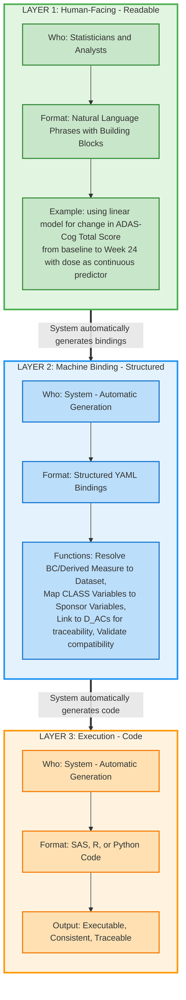

# Hybrid Phrase-Based Approach: Building Blocks with Bindings

## Executive Summary

This document demonstrates a **hybrid approach** to analysis specification that balances human readability with machine executability. The approach has three layers:

1. **Human-Facing Layer**: Natural language phrases composed from building blocks
2. **Machine Binding Layer**: Structured mappings to datasets, variables, and parameters
3. **Execution Layer**: Generated code (SAS, R, Python)

This example uses **M_AC_021 (ADAS-Cog Dose Response Analysis)** to show how complex statistical analyses can be expressed as phrases while remaining fully executable.

### Architecture Overview



**Key Insights:**

- ✅ **Phrases are readable but executable**: Human writes natural language, system ensures executability
- ✅ **Three layers separate concerns**: Readability (Layer 1), Data binding (Layer 2), Implementation (Layer 3)
- ✅ **Automation**: Human only interacts with Layer 1; Layers 2 & 3 are auto-generated

---

## 1. Building Block Library

Building blocks are atomic, reusable units that capture common analysis concepts. Each block has:
- A human-readable phrase template
- Typed slots that accept specific inputs
- Binding requirements (what data elements are needed)

### 1.1 Core Building Blocks

```yaml
# ============================================
# BUILDING BLOCK LIBRARY
# ============================================

BUILDING_BLOCKS:

  # -------------------- OUTCOME BLOCKS --------------------

  - BLOCK_ID: BB_OUTCOME_001
    BLOCK_NAME: "change_from_baseline"
    PHRASE_TEMPLATE: "change in {parameter} from baseline to {timepoint}"
    SLOTS:
      - parameter:
          type: "continuous_measure"
          description: "The measurement being assessed"
          required: true
      - timepoint:
          type: "temporal_reference"
          description: "The analysis timepoint"
          required: true
    BINDING_REQUIREMENTS:
      - variable:
          class: "CHG"
          data_type: "Numeric"
          description: "Change from baseline variable"
      - baseline_variable:
          class: "BASE"
          data_type: "Numeric"
      - analysis_value:
          class: "AVAL"
          data_type: "Numeric"
      - timepoint_variable:
          class: "AVISIT"
          data_type: "Character"
    STATISTICAL_ROLE: "dependent_variable"
    STATO_IRI: "http://purl.obolibrary.org/obo/STATO_0000175"

  - BLOCK_ID: BB_OUTCOME_002
    BLOCK_NAME: "absolute_value"
    PHRASE_TEMPLATE: "{parameter} at {timepoint}"
    SLOTS:
      - parameter:
          type: "continuous_measure"
          required: true
      - timepoint:
          type: "temporal_reference"
          required: true
    BINDING_REQUIREMENTS:
      - variable:
          class: "AVAL"
          data_type: "Numeric"
    STATISTICAL_ROLE: "dependent_variable"

  # -------------------- PREDICTOR BLOCKS --------------------

  - BLOCK_ID: BB_PREDICTOR_001
    BLOCK_NAME: "dose_continuous"
    PHRASE_TEMPLATE: "dose as continuous predictor"
    SLOTS: {}
    BINDING_REQUIREMENTS:
      - variable:
          class: "TRTPN"
          data_type: "Numeric"
          description: "Numeric treatment/dose variable"
    STATISTICAL_ROLE: "fixed_effect"
    STATO_IRI: "http://purl.obolibrary.org/obo/STATO_0000468"

  - BLOCK_ID: BB_PREDICTOR_002
    BLOCK_NAME: "treatment_categorical"
    PHRASE_TEMPLATE: "treatment groups"
    SLOTS: {}
    BINDING_REQUIREMENTS:
      - variable:
          class: "TRT01A"
          data_type: "Character"
    STATISTICAL_ROLE: "fixed_effect"
    STATO_IRI: "http://purl.obolibrary.org/obo/STATO_0000474"

  - BLOCK_ID: BB_PREDICTOR_003
    BLOCK_NAME: "covariate_categorical"
    PHRASE_TEMPLATE: "adjusting for {covariate}"
    SLOTS:
      - covariate:
          type: "categorical_variable"
          description: "Stratification or adjustment variable"
          required: true
    BINDING_REQUIREMENTS:
      - variable:
          class: "SITEGRy"
          data_type: "Character"
    STATISTICAL_ROLE: "fixed_effect"
    STATO_IRI: "http://purl.obolibrary.org/obo/STATO_0000468"

  # -------------------- POPULATION BLOCKS --------------------

  - BLOCK_ID: BB_POPULATION_001
    BLOCK_NAME: "analysis_population"
    PHRASE_TEMPLATE: "in {population_name} population"
    SLOTS:
      - population_name:
          type: "population_descriptor"
          required: true
          examples: ["efficacy", "safety", "intent-to-treat", "per-protocol"]
    BINDING_REQUIREMENTS:
      - flag_variable:
          role: "population_flag"
          data_type: "Character"
          values: ["Y", "N"]
      - selection_criterion:
          type: "equality_filter"
          format: "{flag_variable} = 'Y'"
    STATISTICAL_ROLE: "population_filter"

  - BLOCK_ID: BB_POPULATION_002
    BLOCK_NAME: "record_selection"
    PHRASE_TEMPLATE: "where {condition}"
    SLOTS:
      - condition:
          type: "logical_expression"
          required: true
    BINDING_REQUIREMENTS:
      - filter_variable:
          data_type: "Any"
      - comparison_operator:
          values: ["=", "!=", "<", ">", "<=", ">=", "IN"]
      - comparison_value:
          type: "literal_or_list"
    STATISTICAL_ROLE: "record_filter"

  # -------------------- TEMPORAL BLOCKS --------------------

  - BLOCK_ID: BB_TEMPORAL_001
    BLOCK_NAME: "at_timepoint"
    PHRASE_TEMPLATE: "at {timepoint}"
    SLOTS:
      - timepoint:
          type: "temporal_reference"
          required: true
          examples: ["Week 24", "Month 6", "End of Treatment", "Baseline"]
    BINDING_REQUIREMENTS:
      - timepoint_variable:
          class: "AVISIT"
          data_type: "Character"
      - selection_criterion:
          type: "equality_filter"
          format: "{timepoint_variable} = '{timepoint}'"
    STATISTICAL_ROLE: "temporal_filter"

  # -------------------- STATISTICAL METHOD BLOCKS --------------------

  - BLOCK_ID: BB_METHOD_001
    BLOCK_NAME: "linear_model"
    PHRASE_TEMPLATE: "using linear model"
    SLOTS: {}
    BINDING_REQUIREMENTS:
      - method_type:
          value: "linear_model"
      - formula_pattern:
          format: "OUTCOME ~ PREDICTOR1 + PREDICTOR2 + ..."
      - test_type:
          values: ["type3_ss", "type1_ss", "type2_ss"]
    STATISTICAL_ROLE: "analysis_method"
    STATO_IRI: "http://purl.obolibrary.org/obo/STATO_0000464"

  - BLOCK_ID: BB_METHOD_002
    BLOCK_NAME: "mixed_model"
    PHRASE_TEMPLATE: "using mixed model with {random_effects}"
    SLOTS:
      - random_effects:
          type: "variable_list"
          required: true
    BINDING_REQUIREMENTS:
      - method_type:
          value: "mixed_model"
      - random_structure:
          format: "RANDOM {variable_list}"
    STATO_IRI: "http://purl.obolibrary.org/obo/STATO_0000464"

  - BLOCK_ID: BB_METHOD_003
    BLOCK_NAME: "ancova"
    PHRASE_TEMPLATE: "using ANCOVA with baseline as covariate"
    SLOTS: {}
    BINDING_REQUIREMENTS:
      - method_type:
          value: "ancova"
      - baseline_covariate:
          class: "BASE"
    STATO_IRI: "http://purl.obolibrary.org/obo/STATO_0000039"

  # -------------------- OUTPUT/RESULT BLOCKS --------------------

  - BLOCK_ID: BB_RESULT_001
    BLOCK_NAME: "treatment_effect_estimate"
    PHRASE_TEMPLATE: "estimate of {effect_type} with standard error"
    SLOTS:
      - effect_type:
          type: "effect_descriptor"
          required: true
          examples: ["treatment effect", "dose effect", "time effect"]
    BINDING_REQUIREMENTS:
      - estimate_variable:
          role: "model parameter estimate"
          data_type: "Numeric"
      - se_variable:
          role: "standard error of estimate"
          data_type: "Numeric"
    OUTPUT_CARDINALITY: "multiple"  # estimate + SE
    STATO_IRI: "http://purl.obolibrary.org/obo/STATO_0000144"

  - BLOCK_ID: BB_RESULT_002
    BLOCK_NAME: "hypothesis_test"
    PHRASE_TEMPLATE: "test for {null_hypothesis} reporting {test_statistic} and p-value"
    SLOTS:
      - null_hypothesis:
          type: "hypothesis_statement"
          required: true
          examples: ["no treatment effect", "no dose-response", "equality of means"]
      - test_statistic:
          type: "statistic_type"
          required: true
          values: ["F-statistic", "t-statistic", "chi-square", "z-score"]
    BINDING_REQUIREMENTS:
      - test_stat_variable:
          role: "test statistic"
          data_type: "Numeric"
      - pvalue_variable:
          role: "p-value"
          data_type: "Numeric"
    OUTPUT_CARDINALITY: "multiple"
    STATO_IRI: "http://purl.obolibrary.org/obo/STATO_0000282"

  - BLOCK_ID: BB_RESULT_003
    BLOCK_NAME: "model_fit"
    PHRASE_TEMPLATE: "report model fit using {fit_measure}"
    SLOTS:
      - fit_measure:
          type: "goodness_of_fit_measure"
          required: true
          values: ["R-squared", "adjusted R-squared", "AIC", "BIC"]
    BINDING_REQUIREMENTS:
      - fit_variable:
          role: "goodness of fit measure"
          data_type: "Numeric"
    STATO_IRI: "http://purl.obolibrary.org/obo/STATO_0000564"
```

---

## 2. Phrase Composition Patterns

Building blocks compose into complete analysis phrases using standard patterns:

```yaml
# ============================================
# COMPOSITION PATTERNS
# ============================================

COMPOSITION_PATTERNS:

  - PATTERN_ID: COMP_001
    PATTERN_NAME: "Simple Analysis"
    STRUCTURE: "{METHOD} for {OUTCOME} in {POPULATION}"
    EXAMPLE: "Using linear model for change in ADAS-Cog from baseline to Week 24 in efficacy population"
    REQUIRED_BLOCKS:
      - BB_METHOD_*
      - BB_OUTCOME_*
      - BB_POPULATION_*

  - PATTERN_ID: COMP_002
    PATTERN_NAME: "Comparative Analysis"
    STRUCTURE: "{METHOD} comparing {OUTCOME} across {PREDICTOR} in {POPULATION}"
    EXAMPLE: "Using ANCOVA comparing change in weight across treatment groups in safety population"
    REQUIRED_BLOCKS:
      - BB_METHOD_*
      - BB_OUTCOME_*
      - BB_PREDICTOR_*
      - BB_POPULATION_*

  - PATTERN_ID: COMP_003
    PATTERN_NAME: "Adjusted Analysis"
    STRUCTURE: "{METHOD} for {OUTCOME} with {PREDICTOR} {COVARIATE} in {POPULATION} {TEMPORAL}"
    EXAMPLE: "Using linear model for change in ADAS-Cog with dose as continuous predictor adjusting for site group in efficacy population at Week 24"
    REQUIRED_BLOCKS:
      - BB_METHOD_*
      - BB_OUTCOME_*
      - BB_PREDICTOR_*
      - BB_PREDICTOR_003  # covariate
      - BB_POPULATION_*
      - BB_TEMPORAL_*

  - PATTERN_ID: COMP_004
    PATTERN_NAME: "Complete Specification"
    STRUCTURE: "{METHOD} for {OUTCOME} with {PREDICTOR} {COVARIATE} in {POPULATION} {TEMPORAL} {RECORD_FILTERS} reporting {RESULTS}"
    EXAMPLE: "Full statistical analysis specification with all components"
    REQUIRED_BLOCKS:
      - BB_METHOD_*
      - BB_OUTCOME_*
      - BB_PREDICTOR_*
      - BB_POPULATION_*
      - BB_TEMPORAL_*
      - BB_POPULATION_002  # record filters
      - BB_RESULT_*
```

---

## 3. M_AC_021 in Phrase-Based Format

Here's how the M_AC_021 dose-response analysis looks using the phrase-based approach:

### Rendered Phrase (Building Blocks in Bold)

Test for dose-response relationship **using linear model** for **change in ADAS-Cog (11) Total Score from baseline to Week 24** with **dose as continuous predictor** **adjusting for site group** **in efficacy population** **at Week 24** **where ADAS-Cog total score records are analyzed**, reporting **dose effect estimate with standard error**, **F-statistic, p-value**, and **R-squared**.

### YAML Specification

```yaml
# ============================================
# M_AC_021: ADAS-Cog Dose Response Analysis
# PHRASE-BASED SPECIFICATION
# ============================================

AC_ID: "M_AC_021"
AC_TEMPLATE: "T_AC_007"
AC_NAME: "ADAS-Cog Dose Response Analysis - Linear Model"

# -------------------- HUMAN-FACING LAYER --------------------

ANALYSIS_DESCRIPTION:
  PRIMARY_PHRASE: |
    Test for dose-response relationship **using linear model** for
    **change in ADAS-Cog (11) Total Score from baseline to Week 24**
    with **dose as continuous predictor** **adjusting for site group**
    **in efficacy population** **at Week 24** **where ADAS-Cog total score
    records are analyzed**, reporting **dose effect estimate with
    standard error**, **F-statistic, p-value**, and **R-squared**.

  DECOMPOSED_PHRASES:
    OUTCOME:
      block: BB_OUTCOME_001
      phrase: "change in ADAS-Cog (11) Total Score from baseline to Week 24"
      slots:
        parameter: "ADAS-Cog (11) Total Score"
        timepoint: "Week 24"

    PREDICTOR:
      block: BB_PREDICTOR_001
      phrase: "dose as continuous predictor"

    COVARIATE:
      block: BB_PREDICTOR_003
      phrase: "adjusting for site group"
      slots:
        covariate: "site group"

    POPULATION:
      block: BB_POPULATION_001
      phrase: "in efficacy population"
      slots:
        population_name: "efficacy"

    TEMPORAL:
      block: BB_TEMPORAL_001
      phrase: "at Week 24"
      slots:
        timepoint: "Week 24"

    PARAMETER_FILTER:
      block: BB_POPULATION_002
      phrase: "where PARAMCD = 'ATOT'"
      slots:
        condition: "PARAMCD = 'ATOT'"

    ANALYSIS_FLAG:
      block: BB_POPULATION_002
      phrase: "where ANL01FL = 'Y'"
      slots:
        condition: "ANL01FL = 'Y'"

    METHOD:
      block: BB_METHOD_001
      phrase: "using linear model"

    RESULTS:
      - block: BB_RESULT_001
        phrase: "estimate of dose effect with standard error"
        slots:
          effect_type: "dose effect"

      - block: BB_RESULT_002
        phrase: "test for no dose-response reporting F-statistic and p-value"
        slots:
          null_hypothesis: "no dose-response"
          test_statistic: "F-statistic"

      - block: BB_RESULT_003
        phrase: "report model fit using R-squared"
        slots:
          fit_measure: "R-squared"

# -------------------- MACHINE BINDING LAYER --------------------

BINDINGS:

  # Outcome binding
  OUTCOME_BINDING:
    phrase_block: BB_OUTCOME_001
    phrase_text: "change in ADAS-Cog (11) Total Score from baseline to Week 24"
    source_analysis: D_AC_003
    source_analysis_name: "Change from Baseline ADAS-Cog (11)"
    dataset: ADQSADAS
    variable: CHG
    variable_class: CHG
    data_type: Numeric
    measurement_scale: continuous
    role: dependent_variable
    stato_iri: "http://purl.obolibrary.org/obo/STATO_0000175"
    description: "Change from baseline in ADAS-Cog (11) Total Score"
    dependencies:
      - variable: AVAL
        description: "ADAS-Cog (11) analysis value at post-baseline visit"
      - variable: BASE
        description: "ADAS-Cog (11) baseline value"
      - variable: AVISIT
        filter: "AVISIT = 'Week 24'"

  # Dose predictor binding
  DOSE_BINDING:
    phrase_block: BB_PREDICTOR_001
    phrase_text: "dose as continuous predictor"
    dataset: ADQSADAS
    variable: TRTPN
    variable_class: TRTPN
    data_type: Numeric
    measurement_scale: continuous
    role: fixed_effect
    stato_iri: "http://purl.obolibrary.org/obo/STATO_0000468"
    description: "Dose as continuous variable (0 for placebo; 54 for low dose; 81 for high dose)"
    coding:
      placebo: 0
      low_dose: 54
      high_dose: 81

  # Site group covariate binding
  COVARIATE_BINDING:
    phrase_block: BB_PREDICTOR_003
    phrase_text: "adjusting for site group"
    dataset: ADQSADAS
    variable: SITEGR1
    variable_class: SITEGRy
    data_type: Character
    measurement_scale: categorical
    role: fixed_effect
    stato_iri: "http://purl.obolibrary.org/obo/STATO_0000468"
    description: "Site group"

  # Population binding
  POPULATION_BINDING:
    phrase_block: BB_POPULATION_001
    phrase_text: "in efficacy population"
    dataset: ADQSADAS
    variable: EFFFL
    data_type: Character
    measurement_scale: nominal
    role: population_flag
    selection_criteria: "EFFFL = 'Y'"
    description: "Efficacy Population Flag"

  # Analysis flag binding
  ANALYSIS_FLAG_BINDING:
    phrase_block: BB_POPULATION_002
    phrase_text: "where ANL01FL = 'Y'"
    dataset: ADQSADAS
    variable: ANL01FL
    variable_class: ANLzzFL
    data_type: Character
    measurement_scale: nominal
    role: population_flag
    selection_criteria: "ANL01FL = 'Y'"
    description: "Analysis Flag 01"

  # Parameter filter binding
  PARAMETER_BINDING:
    phrase_block: BB_POPULATION_002
    phrase_text: "where PARAMCD = 'ATOT'"
    dataset: ADQSADAS
    variable: PARAMCD
    variable_class: PARAMCD
    data_type: Character
    measurement_scale: nominal
    role: parameter
    selection_criteria: "PARAMCD = 'ATOT'"
    description: "Parameter Code"

  # Temporal binding
  TEMPORAL_BINDING:
    phrase_block: BB_TEMPORAL_001
    phrase_text: "at Week 24"
    dataset: ADQSADAS
    variable: AVISIT
    variable_class: AVISIT
    data_type: Character
    measurement_scale: nominal
    role: grouping_variable
    selection_criteria: "AVISIT = 'Week 24'"
    description: "Analysis Visit for filtering"

  # Method binding
  METHOD_BINDING:
    phrase_block: BB_METHOD_001
    phrase_text: "using linear model"
    analysis_method: linear_model
    model_formula: "CHG ~ TRTPN + SITEGR1"
    stato_iri: "http://purl.obolibrary.org/obo/STATO_0000464"
    stato_label: "linear mixed model"
    parameters:
      type3_ss: true
      estimation_method: "REML"

  # Result bindings
  RESULT_BINDINGS:
    - phrase_block: BB_RESULT_001
      phrase_text: "estimate of dose effect with standard error"
      outputs:
        - variable_name: DOSE_EFFECT
          description: "Dose coefficient (slope) - linear effect of dose on CHG"
          data_type: Numeric
          measurement_scale: continuous
          role: "model parameter estimate"
          stato_iri: "http://purl.obolibrary.org/obo/STATO_0000144"
          cardinality: single

        - variable_name: DOSE_EFFECT_SE
          description: "Standard error of dose coefficient"
          data_type: Numeric
          measurement_scale: continuous
          role: "standard error of estimate"
          stato_iri: "http://purl.obolibrary.org/obo/STATO_0000562"
          cardinality: single

    - phrase_block: BB_RESULT_002
      phrase_text: "test for no dose-response reporting F-statistic and p-value"
      outputs:
        - variable_name: F_STAT
          description: "F-statistic for dose effect"
          data_type: Numeric
          measurement_scale: continuous
          role: "F-statistic"
          stato_iri: "http://purl.obolibrary.org/obo/STATO_0000282"
          cardinality: single

        - variable_name: PVAL
          description: "P-value for dose effect (Type III SS for treatment dose)"
          data_type: Numeric
          measurement_scale: continuous
          role: "p-value for two-sided test"
          stato_iri: "http://purl.obolibrary.org/obo/STATO_0000662"
          cardinality: single

    - phrase_block: BB_RESULT_003
      phrase_text: "report model fit using R-squared"
      outputs:
        - variable_name: R_SQUARED
          description: "R-squared for model fit"
          data_type: Numeric
          measurement_scale: continuous
          role: "coefficient of determination"
          stato_iri: "http://purl.obolibrary.org/obo/STATO_0000564"
          cardinality: single

# -------------------- EXECUTION LAYER --------------------

EXECUTION_SPECIFICATION:

  # Data preparation steps (derived from bindings)
  DATA_PREPARATION:
    source_dataset: ADQSADAS
    filters:
      - condition: "EFFFL = 'Y'"
        description: "Select efficacy population"
      - condition: "ANL01FL = 'Y'"
        description: "Select analysis records"
      - condition: "PARAMCD = 'ATOT'"
        description: "Select ADAS-Cog total score parameter"
      - condition: "AVISIT = 'Week 24'"
        description: "Select Week 24 visit"

    required_variables:
      - CHG          # Outcome from D_AC_003
      - TRTPN        # Dose predictor
      - SITEGR1      # Covariate
      - EFFFL        # Population flag
      - ANL01FL      # Analysis flag
      - PARAMCD      # Parameter code
      - AVISIT       # Visit

  # Statistical model (derived from method binding)
  STATISTICAL_MODEL:
    procedure: "LINEAR_MODEL"
    formula: "CHG ~ TRTPN + SITEGR1"
    components:
      dependent_variable: CHG
      predictors:
        - variable: TRTPN
          type: continuous
          role: primary_predictor
        - variable: SITEGR1
          type: categorical
          role: covariate
      test_specification:
        type: "Type III Sum of Squares"
        test_variable: TRTPN
        null_hypothesis: "H0: beta_TRTPN = 0 (no linear dose effect)"
        alternative_hypothesis: "HA: beta_TRTPN != 0 (linear dose effect exists)"

    outputs:
      parameter_estimates:
        - name: DOSE_EFFECT
          parameter: "TRTPN coefficient"
          extract: "beta_TRTPN"
        - name: DOSE_EFFECT_SE
          parameter: "TRTPN standard error"
          extract: "se_TRTPN"

      hypothesis_test:
        - name: F_STAT
          test: "Type III F-test for TRTPN"
          extract: "F_value_TRTPN"
        - name: PVAL
          test: "Type III F-test for TRTPN"
          extract: "p_value_TRTPN"

      model_fit:
        - name: R_SQUARED
          statistic: "R-squared"
          extract: "R2"

  # Code generation template
  CODE_GENERATION:
    target_language: "SAS"
    template: |
      /* ========================================== */
      /* M_AC_021: ADAS-Cog Dose Response Analysis */
      /* Generated from phrase-based specification */
      /* ========================================== */

      /* Data preparation */
      DATA analysis_data;
        SET adqsadas;
        WHERE EFFFL = 'Y'
          AND ANL01FL = 'Y'
          AND PARAMCD = 'ATOT'
          AND AVISIT = 'Week 24';
      RUN;

      /* Linear model analysis */
      PROC GLM DATA=analysis_data;
        CLASS SITEGR1;
        MODEL CHG = TRTPN SITEGR1 / SOLUTION SS3;
        ODS OUTPUT
          ParameterEstimates=param_est
          FitStatistics=fit_stats
          ModelANOVA=anova_results;
      RUN;

      /* Extract results */
      DATA results;
        SET param_est;
        IF Parameter = 'TRTPN' THEN DO;
          DOSE_EFFECT = Estimate;
          DOSE_EFFECT_SE = StdErr;
          OUTPUT;
        END;
      RUN;

      DATA test_results;
        SET anova_results;
        IF Source = 'TRTPN' THEN DO;
          F_STAT = FValue;
          PVAL = ProbF;
          OUTPUT;
        END;
      RUN;

      DATA model_fit;
        SET fit_stats;
        IF _STAT_ = 'R-SQUARE' THEN DO;
          R_SQUARED = _VALUE_;
          OUTPUT;
        END;
      RUN;

      /* Combine all results */
      DATA M_AC_021_results;
        MERGE results test_results model_fit;
      RUN;

---

## 4. Envisioned Process: From Standards Templates to Sponsor Instances

This section describes the practical workflow for how standards organizations deliver reusable templates and how sponsors instantiate them for their specific studies.

### 4.1 Standards Organization Deliverables

The standards organization (e.g., CDISC working groups) delivers **reusable templates** that reference abstract concepts rather than sponsor-specific implementations:

**What Standards Deliver:**

1. **Analysis Concept Templates** (e.g., T_AC_007: Linear Model)
   - Defined using building blocks and phrases
   - Reference **ADaM CLASS Variables** (CHG, BASE, AVAL, TRT01A, etc.)
   - Reference **ADaM CLASS Datasets** (BDS structure, OCCDS structure, etc.)
   - Specify requirements, not implementations

2. **Biomedical Concept → SDTM Domain Mappings (Atomic BCs Only)**
   - Example: "ADAS-Cog Q1" → SDTM QS domain
   - Example: "ADAS-Cog Q2" → SDTM QS domain
   - Example: "Systolic Blood Pressure" → SDTM VS domain
   - These are **atomic BCs** (collected data), not derived measures
   - Standards can only map to **standardized SDTM**, not sponsor-specific ADaM datasets
   - Note: "ADAS-Cog Total Score" is NOT a BC - it's a derived measure created by sponsors via D_ACs

3. **ADaM IG CLASS Variables & CLASS Datasets**
   - CLASS variables define abstract requirements (data type, role, measurement scale)
   - CLASS datasets define abstract structures (BDS, OCCDS, ADSL, etc.)
   - These are **specifications**, not actual datasets

**What Standards CANNOT Deliver:**

- Sponsor-specific dataset names (ADQSADAS, ADTTE_STUDY123, etc.)
- BC → Sponsor ADaM dataset mappings (this is sponsor-specific)
- Actual variable names in sponsor datasets

**Example Template Requirement:**
```yaml
OUTCOME_REQUIREMENT:
  phrase: "change in {parameter} from baseline to {timepoint}"
  building_block: BB_OUTCOME_001
  requires:
    - CLASS_variable: CHG
      data_type: Numeric
      measurement_scale: continuous
      role: dependent_variable
    - parameter_source: ["biomedical_concept", "derived_measure"]
      # Can be either an atomic BC (e.g., "Systolic Blood Pressure")
      # OR a derived measure from D_AC (e.g., "ADAS-Cog Total Score" from D_AC_003)
```

**Note**: Template says "I need a variable of CLASS CHG for a parameter" but doesn't specify:
- Whether that parameter is an atomic BC or a derived measure
- Which actual dataset or variable name to use
- This flexibility allows the same template to work with both collected and derived data

---

### 4.2 Sponsor Setup Phase (One-Time per Study)

Before instantiating any templates, the sponsor establishes the infrastructure connecting their data to standard concepts:

#### Step 1: Create Sponsor Model

The sponsor documents their actual study datasets and variables in the **Sponsor Model**:

```yaml
# Example: Sponsor's ADQSADAS dataset
SPONSOR_DATASET:
  dataset_name: ADQSADAS
  data_structure: BDS  # Maps to CLASS Dataset structure
  variables:
    - variable_name: CHG
      variable_label: "Change from Baseline"
      data_type: Numeric
      measurement_scale: continuous
    - variable_name: AVAL
      variable_label: "Analysis Value"
      data_type: Numeric
    - variable_name: BASE
      variable_label: "Baseline Value"
      data_type: Numeric
    # ... etc.
```

#### Step 2: Map Biomedical Concepts → Sponsor ADaM Datasets

The sponsor maps **atomic BCs** (collected data) to their specific ADaM datasets. This can often be **inferred from SDTM mappings**:

**Inference Logic:**
```
Standards say: BC "ADAS-Cog Q1" → SDTM QS
Sponsor reasoning: My QS data → ADQSADAS dataset
Therefore: BC "ADAS-Cog Q1" → ADQSADAS
(Same for Q2, Q3, ..., Q11)
```

**Sponsor BC Mapping:**
```yaml
BC_TO_DATASET_MAPPING:
  # Atomic BCs (collected directly)
  - biomedical_concept: "ADAS-Cog Q1"
    sdtm_domain: QS  # From standards
    sponsor_adam_dataset: ADQSADAS  # Sponsor-specific

  - biomedical_concept: "ADAS-Cog Q2"
    sdtm_domain: QS
    sponsor_adam_dataset: ADQSADAS

  # ... Q3-Q11

  - biomedical_concept: "Systolic Blood Pressure"
    sdtm_domain: VS
    sponsor_adam_dataset: ADVS
```

**Important**: This maps only **atomic BCs** (individual questions, vital signs, lab tests, etc.). Derived measures like "ADAS-Cog Total Score" are NOT BCs - they are outputs of D_ACs (see Step 3).

#### Step 3: Define Derivation Analysis Concepts (D_AC)

For **derived measures** that are computed from atomic BCs, sponsor creates D_ACs:

**Example: ADAS-Cog Total Score (a derived measure)**

```yaml
# D_AC_003: Derive ADAS-Cog Total Score from individual questions (atomic BCs)
DERIVATION_AC:
  ac_id: D_AC_003
  ac_name: "Change from Baseline ADAS-Cog (11)"

  inputs:
    - BC: "ADAS-Cog Q1"  # Atomic BC (individual question)
    - BC: "ADAS-Cog Q2"  # Atomic BC
    # ... Q3-Q11 (all atomic BCs)
    - BC: "ADAS-Cog Baseline Total"  # Atomic BC

  outputs:
    - variable: CHG
      dataset: ADQSADAS
      derivation: "AVAL - BASE"  # Where AVAL = sum(Q1-Q11)
      derived_measure: "ADAS-Cog Total Score"  # This is a DERIVED MEASURE, not a BC
```

**Key Point**: D_ACs define **how derived measures are created** from atomic BCs using derivation logic. The outputs are **derived measures**, not BCs.

#### Step 4: Create Data Catalog (Sponsor Variables → CLASS Variables)

The sponsor establishes **OF_CLASS relationships** mapping their actual variables to ADaM CLASS variables:

**Data Catalog:**
```yaml
DATA_CATALOG:
  dataset: ADQSADAS
  variables:
    - sponsor_variable: CHG
      OF_CLASS: CHG  # ADaM IG CLASS variable
      validated: true  # Meets CLASS requirements

    - sponsor_variable: AVAL
      OF_CLASS: AVAL
      validated: true

    - sponsor_variable: BASE
      OF_CLASS: BASE
      validated: true

    - sponsor_variable: TRTPN
      OF_CLASS: TRTPN
      validated: true
```

**Validation Checks:**
- Does sponsor variable meet data type requirement? ✓
- Does sponsor variable meet measurement scale requirement? ✓
- Does sponsor variable meet role requirement? ✓

**Manual Mapping (for non-compliant variables):**
```yaml
    - sponsor_variable: CHANGE_FROM_BL  # Non-standard name
      OF_CLASS: CHG  # Manually mapped
      validated: true
      notes: "Our legacy name for change from baseline"
```

---

### 4.3 Template Instantiation Process (The Magic Happens Here)

When a sponsor wants to instantiate a template for their study, they interact with a **simple authoring interface**. The system does the heavy lifting.

#### What the User Does (Simple):

**Step 1: Select Template**
```
User selects: T_AC_007 (Linear Model)
```

**Step 2: Compose Phrase from Building Blocks**
```
User composes:
[change in ADAS-Cog Total Score from baseline to Week 24]  ← Select outcome block
with [dose as continuous predictor]                        ← Select predictor block
[adjusting for site group]                                 ← Select covariate block
[in efficacy population]                                   ← Select population block
[at Week 24]                                               ← Select temporal block
```

**Step 3: Fill Slots**
```
Outcome block asks:
- Parameter source? → User chooses: "Derived Measure" (vs "Biomedical Concept")
- Select derived measure → User selects: "ADAS-Cog Total Score" (from D_AC_003)
- Timepoint? → User enters: "Week 24"

Predictor block asks:
- Variable? → User selects from dropdown: TRTPN

Covariate block asks:
- Covariate? → User selects from dropdown: SITEGR1

Population block asks:
- Population? → User selects: "Efficacy" (maps to EFFFL)
```

**Note**: The UI presents **Option B** - two separate choices:
- If user selects "Biomedical Concept": Show dropdown of atomic BCs (ADAS-Cog Q1, Systolic BP, etc.)
- If user selects "Derived Measure": Show dropdown of D_AC outputs (ADAS-Cog Total Score, BMI, etc.)

**That's it!** The user never writes formulas, never manually constructs bindings.

#### What the System Does (Automatic):

**Step 1: Resolve Derived Measure → Dataset**

```
User selected: Derived Measure = "ADAS-Cog Total Score" (from D_AC_003)

System lookup:
  D_AC_CATALOG[D_AC_003].outputs → ADQSADAS dataset, CHG variable

Result:
  Dataset = ADQSADAS
  Source derivation = D_AC_003
  Traceability to atomic BCs = ["ADAS-Cog Q1", "Q2", ..., "Q11"] (via D_AC_003)
```

**Step 2: Resolve CLASS Variables → Sponsor Variables**

```
Template requires: CLASS variable CHG for the outcome

System lookup:
  D_AC_003 already specifies CHG in ADQSADAS
  DATA_CATALOG[ADQSADAS]["CHG"] confirms OF_CLASS: CHG

Result: Variable = CHG in ADQSADAS (validated)
```

**Alternative - If User Selected Atomic BC:**

```
User selected: Biomedical Concept = "Systolic Blood Pressure"

System lookup:
  BC_TO_DATASET_MAPPING["Systolic Blood Pressure"] → ADVS

Result:
  Dataset = ADVS
  No source derivation (atomic BC)
```

**Step 4: Auto-Generate Model Formula**

```
Template: Linear model requires formula pattern "OUTCOME ~ PREDICTOR + COVARIATE"

System constructs:
  OUTCOME = CHG (from Step 2)
  PREDICTOR = TRTPN (user selected)
  COVARIATE = SITEGR1 (user selected)

Result: formula = "CHG ~ TRTPN + SITEGR1"
```

**Step 5: Generate Complete Bindings**

```yaml
BINDINGS:
  OUTCOME_BINDING:
    phrase_text: "change in ADAS-Cog Total Score from baseline to Week 24"
    phrase_block: BB_OUTCOME_001
    parameter_type: "derived_measure"  # Not an atomic BC
    parameter_name: "ADAS-Cog Total Score"  # User selected
    source_derivation: D_AC_003  # Provides traceability to atomic BCs (Q1-Q11)
    dataset: ADQSADAS  # Auto-resolved from D_AC_003
    variable: CHG  # Auto-resolved from D_AC_003
    variable_class: CHG  # From OF_CLASS relationship
    # ... all other details auto-populated

  METHOD_BINDING:
    phrase_block: BB_METHOD_001
    phrase_text: "using linear model"
    model_formula: "CHG ~ TRTPN + SITEGR1"  # Auto-constructed
    parameters:  # From building block defaults
      type3_ss: true
      estimation_method: "REML"
```

**Note**: By referencing `source_derivation: D_AC_003`, we automatically have traceability to the atomic BCs (ADAS-Cog Q1-Q11) without repeating them. D_AC_003 contains the full derivation logic.

**Step 6: Generate Code**

From the complete bindings, generate executable SAS/R/Python code:

```sas
/* Auto-generated from phrase-based specification */
DATA analysis_data;
  SET adqsadas;
  WHERE EFFFL = 'Y'
    AND AVISIT = 'Week 24'
    AND PARAMCD = 'ATOT';
RUN;

PROC GLM DATA=analysis_data;
  CLASS SITEGR1;
  MODEL CHG = TRTPN SITEGR1 / SOLUTION SS3;
  /* ... */
RUN;
```

**Key Insight**: User provided 5-6 high-level selections. System generated complete analysis specification with bindings and code.

---

### 4.4 Two Paths for Variable Resolution

The system supports both automatic and manual variable resolution:

#### Path 1: Automatic Resolution (Preferred)

**When OF_CLASS relationships exist in the Data Catalog:**

```
Template needs: CLASS variable CHG
System queries: DATA_CATALOG WHERE OF_CLASS = 'CHG' AND dataset = ADQSADAS
Finds: sponsor_variable = 'CHG'
Result: Automatically bound ✓
```

**Requirements:**
- Sponsor has established OF_CLASS relationships
- Variables pass validation (correct data type, measurement scale)
- Dataset is correct (from BC mapping)

**User Experience:** Completely automatic, no manual input needed

#### Path 2: Manual Mapping (Fallback)

**When OF_CLASS relationships don't exist or sponsor has custom structures:**

```
Template needs: CLASS variable CHG
System queries: DATA_CATALOG WHERE OF_CLASS = 'CHG' AND dataset = ADQSADAS
Finds: No match ✗
System prompts: "Select a variable to serve as CHG in ADQSADAS"
User selects: "CHANGE_FROM_BASELINE"
System validates:
  - Data type = Numeric? ✓
  - Measurement scale = continuous? ✓
  - Role = change from baseline? ✓
Result: Manually bound and validated ✓
```

**The system still validates that sponsor's variable meets CLASS requirements!**

**Validation Rules:**
```yaml
CLASS_VARIABLE_CHG_REQUIREMENTS:
  data_type: Numeric
  measurement_scale: continuous
  role: "change from baseline"
  calculation: "analysis value - baseline value"

User's variable: CHANGE_FROM_BASELINE
  data_type: Numeric ✓
  measurement_scale: continuous ✓

Validation: PASS → Can be used as CHG
```

**Mixed Scenarios:**

Realistic case: Some variables auto-resolve, others need manual mapping:

```
✓ CHG → auto-resolved (has OF_CLASS)
✓ TRTPN → auto-resolved (has OF_CLASS)
✗ SITEGR1 → manual mapping needed (sponsor calls it "SITE_GROUP_1")
  User maps: SITE_GROUP_1 → CLASS: SITEGRy
  System validates and accepts ✓
```

---

### 4.5 The Role of Biomedical Concepts and Derived Measures

**Key Distinction:**
- **Biomedical Concepts (BCs)**: Atomic concepts representing collected data (individual questions, vital signs, lab tests)
- **Derived Measures**: Outputs of D_ACs, computed from atomic BCs (totals, aggregates, composites)

Both serve as the **critical bridge** between abstract templates and concrete data:

#### Functions:

**1. Dataset Resolution**

Templates reference BCs or derived measures, not datasets:
```yaml
Template: "need CHG for derived measure 'ADAS-Cog Total Score'"
Not: "need CHG from ADQSADAS"  # Too specific!
```

For atomic BCs:
```
BC "ADAS-Cog Q1" → SDTM QS → Sponsor's ADQSADAS
```

For derived measures:
```
Derived measure "ADAS-Cog Total Score" → D_AC_003 → ADQSADAS (from D_AC output)
```

**2. Semantic Clarity**

Clinical meaning vs technical representation:
```
"ADAS-Cog Total Score" (derived measure) is more meaningful than "PARAMCD = 'ATOT'"
"Systolic Blood Pressure" (atomic BC) is more meaningful than "VSTESTCD = 'SYSBP'"
```

**3. Derivation Traceability**

D_ACs show how derived measures are computed from atomic BCs:
```
D_AC_003: "ADAS-Cog Total Score" (derived measure)
  ← inputs: ADAS-Cog Q1, Q2, ..., Q11 (atomic BCs)
  ← calculation: sum of item scores
  ← output: CHG variable in ADQSADAS
```

Templates can reference derived measures:
```yaml
OUTCOME:
  parameter_type: "derived_measure"
  parameter_name: "ADAS-Cog Total Score"
  source_derivation: D_AC_003  # Automatic traceability to atomic BCs
```

**4. Reusability Across Studies**

Different sponsors may have different dataset names:
- Sponsor A: ADQSADAS
- Sponsor B: ADQSCOG
- Sponsor C: ADEFFI

But all:
- Map the same atomic BCs (ADAS-Cog Q1-Q11) to their datasets
- Create the same derived measures (ADAS-Cog Total Score) via D_ACs
- Use the same templates referencing these concepts

Templates remain the same across sponsors!

#### Data Hierarchy Example:

```
Atomic BCs (collected directly):
├── ADAS-Cog Q1: Word Recall
├── ADAS-Cog Q2: Naming Objects
├── ADAS-Cog Q3-Q11: ... (individual questions)
├── Systolic Blood Pressure
├── Weight
└── Height

         ↓ (D_ACs derive from atomic BCs)

Derived Measures (D_AC outputs):
├── ADAS-Cog Total Score at Week 24
│   └── D_AC: Sum(Q1-Q11) at Week 24
├── Change in ADAS-Cog from Baseline to Week 24
│   └── D_AC_003: (Total at Week 24) - (Baseline Total)
└── BMI (Body Mass Index)
    └── D_AC: Weight(kg) / Height(m)²

         ↓ (Templates can reference either level)

Templates:
├── Can use atomic BCs (e.g., "change in Systolic BP")
└── Can use derived measures (e.g., "change in ADAS-Cog Total Score")
```

Templates referencing **derived measures** automatically inherit traceability to the atomic BCs through the D_AC.

---

### 4.6 Concrete Workflow Examples

Let's walk through three realistic scenarios:

#### Example 1: Best Case - Full ADaM Compliance

**Scenario**: Sponsor follows ADaM IG perfectly, all variables have OF_CLASS relationships.

**Sponsor Setup:**
```yaml
DATA_CATALOG:
  dataset: ADQSADAS
  adam_class_dataset: BDS
  variables:
    - CHG: {OF_CLASS: CHG, validated: true}
    - AVAL: {OF_CLASS: AVAL, validated: true}
    - BASE: {OF_CLASS: BASE, validated: true}
    - TRTPN: {OF_CLASS: TRTPN, validated: true}
    - SITEGR1: {OF_CLASS: SITEGRy, validated: true}
    - EFFFL: {OF_CLASS: EFFFLy, validated: true}

BC_MAPPING:
  # Atomic BCs only
  - "ADAS-Cog Q1": ADQSADAS
  - "ADAS-Cog Q2": ADQSADAS
  # ... Q3-Q11
  - "Systolic Blood Pressure": ADVS

D_AC_CATALOG:
  - D_AC_003:
      name: "Change from Baseline ADAS-Cog (11)"
      inputs: ["ADAS-Cog Q1", "Q2", ..., "Q11"]  # Atomic BCs
      outputs:
        - derived_measure: "ADAS-Cog Total Score"
          dataset: ADQSADAS
          variable: CHG
```

**Template Instantiation:**
```
User action:
  - Select T_AC_007, compose phrase
  - Parameter source: "Derived Measure"
  - Select derived measure: "ADAS-Cog Total Score" (from D_AC_003)

System resolution:
  1. D_AC_003 → ADQSADAS, CHG variable ✓ (automatic)
  2. CHG class validation ✓ (automatic via OF_CLASS)
  3. TRTPN class → TRTPN variable ✓ (automatic)
  4. SITEGRy class → SITEGR1 variable ✓ (automatic)
  5. Generate formula: "CHG ~ TRTPN + SITEGR1" ✓ (automatic)
  6. Generate code ✓ (automatic)
  7. Traceability to atomic BCs (Q1-Q11) via D_AC_003 ✓ (automatic)

User effort: 5 minutes of clicking/selecting
Result: Complete M_AC_021 instance with full bindings and executable code
```

**This is the ideal state!**

#### Example 2: Mixed Case - Partial Compliance

**Scenario**: Sponsor mostly follows ADaM IG but has some custom variable names.

**Sponsor Setup:**
```yaml
DATA_CATALOG:
  dataset: ADQSADAS
  variables:
    - CHG: {OF_CLASS: CHG, validated: true}  ✓ Standard
    - AVAL: {OF_CLASS: AVAL, validated: true}  ✓ Standard
    - BASE: {OF_CLASS: BASE, validated: true}  ✓ Standard
    - DOSE_NUM: {OF_CLASS: TRTPN, validated: true, note: "Custom name"}  ⚠ Manual map
    - SITE_GROUP: {OF_CLASS: SITEGRy, validated: true, note: "Custom name"}  ⚠ Manual map
    - EFFICACY_FLG: {OF_CLASS: EFFFLy, validated: true, note: "Custom name"}  ⚠ Manual map
```

**Template Instantiation:**
```
User action: Select T_AC_007, compose phrase
System resolution:
  1. BC → ADQSADAS ✓ (automatic)
  2. CHG class → CHG variable ✓ (automatic via OF_CLASS)
  3. TRTPN class → DOSE_NUM variable ✓ (automatic via OF_CLASS - mapping was pre-established)
  4. SITEGRy class → SITE_GROUP ✓ (automatic via OF_CLASS)
  5. Generate formula: "CHG ~ DOSE_NUM + SITE_GROUP" ✓ (automatic)

User effort: 5 minutes (same as Example 1 because OF_CLASS mapping was done during setup)
Result: Complete instance with custom variable names but standard structure
```

**Key Point**: Even with custom names, if OF_CLASS relationships were established during setup, instantiation is still automatic!

#### Example 3: Custom Case - Legacy Data Structure

**Scenario**: Sponsor has legacy data that doesn't perfectly align with ADaM IG. No OF_CLASS relationships exist yet.

**Sponsor Setup:**
```yaml
DATA_CATALOG:
  dataset: LEGACY_ADAS_DATA  # Not following BDS structure exactly
  variables:
    - CHANGE_FROM_BL  # No OF_CLASS yet
    - POSTBL_VALUE  # No OF_CLASS yet
    - BL_VALUE  # No OF_CLASS yet
    - TRT_DOSE_MG  # Dose in mg, not numeric codes
    - INVESTIGATOR_SITE  # Site identifier, not grouped
```

**Template Instantiation:**
```
User action: Select T_AC_007, compose phrase, pick BC
System resolution:
  1. BC → LEGACY_ADAS_DATA ✓ (sponsor pre-configured)
  2. CHG class → ❌ No OF_CLASS found
     System prompts: "Select variable to use as CHG"
     User selects: "CHANGE_FROM_BL"
     System validates:
       - Data type = Numeric? ✓
       - Represents change from baseline? ✓
       - Calculation = post-baseline - baseline? ✓
     System accepts and creates OF_CLASS relationship ✓

  3. TRTPN class → ❌ No OF_CLASS found
     System prompts: "Select variable for dose as continuous predictor"
     User selects: "TRT_DOSE_MG"
     System validates:
       - Data type = Numeric? ✓
       - Represents treatment/dose? ✓
     System accepts ✓
     Note: User may need to specify coding (0, 54, 81 mg)

  4. SITEGRy class → ❌ No OF_CLASS found
     System prompts: "Select variable for site group"
     User problem: "I only have INVESTIGATOR_SITE (individual sites, not grouped)"
     Options:
       a) User creates derived variable SITE_GROUP grouping sites
       b) User uses INVESTIGATOR_SITE as-is (may result in too many levels)
       c) User selects different covariate (e.g., country)
     User chooses: Create SITE_GROUP (via separate D_AC)
     System accepts ✓

  5. Generate formula: "CHANGE_FROM_BL ~ TRT_DOSE_MG + SITE_GROUP" ✓

User effort: 30-60 minutes (manual mapping and potential data prep)
Result: Complete instance, and OF_CLASS relationships now established for future use!
```

**Key Points:**
- System validates sponsor variables meet CLASS requirements
- Manual mapping creates OF_CLASS relationships for future reuse
- May expose data prep needs (e.g., need to derive SITE_GROUP)
- First template instantiation is harder, subsequent ones easier

---

### 4.7 Summary: Division of Responsibilities

| Responsibility | Standards Body | Sponsor (One-Time Setup) | Sponsor (Per Template) | System (Automatic) |
|----------------|----------------|--------------------------|------------------------|-------------------|
| Define templates with CLASS variables | ✓ | | | |
| Define building blocks | ✓ | | | |
| BC → SDTM mappings (atomic BCs only) | ✓ | | | |
| BC → Sponsor ADaM dataset mappings (atomic BCs) | | ✓ | | |
| Create Sponsor Model (datasets & variables) | | ✓ | | |
| Define D_ACs for derived measures | | ✓ | | |
| Establish OF_CLASS relationships | | ✓ (preferred) | Optional (fallback) | |
| Select template | | | ✓ | |
| Compose phrase from building blocks | | | ✓ | |
| Fill slots (atomic BC or derived measure, timepoint, etc.) | | | ✓ | |
| Resolve atomic BC → dataset | | | | ✓ |
| Resolve derived measure → dataset (via D_AC) | | | | ✓ |
| Resolve CLASS var → sponsor var | | | | ✓ (if OF_CLASS exists) |
| Generate model formula | | | | ✓ |
| Generate bindings (with traceability) | | | | ✓ |
| Generate code | | | | ✓ |
| Validate variable compatibility | | | | ✓ |

**The Key Insight:**

The upfront work (Sponsor Model, BC mappings, OF_CLASS relationships, D_ACs) is done **once per study**. After that:

- Template instantiation is **fast** (minutes)
- Most bindings are **automatic**
- Code generation is **automatic**
- Consistency is **guaranteed**

The human reads and writes **phrases**. The system handles **bindings and code**.

---

## 5. Template-Level Phrase Specification

The template (T_AC_007) can also be expressed in phrase form with placeholders:

```yaml
# ============================================
# T_AC_007: Linear Model Template
# PHRASE-BASED SPECIFICATION
# ============================================

AC_ID: "T_AC_007"
AC_NAME: "Linear Model"

# -------------------- HUMAN-FACING LAYER (TEMPLATE) --------------------

TEMPLATE_PHRASE_PATTERN: |
  Test for linear relationship using linear model for
  {outcome_measure} with {continuous_predictor}
  [{optional: adjusting for {covariate}}]
  in {population} [{optional: at {timepoint}}]
  [{optional: where {additional_filters}}]
  reporting {effect_type} estimate with standard error,
  F-statistic, p-value, and R-squared.

TEMPLATE_BUILDING_BLOCKS:
  OUTCOME:
    block: BB_OUTCOME_001
    required: true
    placeholder: "{outcome_measure}"
    description: "Change from baseline or other continuous outcome"

  PREDICTOR:
    block: BB_PREDICTOR_001
    required: true
    placeholder: "{continuous_predictor}"
    description: "Treatment dose or other continuous predictor"

  COVARIATE:
    block: BB_PREDICTOR_003
    required: false
    placeholder: "{covariate}"
    description: "Stratification or adjustment variable"

  POPULATION:
    block: BB_POPULATION_001
    required: true
    placeholder: "{population}"
    description: "Analysis population"

  TEMPORAL:
    block: BB_TEMPORAL_001
    required: false
    placeholder: "{timepoint}"
    description: "Analysis timepoint"

  METHOD:
    block: BB_METHOD_001
    required: true
    fixed: true  # Not a placeholder - always "linear model"

  RESULTS:
    blocks:
      - BB_RESULT_001  # Effect estimate + SE
      - BB_RESULT_002  # Hypothesis test
      - BB_RESULT_003  # Model fit
    required: true
    fixed: true  # Standard output set

# -------------------- BINDING LAYER (TEMPLATE) --------------------

TEMPLATE_BINDING_REQUIREMENTS:

  OUTCOME_REQUIREMENTS:
    variable_class: CHG
    data_type: Numeric
    measurement_scale: continuous
    role: dependent_variable
    must_provide:
      - dataset
      - variable
      - description

  PREDICTOR_REQUIREMENTS:
    variable_class: TRTPN
    data_type: Numeric
    measurement_scale: continuous
    role: fixed_effect
    must_provide:
      - dataset
      - variable
      - description
      - coding_scheme  # How doses are coded numerically

  COVARIATE_REQUIREMENTS:
    variable_class: SITEGRy
    data_type: Character
    measurement_scale: categorical
    role: fixed_effect
    must_provide:
      - dataset
      - variable
      - description

  METHOD_REQUIREMENTS:
    model_type: linear_model
    formula_pattern: "OUTCOME ~ PREDICTOR + [COVARIATE]"
    test_specification:
      type: type3_ss
      test_variable: PREDICTOR

# -------------------- EXECUTION LAYER (TEMPLATE) --------------------

TEMPLATE_EXECUTION_PATTERN:
  code_generation_strategy: "template_substitution"

  sas_template: |
    /* Linear Model: {{AC_NAME}} */

    /* Data preparation */
    DATA analysis_data;
      SET {{dataset}};
      WHERE {{population_filter}}
        {{#temporal_filter}}AND {{temporal_filter}}{{/temporal_filter}}
        {{#additional_filters}}AND {{additional_filters}}{{/additional_filters}};
    RUN;

    /* Linear model */
    PROC GLM DATA=analysis_data;
      {{#has_categorical_covariate}}CLASS {{covariate_variable}};{{/has_categorical_covariate}}
      MODEL {{outcome_variable}} = {{predictor_variable}} {{#covariate}}{{covariate_variable}}{{/covariate}} / SOLUTION SS3;
      ODS OUTPUT ParameterEstimates=param_est FitStatistics=fit_stats ModelANOVA=anova;
    RUN;

    /* Extract results */
    {{results_extraction}}

  r_template: |
    # Linear Model: {{AC_NAME}}

    # Data preparation
    analysis_data <- {{dataset}} %>%
      filter({{population_filter}}
             {{#temporal_filter}}, {{temporal_filter}}{{/temporal_filter}}
             {{#additional_filters}}, {{additional_filters}}{{/additional_filters}})

    # Fit linear model
    model <- lm({{outcome_variable}} ~ {{predictor_variable}} {{#covariate}}+ {{covariate_variable}}{{/covariate}},
                data = analysis_data)

    # Extract results
    summary_model <- summary(model)
    anova_model <- anova(model)

    results <- tibble(
      DOSE_EFFECT = coef(model)["{{predictor_variable}}"],
      DOSE_EFFECT_SE = summary_model$coefficients["{{predictor_variable}}", "Std. Error"],
      F_STAT = anova_model["{{predictor_variable}}", "F value"],
      PVAL = anova_model["{{predictor_variable}}", "Pr(>F)"],
      R_SQUARED = summary_model$r.squared
    )
```

---

## 5. Advantages of the Hybrid Approach

### 5.1 Human-Facing Layer Benefits

**Readability**:
```
"Test for dose-response relationship using linear model for change in
ADAS-Cog (11) Total Score from baseline to Week 24 with dose as
continuous predictor adjusting for site group in efficacy population"
```

vs. traditional YAML:
```yaml
INPUTS:
  - INPUT_ID: M_AC_021_IN_001
    SOURCE_AC: D_AC_003
    ROLE: dependent_variable
  # ... 6 more inputs
```

**Composability**: Building blocks can be mixed and matched:
- "change in {parameter} from baseline to {timepoint}"
- "{parameter} at {timepoint}"
- "percent change in {parameter} from baseline to {timepoint}"

**Domain Alignment**: Phrases match how statisticians think and communicate

### 5.2 Machine Binding Layer Benefits

**Traceability**: Each phrase element maps to specific data elements:
```yaml
OUTCOME_BINDING:
  phrase_text: "change in ADAS-Cog (11) Total Score from baseline to Week 24"
  source_analysis: D_AC_003  # ← Traces to derivation
  variable: CHG
  dataset: ADQSADAS
```

**Validation**: Bindings specify requirements that can be checked:
- Does the dataset exist?
- Is the variable the right data type?
- Are selection criteria syntactically valid?
- Does the source analysis (D_AC_003) exist?

**Type Safety**: Slots have type constraints:
```yaml
slots:
  timepoint:
    type: "temporal_reference"
    examples: ["Week 24", "Month 6", "End of Treatment"]
```

### 5.3 Execution Layer Benefits

**Code Generation**: Bindings contain all information needed for code:
```yaml
DATA_PREPARATION:
  source_dataset: ADQSADAS
  filters:
    - condition: "EFFFL = 'Y'"
    - condition: "AVISIT = 'Week 24'"
```
→ Generates: `WHERE EFFFL = 'Y' AND AVISIT = 'Week 24'`

**Multi-Language Support**: Same bindings can generate SAS, R, Python

**Consistency**: Template ensures all instances follow same analysis pattern

---

## 6. Implementation Roadmap

### Phase 1: Core Building Block Library
- Define 20-30 essential building blocks covering:
  - Common outcomes (change from baseline, absolute value, percent change)
  - Common predictors (treatment groups, dose, time)
  - Common methods (linear model, mixed model, ANCOVA, logistic regression)
  - Common populations and filters
- Document each block with examples

### Phase 2: Binding Specifications
- Create binding schemas for each block
- Define validation rules
- Build binding validation engine

### Phase 3: Code Generation
- Develop template-based code generators for SAS and R
- Create unit tests using existing analyses as gold standards
- Validate generated code produces identical results

### Phase 4: Authoring Tools
- Build GUI for composing analyses from building blocks
- Implement auto-complete for phrase composition
- Add real-time validation of bindings

### Phase 5: Library Expansion
- Add domain-specific building blocks (oncology, cardiology, etc.)
- Support more complex patterns (repeated measures, survival, dose-finding)
- Community contributions and review

---

## 7. Discussion Points for Working Group

1. **Building Block Granularity**: Are these blocks at the right level? Too coarse? Too fine?

2. **Phrase vs. Structure**: Should we support BOTH phrase-based and structured YAML, or migrate fully to phrases?

3. **Template Flexibility**: Should templates allow arbitrary building block combinations, or enforce specific patterns?

4. **Validation Depth**: How much validation at authoring time vs. execution time?

5. **Executability vs. Abstraction**: Have we found the right balance? The phrase layer adds abstraction but bindings ensure executability.

6. **Learning Curve**: Is this easier for statisticians to learn than current YAML? What training is needed?

7. **Versioning**: How do we handle building block evolution? What if BB_OUTCOME_001 definition changes?

8. **Extension Mechanism**: How should organizations add custom building blocks?

9. **Regulatory Acceptance**: Will regulators accept phrase-based specifications, or do they need to see the bindings?

10. **Tooling Requirements**: What tools are essential for this to be practical? (editors, validators, code generators)
