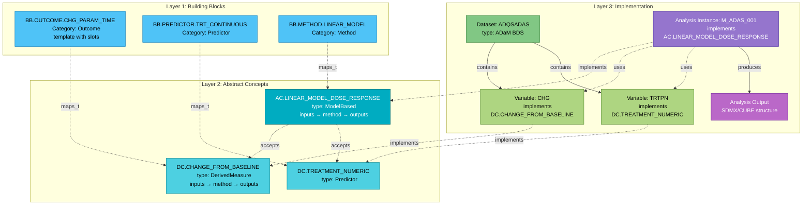

# Phrase-Based Analysis Metadata Architecture

## Overview

This architecture defines a three-layer approach for representing clinical trial analysis metadata, enabling:

1. **Human-readable** natural language descriptions
2. **Semantically rich** abstract concept definitions
3. **Executable** concrete implementations

The separation of concerns allows the same abstract analysis concepts to be reused across different studies while maintaining complete traceability from natural language to implementation.

---

## Three-Layer Architecture



---

## Layer 1: Building Blocks

**File:** [`building_blocks.yaml`](building_blocks.yaml)

Building Blocks are reusable phrase templates that compose natural language analysis descriptions. Each block has:

- **Template**: Natural language pattern with typed slots
- **Category**: Semantic role (Outcome, Predictor, Population, Method, Temporal, Covariate)
- **Slots**: Typed parameters that accept specific data types
- **Concept Mapping**: Links to abstract Derivation or Analysis Concepts

### Categories

| Category | Purpose | Example |
|----------|---------|---------|
| **Outcome** | Dependent variables | "change in {parameter} from baseline to {timepoint}" |
| **Predictor** | Independent variables | "with {treatment} as continuous predictor" |
| **Population** | Subject selection | "in {population_name} population" |
| **Method** | Statistical approach | "using linear model" |
| **Temporal** | Time references | "at {timepoint}" |
| **Covariate** | Adjustment variables | "adjusting for {baseline} and {site}" |

### Example: Outcome Building Block

```yaml
- id: BB.OUTCOME.CHG_PARAM_TIME
  category: Outcome
  label: "Change from Baseline to Timepoint"
  template: "change in {parameter} from baseline to {timepoint}"
  description: "Describes change in a parameter from baseline to a specific analysis timepoint"

  slots:
    - name: parameter
      label: "Parameter"
      type: continuous_measure
      required: true
      description: "The measure being analyzed (e.g., ADAS-Cog Total Score)"
      accepts:
        - derived_measures
        - biomedical_concepts

    - name: timepoint
      label: "Analysis Timepoint"
      type: temporal_reference
      required: true
      description: "Time point for analysis (e.g., Week 24, Month 6)"

  maps_to_concept: DC.CHANGE_FROM_BASELINE
  example: "change in ADAS-Cog (11) Total Score from baseline to Week 24"
```

### Slot Filling

When a Building Block is instantiated, slots are filled with concrete values:

- `{parameter}` → "ADAS-Cog (11) Total Score"
- `{timepoint}` → "Week 24"

Result: **"change in ADAS-Cog (11) Total Score from baseline to Week 24"**

---

## Layer 2: Concepts

**File:** [`concepts.yaml`](concepts.yaml)

Concepts define abstract semantic meaning independent of any specific implementation. There are two types:

### Derivation Concepts (DCs)

Data derivations with computational semantics:

```yaml
- id: DC.CHANGE_FROM_BASELINE
  label: "Change from Baseline"
  description: "Difference between analysis value and baseline value"
  type: DerivedMeasure

  # ADaM Integration
  adam_class_variable: CHG
  adam_class_uri: "https://standards.cdisc.org/adamig/v1-3/variable/CHG"
  adam_data_structure: "Basic Data Structure (BDS)"
  adam_core: "Expected"
  dataType: float
  role: Qualifier

  # Inputs with abstract parameter roles
  inputs:
    - name: analysis_value
      label: "Analysis Value"
      dataType: float
      role: Qualifier
      adam_class_variable: AVAL
      parameter_role: minuend

    - name: baseline_value
      label: "Baseline Value"
      dataType: float
      role: Qualifier
      adam_class_variable: BASE
      parameter_role: subtrahend

  # Method with abstract formula
  method:
    type: subtraction
    formula: "minuend - subtrahend"
    description: "Compute difference from baseline"

  # Outputs
  outputs:
    - name: change_value
      label: "Change Value"
      dataType: float
      role: Qualifier
      adam_class_variable: CHG
```

**Key Features:**
- **ADaM Class Integration**: Links to CDISC ADaM Implementation Guide variables
- **Abstract Parameters**: Uses semantic roles (minuend/subtrahend) instead of variable names
- **Inputs → Method → Outputs**: Complete computational specification

### Analysis Concepts (ACs)

Statistical models with method specifications:

```yaml
- id: AC.LINEAR_MODEL_DOSE_RESPONSE
  label: "Linear Model for Dose Response"
  description: "Test for linear dose-response relationship using regression"
  type: ModelBased
  category: efficacy_analysis

  # Inputs specify what concepts are accepted
  inputs:
    - name: outcome
      label: "Outcome Variable"
      role: Outcome
      required: true
      dataType: float
      accepts_concepts:
        - DC.CHANGE_FROM_BASELINE
        - DC.ANALYSIS_VALUE
      example: "Change in ADAS-Cog Total Score from baseline to Week 24"

    - name: primary_predictor
      label: "Primary Predictor"
      role: FixedEffect
      required: true
      dataType: integer
      accepts_concepts:
        - DC.TREATMENT_NUMERIC
      example: "Treatment dose as continuous numeric (0, 54, 81)"

    - name: covariates
      label: "Covariates"
      role: FixedEffect
      required: false
      multiple: true
      dataType: [float, text]
      accepts_concepts:
        - DC.BASELINE_VALUE
        - DC.SITE_GROUP
      example: "Baseline score, Site group"

  # Method with abstract formula and parameters
  method:
    type: linear_regression
    model_formula: "Outcome ~ Primary_Predictor + Covariate"
    estimation_method: "OLS"
    description: "Fit linear regression model"

    parameters:
      - name: outcome
        description: "Dependent variable in regression"
        required: true
        dataType: float
        parameter_role: dependent_variable
        maps_to_input: outcome

      - name: primary_predictor
        description: "Main independent variable"
        required: true
        dataType: [integer, float]
        parameter_role: independent_variable
        maps_to_input: primary_predictor

      - name: covariate
        description: "Adjustment variable"
        required: false
        multiple: true
        dataType: [float, text]
        parameter_role: adjustment_variable
        maps_to_input: covariates

    # Optional interactions
    interactions:
      - variables: ["primary_predictor", "covariate"]
        type: two_way
        optional: true
        notation: "Primary_Predictor:Covariate"
        description: "Test treatment-by-covariate interaction"

    # Statistical options with allowed values
    statistical_options:
      - name: type3_tests
        type: boolean
        default: true
        allowed_values: [true, false]
        description: "Use Type III sum of squares for hypothesis tests"

      - name: alpha
        type: numeric
        default: 0.05
        allowed_values: [0.01, 0.05, 0.10]
        description: "Significance level for hypothesis tests"

      - name: confidence_level
        type: numeric
        default: 0.95
        allowed_values: [0.90, 0.95, 0.99]
        description: "Confidence level for interval estimates"

      - name: multiple_comparison_method
        type: categorical
        default: "none"
        allowed_values:
          - "none"
          - "Bonferroni"
          - "Tukey"
          - "Dunnett"
          - "Holm"
          - "Hochberg"
          - "Sidak"
        description: "Method for adjusting p-values for multiple comparisons"

      - name: missing_data_approach
        type: categorical
        default: "complete_case"
        allowed_values:
          - "complete_case"
          - "LOCF"
          - "BOCF"
          - "multiple_imputation"
        description: "How to handle missing data"

    assumptions:
      - linearity
      - independence
      - homoscedasticity
      - normality_of_residuals

  # Outputs with dimensional structure
  outputs:
    - name: coefficient_estimates
      description: "Regression coefficients"
      dataType: float
      applies_to_dimensions: [POPULATION, TIMING, CONTRAST]
      includes:
        - intercept
        - slope_primary_predictor
        - covariate_effects

    - name: standard_errors
      description: "Standard errors for coefficients"
      dataType: float
      applies_to_dimensions: [POPULATION, TIMING, CONTRAST]

    - name: p_values
      description: "P-values for significance tests"
      dataType: float
      applies_to_dimensions: [POPULATION, TIMING, CONTRAST]

    - name: confidence_intervals
      description: "Confidence intervals for coefficients"
      dataType: float
      applies_to_dimensions: [POPULATION, TIMING, CONTRAST]

    - name: model_fit
      description: "Model diagnostics"
      dataType: float
      applies_to_dimensions: [POPULATION, TIMING]
      includes:
        - r_squared
        - adjusted_r_squared
        - residual_plots

  # Result dimensional structure (abstract)
  result_dimensions:
    - name: POPULATION
      role: population
      contextType: population
      required: true
      description: "Analysis population for result stratification"

    - name: TIMING
      role: timing
      contextType: timing
      required: true
      ordered: true
      description: "Analysis timepoint for result stratification"

    - name: CONTRAST
      role: contrast
      contextType: contrast
      required: true
      description: "Statistical contrast being tested"
```

**Key Features:**
- **Accepts Concepts**: Inputs specify which Derivation Concepts are acceptable
- **Generic Model Formula**: Uses abstract parameter names (Outcome, Primary_Predictor)
- **Statistical Options Schema**: Defines allowed values at concept level
- **Result Dimensions**: Defines abstract dimensional structure for outputs
- **Output Applicability**: Each output specifies which dimensions apply

---

## Layer 3: Implementation

**File:** [`implementation.yaml`](implementation.yaml)

Concrete sponsor-specific implementations with actual variable names, datasets, and analysis specifications.

### Datasets and Variables

```yaml
datasets:
  - name: ADQSADAS
    label: "ADAS-Cog Analysis Dataset"
    description: "Analysis dataset for ADAS-Cog questionnaire"
    type: ADaM
    based_on_class: "Basic Data Structure (BDS)"

    variables:
      # Variable implementing Change from Baseline concept
      - name: CHG
        label: "Change from Baseline"
        implements_concept: DC.CHANGE_FROM_BASELINE
        of_class: CHG  # Links to ADaM Class Variable
        length: 8
        displayFormat: "8.2"

        origin:
          type: Derived
          method: MTH.CHANGE_FROM_BASELINE
          source_items:
            - IT.ADQSADAS.AVAL
            - IT.ADQSADAS.BASE

        description: "Change in ADAS-Cog total score from baseline (AVAL - BASE)"

      # Variable implementing Treatment Numeric concept
      - name: TRTPN
        label: "Planned Treatment (N)"
        implements_concept: DC.TREATMENT_NUMERIC
        of_class: TRT01PN
        length: 8

        coding:
          - code: 0
            decode: "Placebo"
          - code: 54
            decode: "Xanomeline Low Dose"
          - code: 81
            decode: "Xanomeline High Dose"

        description: "Numeric treatment code for dose-response modeling"
```

**Key Features:**
- **Implements Concept**: Each variable links to an abstract Derivation Concept
- **Of Class**: Links to ADaM Class Variable for standards compliance
- **Origin**: Traceability to source data
- **Coding**: Controlled terminology

### Analysis Instances

Complete analysis specification with variable bindings:

```yaml
analysis_instances:
  - id: M_ADAS_001
    name: "ADAS-Cog Dose Response Analysis"
    description: "Linear model testing for dose-response relationship in ADAS-Cog change from baseline at Week 24"
    implements_concept: AC.LINEAR_MODEL_DOSE_RESPONSE

    # Map abstract inputs to concrete variables
    variable_bindings:

      outcome:
        source: IT.ADQSADAS.CHG
        dataset: ADQSADAS
        variable: CHG
        concept: DC.CHANGE_FROM_BASELINE
        description: "Change from baseline in ADAS-Cog total score"

      primary_predictor:
        source: IT.ADQSADAS.TRTPN
        dataset: ADQSADAS
        variable: TRTPN
        concept: DC.TREATMENT_NUMERIC
        description: "Treatment as continuous numeric (0, 54, 81)"

      covariates:
        - source: IT.ADQSADAS.BASE
          dataset: ADQSADAS
          variable: BASE
          concept: DC.BASELINE_VALUE
          description: "Baseline ADAS-Cog score"

        - source: IT.ADQSADAS.SITEGR1
          dataset: ADQSADAS
          variable: SITEGR1
          concept: DC.SITE_GROUP
          description: "Pooled site group"

      population:
        filters:
          - variable: EFFFL
            operator: "="
            value: "Y"
            concept: DC.EFFICACY_POPULATION
            description: "Efficacy population"

          - variable: ANL01FL
            operator: "="
            value: "Y"
            concept: DC.ANALYSIS_FLAG_01
            description: "Analysis record flag"

          - variable: AVISIT
            operator: "="
            value: "Week 24"
            concept: DC.ANALYSIS_VISIT
            description: "Week 24 visit"

          - variable: PARAMCD
            operator: "="
            value: "ADAS11"
            concept: DC.PARAMETER_CODE
            description: "ADAS-Cog (11) parameter"

    # Selected statistical options (from concept's allowed values)
    statistical_options_selected:
      type3_tests: true
      alpha: 0.05
      confidence_level: 0.95
      multiple_comparison_method: "none"
      missing_data_approach: "complete_case"

    # Software execution details
    execution:
      software: SAS
      procedure: PROC GLM

      code_template: |
        PROC GLM DATA=ADQSADAS;
          WHERE EFFFL='Y' AND ANL01FL='Y' AND AVISIT='Week 24' AND PARAMCD='ADAS11';
          CLASS SITEGR1;
          MODEL CHG = TRTPN BASE SITEGR1 / SS3 SOLUTION;
          ESTIMATE 'Dose Response' TRTPN 1;
        RUN;

      alternative_implementations:
        r: |
          library(dplyr)
          library(broom)

          # Filter data
          analysis_data <- adqsadas %>%
            filter(EFFFL == 'Y', ANL01FL == 'Y', AVISIT == 'Week 24', PARAMCD == 'ADAS11')

          # Fit model
          model <- lm(CHG ~ TRTPN + BASE + SITEGR1, data = analysis_data)

          # Get results
          summary(model)
          tidy(model, conf.int = TRUE, conf.level = 0.95)
```

### Analysis Output Bindings

SDMX/CUBE structure following the concept's result_dimensions:

```yaml
analysis_output_bindings:
  - analysis_id: M_ADAS_001
    implements_concept: AC.LINEAR_MODEL_DOSE_RESPONSE
    description: "Output structure for linear dose-response analysis"

    cube_structure:

      # Concrete dimension values (structure defined in concept)
      dimension_values:
        - name: POPULATION
          contextVariable: POPULATION
          values:
            - "Full Analysis Set"

        - name: TIMING
          contextVariable: AVISIT
          values:
            - "Week 24"
          ordered: true

        - name: CONTRAST
          contextVariable: CONTRAST
          values:
            - "Dose Response (per unit increase)"

      # Measures with STATO ontology links
      measures:
        - output_id: OUT.M_ADAS_001.BETA
          variable_name: BETA_COEFFICIENT
          label: "Dose Response Coefficient"
          dataType: Numeric
          statoIri: "http://purl.obolibrary.org/obo/STATO_0000144"
          statoLabel: "regression coefficient"
          unit: "points per mg"
          precision: 4
          description: "Slope coefficient for continuous treatment effect"

        - output_id: OUT.M_ADAS_001.SE
          variable_name: SE
          label: "Standard Error"
          dataType: Numeric
          statoIri: "http://purl.obolibrary.org/obo/STATO_0000262"
          statoLabel: "standard error"
          precision: 4

        - output_id: OUT.M_ADAS_001.PVAL
          variable_name: PVAL
          label: "P-value"
          dataType: Numeric
          statoIri: "http://purl.obolibrary.org/obo/STATO_0000051"
          statoLabel: "p-value"
          precision: 4

        - output_id: OUT.M_ADAS_001.CI_LOWER
          variable_name: CI_LOWER
          label: "95% CI Lower Bound"
          dataType: Numeric
          statoIri: "http://purl.obolibrary.org/obo/STATO_0000315"
          statoLabel: "confidence interval lower bound"
          precision: 4

        - output_id: OUT.M_ADAS_001.CI_UPPER
          variable_name: CI_UPPER
          label: "95% CI Upper Bound"
          dataType: Numeric
          statoIri: "http://purl.obolibrary.org/obo/STATO_0000314"
          statoLabel: "confidence interval upper bound"
          precision: 4

      # Result attributes
      attributes:
        - name: ADJUSTMENT
          role: condition
          contextType: condition
          contextVariable: ADJUSTMENT
          value: "Adjusted for baseline score and site group"
          description: "Covariates included in model"

        - name: ESTIMATION_METHOD
          value: "Ordinary Least Squares"
          description: "Estimation method used"

        - name: CONFIDENCE_LEVEL
          value: 0.95
          dataType: Numeric
          description: "Confidence level for intervals"

    # Result generation metadata
    result_generation:
      resultId_pattern: "RES_{analysis_id}_{output_id}_{sequence}"
      description: "Pattern for generating unique result identifiers"

      cardinality:
        BETA_COEFFICIENT: 1
        SE: 1
        CI_LOWER: 1
        CI_UPPER: 1
        PVAL: 1

    result_metadata:
      studyId: "CDISCPILOT01"
      analysisVersion: "1.0"
      generatedBy: "analysis_pipeline"
      description: "Single dose-response test at Week 24"
```

---

## Relationships Between Layers

### Building Block → Concept

Building Blocks map to Concepts via `maps_to_concept`:

```
BB.OUTCOME.CHG_PARAM_TIME → DC.CHANGE_FROM_BASELINE
BB.PREDICTOR.TRT_CONTINUOUS → DC.TREATMENT_NUMERIC
BB.METHOD.LINEAR_MODEL → AC.LINEAR_MODEL_DOSE_RESPONSE
```

### Concept → Concept

Analysis Concepts accept specific Derivation Concepts as inputs:

```
AC.LINEAR_MODEL_DOSE_RESPONSE
  ├─ accepts DC.CHANGE_FROM_BASELINE (as outcome)
  ├─ accepts DC.ANALYSIS_VALUE (as outcome)
  ├─ accepts DC.TREATMENT_NUMERIC (as primary_predictor)
  ├─ accepts DC.BASELINE_VALUE (as covariate)
  └─ accepts DC.SITE_GROUP (as covariate)
```

### Variable → Concept

Variables implement Derivation Concepts:

```
ADQSADAS.CHG → implements → DC.CHANGE_FROM_BASELINE
ADQSADAS.AVAL → implements → DC.ANALYSIS_VALUE
ADQSADAS.BASE → implements → DC.BASELINE_VALUE
ADQSADAS.TRTPN → implements → DC.TREATMENT_NUMERIC
ADQSADAS.SITEGR1 → implements → DC.SITE_GROUP
```

### Analysis Instance → Everything

Analysis Instances tie everything together:

```
M_ADAS_001
  ├─ implements → AC.LINEAR_MODEL_DOSE_RESPONSE
  ├─ binds outcome → ADQSADAS.CHG (which implements DC.CHANGE_FROM_BASELINE)
  ├─ binds primary_predictor → ADQSADAS.TRTPN (which implements DC.TREATMENT_NUMERIC)
  ├─ binds covariates → ADQSADAS.BASE, ADQSADAS.SITEGR1
  └─ produces → Output with dimension_values, measures, attributes
```

---

## Example: Complete Traceability

### Natural Language (Composed from Building Blocks)

> "Test **using linear model** for **change in ADAS-Cog (11) Total Score from baseline to Week 24** **with treatment as continuous predictor** **adjusting for baseline score and site group** **in efficacy population** **at Week 24**"

### Building Block Decomposition

1. **"using linear model"**
   - BB.METHOD.LINEAR_MODEL
   - Maps to: AC.LINEAR_MODEL_DOSE_RESPONSE

2. **"change in ADAS-Cog (11) Total Score from baseline to Week 24"**
   - BB.OUTCOME.CHG_PARAM_TIME
   - Slots: {parameter: "ADAS-Cog (11) Total Score", timepoint: "Week 24"}
   - Maps to: DC.CHANGE_FROM_BASELINE

3. **"with treatment as continuous predictor"**
   - BB.PREDICTOR.TRT_CONTINUOUS
   - Maps to: DC.TREATMENT_NUMERIC

4. **"adjusting for baseline score and site group"**
   - BB.COVARIATE.ADJUST_FOR
   - Maps to: DC.BASELINE_VALUE, DC.SITE_GROUP

5. **"in efficacy population"**
   - BB.POPULATION.IN_POPULATION
   - Maps to: DC.EFFICACY_POPULATION

6. **"at Week 24"**
   - BB.TEMPORAL.AT_TIMEPOINT
   - Slot: {timepoint: "Week 24"}
   - Maps to: DC.ANALYSIS_VISIT

### Concept Level

**Analysis Concept:** AC.LINEAR_MODEL_DOSE_RESPONSE
- **Model:** Outcome ~ Primary_Predictor + Covariate
- **Method:** linear_regression, OLS
- **Accepts:**
  - outcome: DC.CHANGE_FROM_BASELINE
  - primary_predictor: DC.TREATMENT_NUMERIC
  - covariates: DC.BASELINE_VALUE, DC.SITE_GROUP

**Derivation Concepts:**
- DC.CHANGE_FROM_BASELINE: minuend - subtrahend
- DC.TREATMENT_NUMERIC: Numeric treatment code
- DC.BASELINE_VALUE: Value at baseline
- DC.SITE_GROUP: Pooled site grouping

### Implementation Level

**Analysis Instance:** M_ADAS_001
- **Dataset:** ADQSADAS
- **Variable Bindings:**
  - outcome → CHG (implements DC.CHANGE_FROM_BASELINE)
  - primary_predictor → TRTPN (implements DC.TREATMENT_NUMERIC)
  - covariates → [BASE, SITEGR1]
- **Population Filters:**
  - EFFFL='Y' (efficacy population)
  - ANL01FL='Y' (analysis flag)
  - AVISIT='Week 24' (timepoint)
  - PARAMCD='ADAS11' (parameter)
- **Statistical Options:**
  - alpha: 0.05
  - confidence_level: 0.95
  - type3_tests: true

**Output Structure:**
- **Dimensions:** POPULATION, TIMING, CONTRAST
- **Measures:** BETA_COEFFICIENT, SE, PVAL, CI_LOWER, CI_UPPER
- **Attributes:** Adjustment method, estimation method
- **STATO Links:** Semantic interoperability via ontology

### Executable Code

**SAS:**
```sas
PROC GLM DATA=ADQSADAS;
  WHERE EFFFL='Y' AND ANL01FL='Y' AND AVISIT='Week 24' AND PARAMCD='ADAS11';
  CLASS SITEGR1;
  MODEL CHG = TRTPN BASE SITEGR1 / SS3 SOLUTION;
  ESTIMATE 'Dose Response' TRTPN 1;
RUN;
```

**R:**
```r
analysis_data <- adqsadas %>%
  filter(EFFFL == 'Y', ANL01FL == 'Y', AVISIT == 'Week 24', PARAMCD == 'ADAS11')

model <- lm(CHG ~ TRTPN + BASE + SITEGR1, data = analysis_data)
summary(model)
```

---

## Key Design Principles

### 1. Separation of Concerns

Each layer has a distinct purpose:
- **Building Blocks**: Human readability and composition
- **Concepts**: Semantic meaning and abstract specification
- **Implementation**: Concrete execution details

### 2. Reusability

- Building Blocks can compose many different analyses
- Concepts are study-independent
- Only Implementation layer is study-specific

### 3. Traceability

Complete chain from natural language to code:
```
Phrase → Building Block → Concept → Variable → Analysis Instance → Code
```

### 4. Standards Integration

- **ADaM Class Variables**: Links to CDISC ADaM IG
- **STATO Ontology**: Semantic interoperability for statistical terms
- **SDMX/CUBE**: Dimensional organization of results

### 5. Flexibility

- Multiple implementations can satisfy same concept
- Different statistical software (SAS, R, Python)
- Alternative analysis approaches for same question

---

## File References

- [building_blocks.yaml](building_blocks.yaml) - Phrase templates with slots
- [concepts.yaml](concepts.yaml) - Abstract concept definitions
- [implementation.yaml](implementation.yaml) - Concrete implementations

---

## Summary

This three-layer architecture enables:

✓ **Machine-executable** analysis metadata
✓ **Human-readable** natural language descriptions
✓ **Standards-compliant** CDISC ADaM integration
✓ **Semantically rich** concept definitions
✓ **Flexible** support for multiple implementations
✓ **Traceable** from phrase to code
✓ **Reusable** across studies and sponsors
